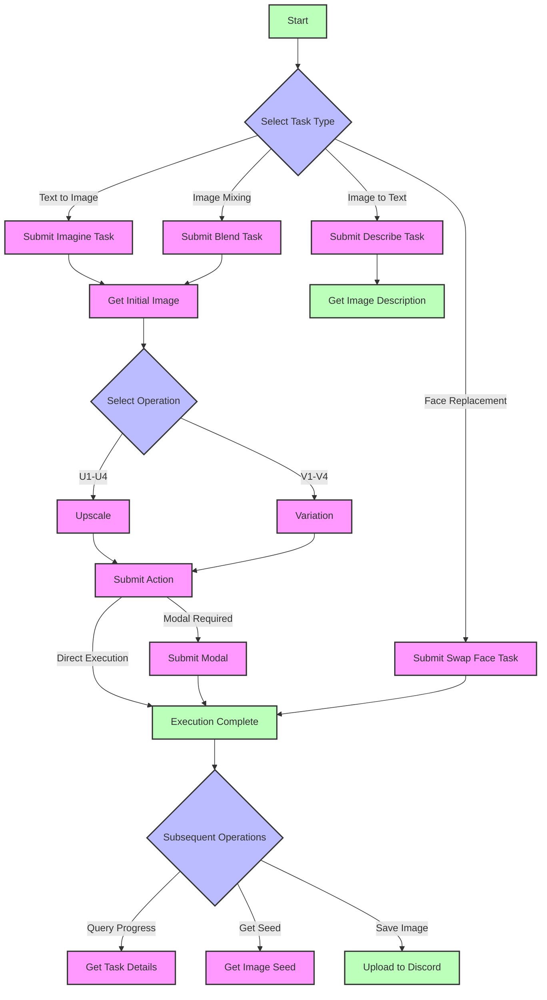

---
title: Midjourney Image Format (Midjourney Proxy/Midjourney Proxy Plus)
---

{/* TODO: Convert to Callout - note: Please Note */}
This interface is **not an official Midjourney interface**, but rather a Midjourney proxy interface implemented based on the open-source project [**midjourney-proxy**](https://github.com/novicezk/midjourney-proxy) by author **novicezk**.

    This project is divided into two versions, both of which New API has adapted:

    - Open Source Version [midjourney-proxy](https://github.com/novicezk/midjourney-proxy)

    - Paid Version [midjourney-proxy-plus](https://github.com/litter-coder/midjourney-proxy-plus)

    We are very grateful for the author's contribution, which allows us to easily use Midjourney's powerful features. If you have time, please give the author a Star. If you have the ability, we recommend supporting the author's paid version, which supports more features.

| Feature Category                           | Open Source | Paid Version |
| ------------------------------------------ | ----------- | ------------ |
| **Basic Features**                         |             |              |
| Imagine commands and related actions       | ✓           | ✓            |
| Image padding support                      | ✓           | ✓            |
| Blend (Image mixing)                       | ✓           | ✓            |
| Describe (Image to text)                   | ✓           | ✓            |
| Real-time task progress                    | ✓           | ✓            |
| Chinese prompt translation                 | ✓           | ✓            |
| Prompt sensitive word detection            | ✓           | ✓            |
| User-token WSS connection                  | ✓           | ✓            |
| Multi-account configuration                | ✓           | ✓            |
| **Advanced Features**                      |             |              |
| Shorten (Prompt analysis)                  | ✗           | ✓            |
| Focus movement (Pan)                       | ✗           | ✓            |
| Image zoom (Zoom)                          | ✗           | ✓            |
| Local redraw (Vary Region)                 | ✗           | ✓            |
| Associated button actions and Remix mode   | ✗           | ✓            |
| Get image seed value                       | ✗           | ✓            |
| **Account Management**                     |             |              |
| Account pool persistence                   | ✗           | ✓            |
| Multiple storage support (Redis/MySQL)     | ✗           | ✓            |
| Account information retrieval and settings | ✗           | ✓            |
| Task cancellation function                 | ✗           | ✓            |
| Built-in management backend                | ✗           | ✓            |
| **Smart Features**                         |             |              |
| MJ V6.0 support                            | ✗           | ✓            |
| Automatic account status monitoring        | ✗           | ✓            |
| Automatic mode switching                   | ✗           | ✓            |
| Niji・journey Bot support                  | ✗           | ✓            |
| InsightFace face service                   | ✗           | ✓            |
| **Security & Performance**                 |             |              |
| Dynamic configuration support              | ✗           | ✓            |
| Token disconnection issue fixes            | ✗           | ✓            |
| Automatic verification function            | ✗           | ✓            |
| Prohibited word automatic appeal           | ✗           | ✓            |

## 📝 Introduction

Midjourney is a powerful image generation and processing model that can create, edit, and modify images based on natural language descriptions. By providing different interfaces, various image generation and processing tasks can be implemented.

## 🔄 Process Flow Diagram



### Flow Description

1. **Initial Tasks**
   - Imagine: Text to image generation
   - Blend: Multi-image mixing
   - Describe: Image description
   - Swap Face: Face replacement

2. **Image Processing**
   - U1-U4: Upscale operations
   - V1-V4: Variation generation
   - Pan: Image translation
   - Zoom: Image scaling

3. **Special Flows**
   - Action + Modal: Operations requiring modal confirmation
   - Direct Action execution: Operations not requiring modal

4. **Task Management**
   - Get task details
   - Get image seed
   - Upload to Discord

## 💡 Request Examples

### Submit Imagine Task ✅

```bash
curl --location --request POST 'https://your-newapi-server-address/mj/submit/imagine' \
--header 'Authorization: Bearer $NEWAPI_API_KEY' \
--header 'Accept: application/json' \
--header 'Content-Type: application/json' \
--data-raw '{
  "botType": "MID_JOURNEY",
  "prompt": "Cat",
  "base64Array": [],
  "accountFilter": {
    "channelId": "",
    "instanceId": "",
    "modes": [],
    "remark": "",
    "remix": true,
    "remixAutoConsidered": true
  },
  "notifyHook": "",
  "state": ""
}'
```

**Response Example:**

```json
{
  "code": 1,
  "description": "Submitted successfully",
  "properties": {},
  "result": 1320098173412546
}
```

### Submit Blend Task ✅

```bash
curl --location --request POST 'https://your-newapi-server-address/mj/submit/blend' \
--header 'Authorization: Bearer $NEWAPI_API_KEY' \
--header 'Accept: application/json' \
--header 'Content-Type: application/json' \
--data-raw '{
  "botType": "MID_JOURNEY",
  "base64Array": [
    "data:image/png;base64,xxx1",
    "data:image/png;base64,xxx2"
  ],
  "dimensions": "SQUARE",
  "accountFilter": {
    "channelId": "",
    "instanceId": "",
    "modes": [],
    "remark": "",
    "remix": true,
    "remixAutoConsidered": true
  },
  "notifyHook": "",
  "state": ""
}'
```

**Response Example:**

```json
{
  "code": 1,
  "description": "Submitted successfully",
  "properties": {},
  "result": 1320098173412546
}
```

### Submit Describe Task ✅

```bash
curl --location --request POST 'https://your-newapi-server-address/mj/submit/describe' \
--header 'Authorization: Bearer $NEWAPI_API_KEY' \
--header 'Accept: application/json' \
--header 'Content-Type: application/json' \
--data-raw '{
  "botType": "MID_JOURNEY",
  "base64": "data:image/png;base64,xxx",
  "accountFilter": {
    "channelId": "",
    "instanceId": "",
    "modes": [],
    "remark": "",
    "remix": true,
    "remixAutoConsidered": true
  },
  "notifyHook": "",
  "state": ""
}'
```

**Response Example:**

```json
{
  "code": 1,
  "description": "Submitted successfully",
  "properties": {},
  "result": 1320098173412546
}
```

### Submit Modal ✅

```bash
curl --location --request POST 'https://your-newapi-server-address/mj/submit/modal' \
--header 'Authorization: Bearer $NEWAPI_API_KEY' \
--header 'Accept: application/json' \
--header 'Content-Type: application/json' \
--data-raw '{
  "maskBase64": "",
  "prompt": "",
  "taskId": "14001934816969359"
}'
```

**Response Example:**

```json
{
  "code": 1,
  "description": "Submitted successfully",
  "properties": {},
  "result": 1320098173412546
}
```

### Submit swap_face Task ✅

```bash
curl --location --request POST 'https://your-newapi-server-address/mj/insight-face/swap' \
--header 'Authorization: Bearer $NEWAPI_API_KEY' \
--header 'Accept: application/json' \
--header 'Content-Type: application/json' \
--data-raw '{
  "sourceBase64": "data:image/jpeg;base64,/9j/4AAQSkZJRgABAQAAAQABAAD/2wCEAAkGBwgHBgkIBwgKCgkLDRYPDQwMDRsUFRAWIB0iIiAdHx8kKDQsJCYxJx8fLT0tMTU3Ojo6Iys/RDnYdriP1wsS81kwU8OVs/R3xu8s6bX7+zYnOH8coSqpmRSBjqerjcBlr2OB/lbAf/2Q==",
  "targetBase64": "data:image/jpeg;base64,/9j/4AAQSkZJRgABAQAAAQABAAD/2wCEAAkGBwgHBgkIBwgKCgkLDRYPDQwMDRsUFRAWIB0iIiAdHx8kKDQsJCYxJx8fLT0tMTU3Ojo6Iys/RD849k="
}'
```

**Response Example:**

```json
{
  "code": 0,
  "description": "string",
  "result": "string"
}
```

### Execute Action ✅

```bash
curl --location --request POST 'https://your-newapi-server-address/mj/submit/action' \
--header 'Authorization: Bearer $NEWAPI_API_KEY' \
--header 'Accept: application/json' \
--header 'Content-Type: application/json' \
--data-raw '{
  "chooseSameChannel": true,
  "customId": "MJ::JOB::upsample::1::82c51c9d-bc33-4c07-a471-36c3dcb1a6f0",
  "taskId": "1728781324658687",
  "accountFilter": {
    "channelId": "",
    "instanceId": "",
    "modes": [],
    "remark": "",
    "remix": true,
    "remixAutoConsidered": true
  },
  "notifyHook": "",
  "state": ""
}'
```

**Response Example:**

```json
{
  "code": 1,
  "description": "Submitted successfully",
  "properties": {},
  "result": 1320098173412546
}
```

### Upload Files to Discord ✅

```bash
curl --location --request POST 'https://your-newapi-server-address/mj/submit/upload-discord-images' \
--header 'Authorization: Bearer $NEWAPI_API_KEY' \
--header 'Accept: application/json' \
--header 'Content-Type: application/json' \
--data-raw '{
  "base64Array": [],
  "filter": {
    "channelId": "",
    "instanceId": "",
    "remark": ""
  }
}'
```

**Response Example:**

```json
{
  "code": 0,
  "description": "string",
  "result": ["string"]
}
```

### Query Tasks by ID List ✅

```bash
curl --location --request POST 'https://your-newapi-server-address/mj/task/list-by-condition' \
--header 'Accept: application/json' \
--header 'Authorization: Bearer $NEWAPI_API_KEY' \
--header 'Content-Type: application/json' \
--data-raw '{
  "ids": []
}'
```

**Response Example:**

```json
[
  {
    "action": "IMAGINE",
    "buttons": [
      {
        "customId": "string",
        "emoji": "string",
        "label": "string",
        "style": 0,
        "type": 0
      }
    ],
    "description": "string",
    "failReason": "string",
    "finishTime": 0,
    "id": "string",
    "imageUrl": "string",
    "progress": "string",
    "prompt": "string",
    "promptEn": "string",
    "properties": {},
    "startTime": 0,
    "state": "string",
    "status": "NOT_START",
    "submitTime": 0
  }
]
```

### Get Task by Specific ID ✅

```bash
curl --location --request GET 'https://your-newapi-server-address/mj/task/{id}/fetch' \
--header 'Accept: application/json' \
--header 'Authorization: Bearer $NEWAPI_API_KEY' \
--header 'Content-Type: application/json'
```

**Response Example:**

```json
{
  "action": "IMAGINE",
  "buttons": [
    {
      "customId": "string",
      "emoji": "string",
      "label": "string",
      "style": 0,
      "type": 0
    }
  ],
  "description": "string",
  "failReason": "string",
  "finishTime": 0,
  "id": "string",
  "imageUrl": "string",
  "progress": "string",
  "prompt": "string",
  "promptEn": "string",
  "properties": {},
  "startTime": 0,
  "state": "string",
  "status": "NOT_START",
  "submitTime": 0
}
```

### Get Task Image Seed ✅

```bash
curl --location --request GET 'https://your-newapi-server-address/mj/task/{id}/image-seed' \
--header 'Accept: application/json' \
--header 'Authorization: Bearer $NEWAPI_API_KEY' \
--header 'Content-Type: application/json'
```

**Response Example:**

```json
{
  "code": 0,
  "description": "string",
  "result": "string"
}
```

## 📮 Request

### Endpoints

#### Submit Imagine Task

```
POST /mj/submit/imagine
```

Create images based on text prompts.

#### Submit Blend Task

```
POST /mj/submit/blend
```

Generate new images by blending multiple input images.

#### Submit Describe Task

```
POST /mj/submit/describe
```

Generate text descriptions based on input images.

#### Submit Modal

```
POST /mj/submit/modal
```

Submit modal information for adjusting image generation details.

#### Submit swap_face Task

```
POST /mj/insight-face/swap
```

Perform face swapping based on source and target images.

#### Execute Action

```
POST /mj/submit/action
```

Perform subsequent operations on generated images, such as upscaling, adjustments, etc.

#### Upload Files to Discord

```
POST /mj/submit/upload-discord-images
```

Upload images to the Discord platform.

#### Query Tasks by ID List

```
POST /mj/task/list-by-condition
```

Query task details based on specified task ID list.

#### Get Task by Specific ID

```
GET /mj/task/{id}/fetch
```

Get task details by task ID.

#### Get Task Image Seed

```
GET /mj/task/{id}/image-seed
```

Get the seed value of the image generated by the specified task.

### Authentication Method

Include the following in the request header for API key authentication:

```
Authorization: Bearer $NEWAPI_API_KEY
```

Where `$NEWAPI_API_KEY` is your API key.

### Request Body Parameters

#### Submit Imagine Task

##### `botType`

- Type: Enum string
- Required: No
- Default: MID_JOURNEY
- Options:
  - `MID_JOURNEY`: Midjourney model
  - `NIJI_JOURNEY`: Niji Journey model
- Description: Select the bot type to use

##### `prompt`

- Type: String
- Required: Yes
- Description: Text prompt for image generation
- Tips:
  - Use clear and specific descriptions
  - Can include artistic style, composition, and other details
  - Supports both English and Chinese input

##### `base64Array`

- Type: String array
- Required: No
- Description: Base64 encoded array for image padding
- Format: Each element should be a complete base64 image string with MIME type prefix

##### `accountFilter`

- Type: Object
- Required: No
- Properties:
  - `channelId`: Channel ID
  - `instanceId`: Account instance ID
  - `modes`: Account mode array, options: RELAX, FAST, TURBO
  - `remark`: Content included in remarks
  - `remix`: Whether the account supports remix
  - `remixAutoConsidered`: Remix auto-submit settings

##### `notifyHook`

- Type: String
- Required: No
- Description: Callback address after task completion, uses global notifyHook when empty

##### `state`

- Type: String
- Required: No
- Description: Custom state parameter for tracking requests

#### Submit Blend Task

##### `base64Array`

- Type: String array
- Required: Yes
- Description: Base64 encoded array of images to blend
- Format: Must include 2-5 base64 image strings

##### `dimensions`

- Type: Enum string
- Required: No
- Options:
  - `PORTRAIT`: 2:3 ratio
  - `SQUARE`: 1:1 ratio
  - `LANDSCAPE`: 3:2 ratio
- Description: Output image aspect ratio settings

#### Submit Describe Task

##### `base64`

- Type: String
- Required: Yes
- Description: Base64 encoding of the image to be described
- Format: Complete base64 string with MIME type prefix

#### Submit Modal Task

##### `maskBase64`

- Type: String
- Required: No
- Description: Base64 encoding of the mask image for local redraw

##### `prompt`

- Type: String
- Required: No
- Description: Text prompt for the redraw area

##### `taskId`

- Type: String
- Required: Yes
- Description: ID of the original task

#### Submit Swap Face Task

##### `sourceBase64`

- Type: String
- Required: Yes
- Description: Base64 encoding of the face source image
- Requirements: Image must contain a clear face

##### `targetBase64`

- Type: String
- Required: Yes
- Description: Base64 encoding of the target image
- Requirements: Image must contain the face to be replaced

#### Execute Action

##### `chooseSameChannel`

- Type: Boolean
- Required: No
- Default: false
- Description: Whether to select accounts in the same channel

##### `customId`

- Type: String
- Required: Yes
- Description: Action identifier
- Format: Specific format string, such as "MJ::JOB::upsample::1::xxx"

##### `taskId`

- Type: String
- Required: Yes
- Description: Task ID for the action to be executed

#### Upload Files to Discord

##### `base64Array`

- Type: String array
- Required: Yes
- Description: Base64 encoded array of images to upload

##### `filter`

- Type: Object
- Required: No
- Properties:
  - `channelId`: Target channel ID
  - `instanceId`: Account instance ID
  - `remark`: Remark information

#### Query Tasks by ID List

##### `ids`

- Type: String array
- Required: Yes
- Description: List of task IDs to query

### Common Response Format

All interfaces return similar response structures:

##### `code`

- Type: Integer
- Description: Status code

| Status Code | Description            |
| ----------- | ---------------------- |
| 1           | Submitted successfully |
| 22          | Task queued            |
| 21          | Parameter error        |
| 23          | System error           |
| 24          | Account unavailable    |
| 25          | Insufficient balance   |

##### `description`

- Type: String
- Description: Response description information

##### `properties`

- Type: Object
- Description: Extended properties

##### `result`

- Type: String or array
- Description: Return result, may be task ID or other data

## 📥 Response

### Successful Response

#### `action`

- Type: Enum string
- Description: Task type

| String Value | Description        |
| ------------ | ------------------ |
| `IMAGINE`    | Create image       |
| `UPSCALE`    | Upscale image      |
| `VARIATION`  | Generate variation |
| `ZOOM`       | Zoom image         |
| `PAN`        | Pan image          |
| `DESCRIBE`   | Image description  |
| `BLEND`      | Image blending     |
| `SHORTEN`    | Shorten prompt     |
| `SWAP_FACE`  | Face replacement   |

#### `buttons`

- Type: Object array
- Description: Executable operation buttons

| Array Properties | Description                        |
| ---------------- | ---------------------------------- |
| `customId`       | Action identifier                  |
| `emoji`          | Button icon                        |
| `label`          | Button text                        |
| `style`          | Style (2=Primary, 3=Green)         |
| `type`           | Type used internally by the system |

#### `description`

- Type: String
- Description: Task description information

#### `failReason`

- Type: String
- Description: Task failure reason

#### `finishTime`

- Type: Integer
- Description: Task completion timestamp

#### `id`

- Type: String
- Description: Task unique identifier

#### `imageUrl`

- Type: String
- Description: URL of the generated image

#### `progress`

- Type: String
- Description: Task progress information

#### `prompt`

- Type: String
- Description: Original prompt

#### `promptEn`

- Type: String
- Description: English prompt

#### `status`

- Type: Enum string
- Description: Task status

| String Value  | Description                 |
| ------------- | --------------------------- |
| `NOT_START`   | Not started                 |
| `SUBMITTED`   | Submitted                   |
| `MODAL`       | Modal operation in progress |
| `IN_PROGRESS` | In progress                 |
| `FAILURE`     | Failed                      |
| `SUCCESS`     | Successful                  |
| `CANCEL`      | Cancelled                   |

#### `submitTime`

- Type: Integer
- Description: Task submission timestamp

#### `startTime`

- Type: Integer
- Description: Task execution start timestamp

### Error Response

When there are issues with the request, the API will return an error response:

#### HTTP Status Codes

- `400 Bad Request`: Invalid request parameters
- `401 Unauthorized`: Invalid or missing API key
- `403 Forbidden`: Insufficient permissions
- `404 Not Found`: Resource not found
- `429 Too Many Requests`: Request frequency limit exceeded
- `500 Internal Server Error`: Internal server error

#### Error Response Format

```json
{
  "code": `<error_code>`,
  "description": "Error description information",
  "result": null
}
```

## 💡 Best Practices

### Prompt Writing Suggestions

1. Use clear and concise language to describe the expected image content
2. Can refer to various parameters supported by Midjourney to control image style
3. Appropriately use negative descriptions to exclude unwanted elements
4. Can use image URLs as references to guide generation

### Image Generation Process

1. Submit Imagine task to get initial images
2. Further optimize through Blend, Modal, and other tasks as needed
3. Execute Action operations for image fine-tuning
4. Upload and save satisfactory result images

### Image Format Requirements

1. Supported image formats:
   - JPEG/JPG
   - PNG
   - GIF (static)
   - WEBP

2. Image size limitations:
   - File size: Maximum 4MB
   - Resolution: Recommended 1024x1024 or higher
   - Aspect ratio: Supports 1:1, 2:3, 3:2

### Performance Optimization Suggestions

1. Base64 encoding:
   - Use standard Base64 encoding format
   - Include correct MIME type prefix
   - Compress images to reduce data transmission

2. Task processing:
   - Use webhook to receive task completion notifications
   - Set reasonable retry strategies
   - Recommend using asynchronous processing methods

### Error Handling

- Implement request retry mechanisms

- Add error log recording

- Set reasonable timeout times
