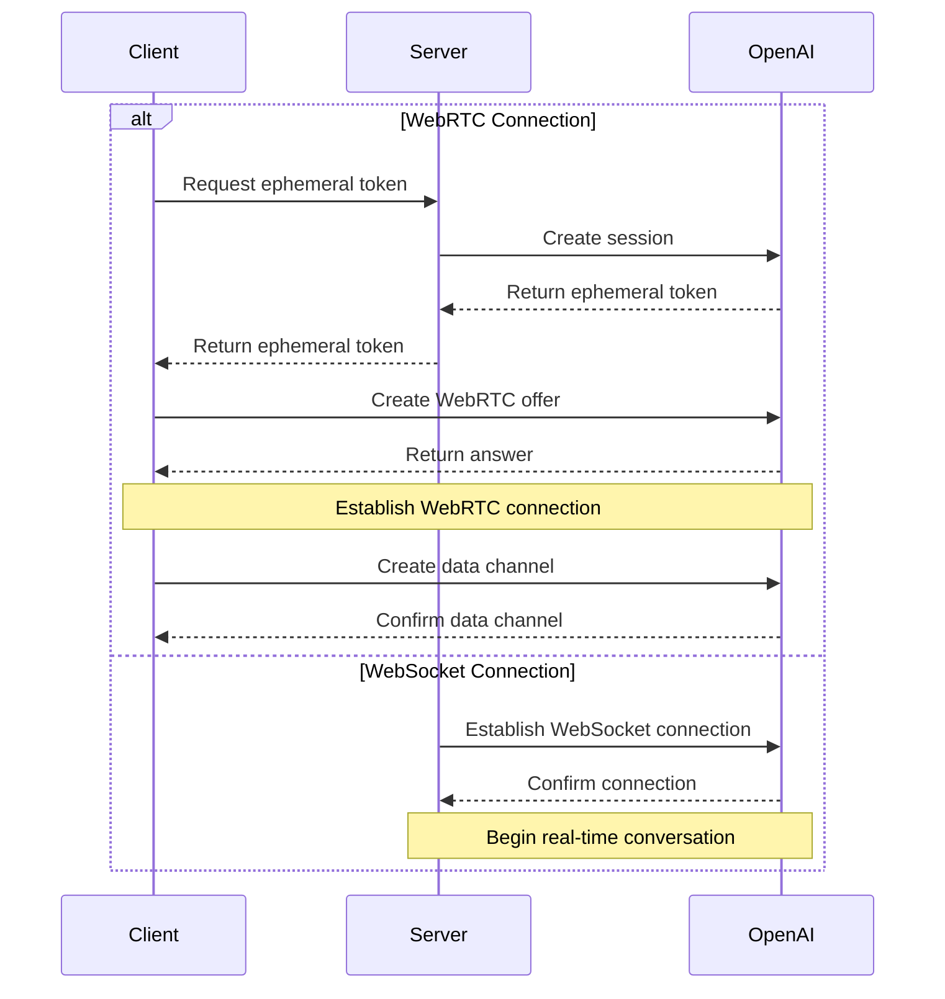

---
title: OpenAI Realtime API
---

{/* TODO: Convert to Callout - info: Official Documentation */} - [OpenAI Realtime WebRTC](https://platform.openai.com/docs/guides/realtime-webrtc) - [OpenAI Realtime WebSocket](https://platform.openai.com/docs/guides/realtime-websocket)

## 📝 Overview

### Introduction

OpenAI Realtime API provides two connection methods:

1. WebRTC - For real-time audio/video interaction in browsers and mobile clients

2. WebSocket - For server-to-server application integration

### Use Cases

- Real-time voice conversations
- Audio/video conferencing
- Real-time translation
- Speech transcription
- Real-time code generation
- Server-side real-time integration

### Key Features

- Bidirectional audio streaming
- Mixed text and audio conversations
- Function calling support
- Automatic Voice Activity Detection (VAD)
- Audio transcription capabilities
- WebSocket server-side integration

## 🔐 Authentication & Security

### Authentication Methods

1. Standard API Key (server-side only)
2. Ephemeral Token (client-side use)

### Ephemeral Token

- Validity: 1 minute
- Usage limit: Single connection
- Generation: Created via server-side API

```http
POST https://your-newapi-server-address/v1/realtime/sessions
Content-Type: application/json
Authorization: Bearer $NEW_API_KEY

\{
  "model": "gpt-4o-realtime-preview-2024-12-17",
  "voice": "verse"
}
```

### Security Recommendations

- Never expose standard API keys on the client side
- Use HTTPS/WSS for communication
- Implement appropriate access controls
- Monitor for unusual activity

## 🔌 Connection Establishment

### WebRTC Connection

- URL: `https://your-newapi-server-address/v1/realtime`
- Query parameters: `model`
- Headers:
  - `Authorization: Bearer EPHEMERAL_KEY`
  - `Content-Type: application/sdp`

### WebSocket Connection

- URL: `wss://your-newapi-server-address/v1/realtime`
- Query parameters: `model`
- Headers:
  - `Authorization: Bearer YOUR_API_KEY`
  - `OpenAI-Beta: realtime=v1`

### Connection Flow



### Data Channel

- Name: `oai-events`
- Purpose: Event transmission
- Format: JSON

### Audio Stream

- Input: `addTrack()`
- Output: `ontrack` event

## 💬 Conversation Interaction

### Conversation Modes

1. Text-only conversations
2. Voice conversations
3. Mixed conversations

### Session Management

- Create session
- Update session
- End session
- Session configuration

### Event Types

- Text events
- Audio events
- Function calls
- Status updates
- Error events

## ⚙️ Configuration Options

### Audio Configuration

- Input formats
  - `pcm16`
  - `g711_ulaw`
  - `g711_alaw`
- Output formats
  - `pcm16`
  - `g711_ulaw`
  - `g711_alaw`
- Voice types
  - `alloy`
  - `echo`
  - `shimmer`

### Model Configuration

- Temperature
- Maximum output length
- System prompt
- Tool configuration

### VAD Configuration

- Threshold
- Silence duration
- Prefix padding

## 💡 Request Examples

### WebRTC Connection ❌

#### Client Implementation (Browser)

```javascript
async function init() \{
  // Get ephemeral key from server - see server code below
  const tokenResponse = await fetch("/session");
  const data = await tokenResponse.json();
  const EPHEMERAL_KEY = data.client_secret.value;

  // Create peer connection
  const pc = new RTCPeerConnection();

  // Set up remote audio from model playback
  const audioEl = document.createElement("audio");
  audioEl.autoplay = true;
  pc.ontrack = e => audioEl.srcObject = e.streams[0];

  // Add local audio track from browser microphone input
  const ms = await navigator.mediaDevices.getUserMedia({
    audio: true
  });
  pc.addTrack(ms.getTracks()[0]);

  // Set up data channel for sending and receiving events
  const dc = pc.createDataChannel("oai-events");
  dc.addEventListener("message", (e) => \{
    // Receive real-time server events here!
    console.log(e);
  });

  // Start session using Session Description Protocol (SDP)
  const offer = await pc.createOffer();
  await pc.setLocalDescription(offer);

  const baseUrl = "https://your-newapi-server-address/v1/realtime";
  const model = "gpt-4o-realtime-preview-2024-12-17";
  const sdpResponse = await fetch(`${baseUrl}?model=${model}`, {
    method: "POST",
    body: offer.sdp,
    headers: {
      Authorization: `Bearer ${EPHEMERAL_KEY}`,
      "Content-Type": "application/sdp"
    },
  });

  const answer = {
    type: "answer",
    sdp: await sdpResponse.text(),
  };
  await pc.setRemoteDescription(answer);
}

init();
```

#### Server Implementation (Node.js)

```javascript
import express from "express";

const app = express();

// Create an endpoint for generating ephemeral tokens
// This endpoint works with the client code above
app.get("/session", async (req, res) => {
  const r = await fetch("https://your-newapi-server-address/v1/realtime/sessions", {
    method: "POST",
    headers: \{
      "Authorization": `Bearer ${process.env.NEW_API_KEY}`,
      "Content-Type": "application/json",
    },
    body: JSON.stringify({
      model: "gpt-4o-realtime-preview-2024-12-17",
      voice: "verse",
    }),
  });
  const data = await r.json();

  // Send the JSON received from OpenAI REST API back to client
  res.send(data);
});

app.listen(3000);
```

#### WebRTC Event Send/Receive Example

```javascript
// Create data channel from peer connection
const dc = pc.createDataChannel('oai-events');

// Listen for server events on data channel
// Event data needs to be parsed from JSON string
dc.addEventListener('message', (e) => {
  const realtimeEvent = JSON.parse(e.data);
  console.log(realtimeEvent);
});

// Send client event: serialize valid client events to
// JSON and send via data channel
const responseCreate = {
  type: 'response.create',
  response: {
    modalities: ['text'],
    instructions: 'Write a haiku about code',
  },
};
dc.send(JSON.stringify(responseCreate));
```

### WebSocket Connection ✅

#### Node.js (ws module)

```javascript
import WebSocket from "ws";

const url = "wss://your-newapi-server-address/v1/realtime?model=gpt-4o-realtime-preview-2024-12-17";
const ws = new WebSocket(url, {
  headers: \{
    "Authorization": "Bearer " + process.env.NEW_API_KEY,
    "OpenAI-Beta": "realtime=v1",
  },
});

ws.on("open", function open() {
  console.log("Connected to server.");
});

ws.on("message", function incoming(message) {
  console.log(JSON.parse(message.toString()));
});
```

#### Python (websocket-client)

```python
# Requires websocket-client library:
# pip install websocket-client

import os
import json
import websocket

NEW_API_KEY = os.environ.get("NEW_API_KEY")

url = "wss://your-newapi-server-address/v1/realtime?model=gpt-4o-realtime-preview-2024-12-17"
headers = [
    "Authorization: Bearer " + NEW_API_KEY,
    "OpenAI-Beta: realtime=v1"
]

def on_open(ws):
    print("Connected to server.");

def on_message(ws, message):
    data = json.loads(message)
    print("Received event:", json.dumps(data, indent=2))

ws = websocket.WebSocketApp(
    url,
    header=headers,
    on_open=on_open,
    on_message=on_message,
)

ws.run_forever()
```

#### Browser (Standard WebSocket)

```javascript
/*
Note: In browser and other client environments, we recommend using WebRTC.
But in Deno and Cloudflare Workers and other browser-like environments,
you can also use the standard WebSocket interface.
*/

const ws = new WebSocket(
  'wss://your-newapi-server-address/v1/realtime?model=gpt-4o-realtime-preview-2024-12-17',
  [
    'realtime',
    // Authentication
    'openai-insecure-api-key.' + NEW_API_KEY,
    // Optional
    'openai-organization.' + OPENAI_ORG_ID,
    'openai-project.' + OPENAI_PROJECT_ID,
    // Beta protocol, required
    'openai-beta.realtime-v1',
  ]
);

ws.on('open', function open() {
  console.log('Connected to server.');
});

ws.on('message', function incoming(message) {
  console.log(message.data);
});
```

#### Message Send/Receive Example

##### Node.js/Browser

```javascript
// Receive server events
ws.on("message", function incoming(message) \{
  // Need to parse message data from JSON
  const serverEvent = JSON.parse(message.data)
  console.log(serverEvent);
});

// Send events, create JSON data structure conforming to client event format
const event = {
  type: "response.create",
  response: {
    modalities: ["audio", "text"],
    instructions: "Give me a haiku about code.",
  }
};
ws.send(JSON.stringify(event));
```

##### Python

```python
# Send client events, serialize dictionary to JSON
def on_open(ws):
    print("Connected to server.");

    event = \{
        "type": "response.create",
        "response": \{
            "modalities": ["text"],
            "instructions": "Please assist the user."
        }
    }
    ws.send(json.dumps(event))

# Receive messages need to parse message payload from JSON
def on_message(ws, message):
    data = json.loads(message)
    print("Received event:", json.dumps(data, indent=2))
```

## ⚠️ Error Handling

### Common Errors

1. Connection errors
   - Network issues
   - Authentication failures
   - Configuration errors
2. Audio errors
   - Device permissions
   - Unsupported formats
   - Codec issues
3. Session errors
   - Token expiration
   - Session timeout
   - Concurrency limits

### Error Recovery

1. Automatic reconnection
2. Session recovery
3. Error retry
4. Graceful degradation

## 📝 Event Reference

### Common Request Headers

All events need to include the following request headers:

| Header        | Type   | Description          | Example Value       |
| ------------- | ------ | -------------------- | ------------------- |
| Authorization | String | Authentication token | Bearer $NEW_API_KEY |
| OpenAI-Beta   | String | API version          | realtime=v1         |

### Client Events

#### session.update

Update the default configuration for the session.

| Parameter                          | Type           | Required | Description                                  | Example Value/Optional Values         |
| ---------------------------------- | -------------- | -------- | -------------------------------------------- | ------------------------------------- |
| event_id                           | String         | No       | Client-generated event identifier            | event_123                             |
| type                               | String         | No       | Event type                                   | session.update                        |
| modalities                         | String array   | No       | Modality types the model can respond with    | ["text", "audio"]                     |
| instructions                       | String         | No       | System instructions prepended to model calls | "Your knowledge cutoff is 2023-10..." |
| voice                              | String         | No       | Voice type used by the model                 | alloy, echo, shimmer                  |
| input_audio_format                 | String         | No       | Input audio format                           | pcm16, g711_ulaw, g711_alaw           |
| output_audio_format                | String         | No       | Output audio format                          | pcm16, g711_ulaw, g711_alaw           |
| input_audio_transcription.model    | String         | No       | Model used for transcription                 | whisper-1                             |
| turn_detection.type                | String         | No       | Voice detection type                         | server_vad                            |
| turn_detection.threshold           | Number         | No       | VAD activation threshold (0.0-1.0)           | 0.8                                   |
| turn_detection.prefix_padding_ms   | Integer        | No       | Audio duration included before speech starts | 500                                   |
| turn_detection.silence_duration_ms | Integer        | No       | Silence duration to detect speech stop       | 1000                                  |
| tools                              | Array          | No       | List of tools available to the model         | []                                    |
| tool_choice                        | String         | No       | How the model chooses tools                  | auto/none/required                    |
| temperature                        | Number         | No       | Model sampling temperature                   | 0.8                                   |
| max_output_tokens                  | String/Integer | No       | Maximum tokens per response                  | "inf"/4096                            |

#### input_audio_buffer.append

Append audio data to the input audio buffer.

| Parameter | Type   | Required | Description                       | Example Value             |
| --------- | ------ | -------- | --------------------------------- | ------------------------- |
| event_id  | String | No       | Client-generated event identifier | event_456                 |
| type      | String | No       | Event type                        | input_audio_buffer.append |
| audio     | String | No       | Base64-encoded audio data         | Base64EncodedAudioData    |

#### input_audio_buffer.commit

Commit the audio data in the buffer as a user message.

| Parameter | Type   | Required | Description                       | Example Value             |
| --------- | ------ | -------- | --------------------------------- | ------------------------- |
| event_id  | String | No       | Client-generated event identifier | event_789                 |
| type      | String | No       | Event type                        | input_audio_buffer.commit |

#### input_audio_buffer.clear

Clear all audio data from the input audio buffer.

| Parameter | Type   | Required | Description                       | Example Value            |
| --------- | ------ | -------- | --------------------------------- | ------------------------ |
| event_id  | String | No       | Client-generated event identifier | event_012                |
| type      | String | No       | Event type                        | input_audio_buffer.clear |

#### conversation.item.create

Add a new conversation item to the conversation.

| Parameter        | Type   | Required | Description                                 | Example Value                              |
| ---------------- | ------ | -------- | ------------------------------------------- | ------------------------------------------ |
| event_id         | String | No       | Client-generated event identifier           | event_345                                  |
| type             | String | No       | Event type                                  | conversation.item.create                   |
| previous_item_id | String | No       | New item will be inserted after this ID     | null                                       |
| item.id          | String | No       | Unique identifier for the conversation item | msg_001                                    |
| item.type        | String | No       | Type of conversation item                   | message/function_call/function_call_output |
| item.status      | String | No       | Status of conversation item                 | completed/in_progress/incomplete           |
| item.role        | String | No       | Role of message sender                      | user/assistant/system                      |
| item.content     | Array  | No       | Message content                             | [text/audio/transcript]                    |
| item.call_id     | String | No       | ID of function call                         | call_001                                   |
| item.name        | String | No       | Name of called function                     | function_name                              |
| item.arguments   | String | No       | Arguments for function call                 | \{"param": "value"}                        |
| item.output      | String | No       | Output result of function call              | \{"result": "value"}                       |

#### conversation.item.truncate

Truncate audio content in assistant messages.

| Parameter     | Type    | Required | Description                              | Example Value              |
| ------------- | ------- | -------- | ---------------------------------------- | -------------------------- |
| event_id      | String  | No       | Client-generated event identifier        | event_678                  |
| type          | String  | No       | Event type                               | conversation.item.truncate |
| item_id       | String  | No       | ID of assistant message item to truncate | msg_002                    |
| content_index | Integer | No       | Index of content part to truncate        | 0                          |
| audio_end_ms  | Integer | No       | End time point for audio truncation      | 1500                       |

#### conversation.item.delete

Delete the specified conversation item from conversation history.

| Parameter | Type   | Required | Description                       | Example Value            |
| --------- | ------ | -------- | --------------------------------- | ------------------------ |
| event_id  | String | No       | Client-generated event identifier | event_901                |
| type      | String | No       | Event type                        | conversation.item.delete |
| item_id   | String | No       | ID of conversation item to delete | msg_003                  |

#### response.create

Trigger response generation.

| Parameter                    | Type           | Required | Description                          | Example Value                   |
| ---------------------------- | -------------- | -------- | ------------------------------------ | ------------------------------- |
| event_id                     | String         | No       | Client-generated event identifier    | event_234                       |
| type                         | String         | No       | Event type                           | response.create                 |
| response.modalities          | String array   | No       | Modality types for response          | ["text", "audio"]               |
| response.instructions        | String         | No       | Instructions for the model           | "Please assist the user."       |
| response.voice               | String         | No       | Voice type used by the model         | alloy/echo/shimmer              |
| response.output_audio_format | String         | No       | Output audio format                  | pcm16                           |
| response.tools               | Array          | No       | List of tools available to the model | ["type", "name", "description"] |
| response.tool_choice         | String         | No       | How the model chooses tools          | auto                            |
| response.temperature         | Number         | No       | Sampling temperature                 | 0.7                             |
| response.max_output_tokens   | Integer/String | No       | Maximum output tokens                | 150/"inf"                       |

#### response.cancel

Cancel ongoing response generation.

| Parameter | Type   | Required | Description                       | Example Value   |
| --------- | ------ | -------- | --------------------------------- | --------------- |
| event_id  | String | No       | Client-generated event identifier | event_567       |
| type      | String | No       | Event type                        | response.cancel |

### Server Events

#### error

Event returned when an error occurs.

| Parameter      | Type         | Required | Description                        | Example Value                      |
| -------------- | ------------ | -------- | ---------------------------------- | ---------------------------------- |
| event_id       | String array | No       | Unique identifier for server event | ["event_890"]                      |
| type           | String       | No       | Event type                         | error                              |
| error.type     | String       | No       | Error type                         | invalid_request_error/server_error |
| error.code     | String       | No       | Error code                         | invalid_event                      |
| error.message  | String       | No       | Human-readable error message       | "The 'type' field is missing."     |
| error.param    | String       | No       | Parameter related to error         | null                               |
| error.event_id | String       | No       | ID of related event                | event_567                          |

#### conversation.item.input_audio_transcription.completed

Returned when input audio transcription is enabled and transcription succeeds.

| Parameter     | Type    | Required | Description                            | Example Value                                         |
| ------------- | ------- | -------- | -------------------------------------- | ----------------------------------------------------- |
| event_id      | String  | No       | Unique identifier for server event     | event_2122                                            |
| type          | String  | No       | Event type                             | conversation.item.input_audio_transcription.completed |
| item_id       | String  | No       | ID of user message item                | msg_003                                               |
| content_index | Integer | No       | Index of content part containing audio | 0                                                     |
| transcript    | String  | No       | Transcribed text content               | "Hello, how are you?"                                 |

#### conversation.item.input_audio_transcription.failed

Returned when input audio transcription is configured but transcription request for user message fails.

| Parameter     | Type         | Required | Description                            | Example Value                                          |
| ------------- | ------------ | -------- | -------------------------------------- | ------------------------------------------------------ |
| event_id      | String       | No       | Unique identifier for server event     | event_2324                                             |
| type          | String array | No       | Event type                             | ["conversation.item.input_audio_transcription.failed"] |
| item_id       | String       | No       | ID of user message item                | msg_003                                                |
| content_index | Integer      | No       | Index of content part containing audio | 0                                                      |
| error.type    | String       | No       | Error type                             | transcription_error                                    |
| error.code    | String       | No       | Error code                             | audio_unintelligible                                   |
| error.message | String       | No       | Human-readable error message           | "The audio could not be transcribed."                  |
| error.param   | String       | No       | Parameter related to error             | null                                                   |

#### conversation.item.truncated

Returned when client truncates previous assistant audio message item.

| Parameter     | Type    | Required | Description                                        | Example Value               |
| ------------- | ------- | -------- | -------------------------------------------------- | --------------------------- |
| event_id      | String  | No       | Unique identifier for server event                 | event_2526                  |
| type          | String  | No       | Event type                                         | conversation.item.truncated |
| item_id       | String  | No       | ID of truncated assistant message item             | msg_004                     |
| content_index | Integer | No       | Index of truncated content part                    | 0                           |
| audio_end_ms  | Integer | No       | Time point when audio was truncated (milliseconds) | 1500                        |

#### conversation.item.deleted

Returned when an item in the conversation is deleted.

| Parameter | Type   | Required | Description                        | Example Value             |
| --------- | ------ | -------- | ---------------------------------- | ------------------------- |
| event_id  | String | No       | Unique identifier for server event | event_2728                |
| type      | String | No       | Event type                         | conversation.item.deleted |
| item_id   | String | No       | ID of deleted conversation item    | msg_005                   |

#### input_audio_buffer.committed

Returned when audio buffer data is committed.

| Parameter        | Type   | Required | Description                                          | Example Value                |
| ---------------- | ------ | -------- | ---------------------------------------------------- | ---------------------------- |
| event_id         | String | No       | Unique identifier for server event                   | event_1121                   |
| type             | String | No       | Event type                                           | input_audio_buffer.committed |
| previous_item_id | String | No       | New conversation item will be inserted after this ID | msg_001                      |
| item_id          | String | No       | ID of user message item to be created                | msg_002                      |

#### input_audio_buffer.cleared

Returned when client clears input audio buffer.

| Parameter | Type   | Required | Description                        | Example Value              |
| --------- | ------ | -------- | ---------------------------------- | -------------------------- |
| event_id  | String | No       | Unique identifier for server event | event_1314                 |
| type      | String | No       | Event type                         | input_audio_buffer.cleared |

#### input_audio_buffer.speech_started

In server voice detection mode, returned when voice input is detected.

| Parameter      | Type    | Required | Description                                            | Example Value                     |
| -------------- | ------- | -------- | ------------------------------------------------------ | --------------------------------- |
| event_id       | String  | No       | Unique identifier for server event                     | event_1516                        |
| type           | String  | No       | Event type                                             | input_audio_buffer.speech_started |
| audio_start_ms | Integer | No       | Milliseconds from session start to voice detection     | 1000                              |
| item_id        | String  | No       | ID of user message item to be created when voice stops | msg_003                           |

#### input_audio_buffer.speech_stopped

In server voice detection mode, returned when voice input stops.

| Parameter      | Type    | Required | Description                                             | Example Value                     |
| -------------- | ------- | -------- | ------------------------------------------------------- | --------------------------------- |
| event_id       | String  | No       | Unique identifier for server event                      | event_1718                        |
| type           | String  | No       | Event type                                              | input_audio_buffer.speech_stopped |
| audio_start_ms | Integer | No       | Milliseconds from session start to voice stop detection | 2000                              |
| item_id        | String  | No       | ID of user message item to be created                   | msg_003                           |

#### response.created

Returned when a new response is created.

| Parameter               | Type         | Required | Description                                | Example Value     |
| ----------------------- | ------------ | -------- | ------------------------------------------ | ----------------- |
| event_id                | String       | No       | Unique identifier for server event         | event_2930        |
| type                    | String       | No       | Event type                                 | response.created  |
| response.id             | String       | No       | Unique identifier for response             | resp_001          |
| response.object         | String       | No       | Object type                                | realtime.response |
| response.status         | String       | No       | Status of response                         | in_progress       |
| response.status_details | Object       | No       | Additional details about status            | null              |
| response.output         | String array | No       | List of output items generated by response | ["[]"]            |
| response.usage          | Object       | No       | Usage statistics for response              | null              |

#### response.done

Returned when response streaming is complete.

| Parameter                    | Type         | Required | Description                                | Example Value                         |
| ---------------------------- | ------------ | -------- | ------------------------------------------ | ------------------------------------- |
| event_id                     | String       | No       | Unique identifier for server event         | event_3132                            |
| type                         | String       | No       | Event type                                 | response.done                         |
| response.id                  | String       | No       | Unique identifier for response             | resp_001                              |
| response.object              | String       | No       | Object type                                | realtime.response                     |
| response.status              | String       | No       | Final status of response                   | completed/cancelled/failed/incomplete |
| response.status_details      | Object       | No       | Additional details about status            | null                                  |
| response.output              | String array | No       | List of output items generated by response | ["[...]"]                             |
| response.usage.total_tokens  | Integer      | No       | Total tokens                               | 50                                    |
| response.usage.input_tokens  | Integer      | No       | Input tokens                               | 20                                    |
| response.usage.output_tokens | Integer      | No       | Output tokens                              | 30                                    |

#### response.output_item.added

Returned when a new output item is created during response generation.

| Parameter    | Type   | Required | Description                               | Example Value                              |
| ------------ | ------ | -------- | ----------------------------------------- | ------------------------------------------ |
| event_id     | String | No       | Unique identifier for server event        | event_3334                                 |
| type         | String | No       | Event type                                | response.output_item.added                 |
| response_id  | String | No       | ID of response the output item belongs to | resp_001                                   |
| output_index | String | No       | Index of output item in response          | 0                                          |
| item.id      | String | No       | Unique identifier for output item         | msg_007                                    |
| item.object  | String | No       | Object type                               | realtime.item                              |
| item.type    | String | No       | Type of output item                       | message/function_call/function_call_output |
| item.status  | String | No       | Status of output item                     | in_progress/completed                      |
| item.role    | String | No       | Role associated with output item          | assistant                                  |
| item.content | Array  | No       | Content of output item                    | ["type", "text", "audio", "transcript"]    |

#### response.output_item.done

Returned when output item streaming is complete.

| Parameter    | Type   | Required | Description                               | Example Value                              |
| ------------ | ------ | -------- | ----------------------------------------- | ------------------------------------------ |
| event_id     | String | No       | Unique identifier for server event        | event_3536                                 |
| type         | String | No       | Event type                                | response.output_item.done                  |
| response_id  | String | No       | ID of response the output item belongs to | resp_001                                   |
| output_index | String | No       | Index of output item in response          | 0                                          |
| item.id      | String | No       | Unique identifier for output item         | msg_007                                    |
| item.object  | String | No       | Object type                               | realtime.item                              |
| item.type    | String | No       | Type of output item                       | message/function_call/function_call_output |
| item.status  | String | No       | Final status of output item               | completed/incomplete                       |
| item.role    | String | No       | Role associated with output item          | assistant                                  |
| item.content | Array  | No       | Content of output item                    | ["type", "text", "audio", "transcript"]    |

#### response.content_part.added

Returned when a new content part is added to assistant message item during response generation.

| Parameter       | Type    | Required | Description                                         | Example Value               |
| --------------- | ------- | -------- | --------------------------------------------------- | --------------------------- |
| event_id        | String  | No       | Unique identifier for server event                  | event_3738                  |
| type            | String  | No       | Event type                                          | response.content_part.added |
| response_id     | String  | No       | ID of response                                      | resp_001                    |
| item_id         | String  | No       | ID of message item to add content part to           | msg_007                     |
| output_index    | Integer | No       | Index of output item in response                    | 0                           |
| content_index   | Integer | No       | Index of content part in message item content array | 0                           |
| part.type       | String  | No       | Content type                                        | text/audio                  |
| part.text       | String  | No       | Text content                                        | "Hello"                     |
| part.audio      | String  | No       | Base64-encoded audio data                           | "base64_encoded_audio_data" |
| part.transcript | String  | No       | Transcribed text of audio                           | "Hello"                     |

#### response.content_part.done

Returned when content part in assistant message item streaming is complete.

| Parameter       | Type    | Required | Description                                         | Example Value               |
| --------------- | ------- | -------- | --------------------------------------------------- | --------------------------- |
| event_id        | String  | No       | Unique identifier for server event                  | event_3940                  |
| type            | String  | No       | Event type                                          | response.content_part.done  |
| response_id     | String  | No       | ID of response                                      | resp_001                    |
| item_id         | String  | No       | ID of message item to add content part to           | msg_007                     |
| output_index    | Integer | No       | Index of output item in response                    | 0                           |
| content_index   | Integer | No       | Index of content part in message item content array | 0                           |
| part.type       | String  | No       | Content type                                        | text/audio                  |
| part.text       | String  | No       | Text content                                        | "Hello"                     |
| part.audio      | String  | No       | Base64-encoded audio data                           | "base64_encoded_audio_data" |
| part.transcript | String  | No       | Transcribed text of audio                           | "Hello"                     |

#### response.text.delta

Returned when text value of "text" type content part is updated.

| Parameter     | Type    | Required | Description                                         | Example Value       |
| ------------- | ------- | -------- | --------------------------------------------------- | ------------------- |
| event_id      | String  | No       | Unique identifier for server event                  | event_4142          |
| type          | String  | No       | Event type                                          | response.text.delta |
| response_id   | String  | No       | ID of response                                      | resp_001            |
| item_id       | String  | No       | ID of message item                                  | msg_007             |
| output_index  | Integer | No       | Index of output item in response                    | 0                   |
| content_index | Integer | No       | Index of content part in message item content array | 0                   |
| delta         | String  | No       | Text delta update content                           | "Sure, I can h"     |

#### response.text.done

Returned when "text" type content part text streaming is complete.

| Parameter     | Type    | Required | Description                                         | Example Value                 |
| ------------- | ------- | -------- | --------------------------------------------------- | ----------------------------- |
| event_id      | String  | No       | Unique identifier for server event                  | event_4344                    |
| type          | String  | No       | Event type                                          | response.text.done            |
| response_id   | String  | No       | ID of response                                      | resp_001                      |
| item_id       | String  | No       | ID of message item                                  | msg_007                       |
| output_index  | Integer | No       | Index of output item in response                    | 0                             |
| content_index | Integer | No       | Index of content part in message item content array | 0                             |
| delta         | String  | No       | Final complete text content                         | "Sure, I can help with that." |

#### response.audio_transcript.delta

Returned when transcription content of model-generated audio output is updated.

| Parameter     | Type    | Required | Description                                         | Example Value                   |
| ------------- | ------- | -------- | --------------------------------------------------- | ------------------------------- |
| event_id      | String  | No       | Unique identifier for server event                  | event_4546                      |
| type          | String  | No       | Event type                                          | response.audio_transcript.delta |
| response_id   | String  | No       | ID of response                                      | resp_001                        |
| item_id       | String  | No       | ID of message item                                  | msg_008                         |
| output_index  | Integer | No       | Index of output item in response                    | 0                               |
| content_index | Integer | No       | Index of content part in message item content array | 0                               |
| delta         | String  | No       | Transcription text delta update content             | "Hello, how can I a"            |

#### response.audio_transcript.done

Returned when transcription of model-generated audio output streaming is complete.

| Parameter     | Type    | Required | Description                                         | Example Value                        |
| ------------- | ------- | -------- | --------------------------------------------------- | ------------------------------------ |
| event_id      | String  | No       | Unique identifier for server event                  | event_4748                           |
| type          | String  | No       | Event type                                          | response.audio_transcript.done       |
| response_id   | String  | No       | ID of response                                      | resp_001                             |
| item_id       | String  | No       | ID of message item                                  | msg_008                              |
| output_index  | Integer | No       | Index of output item in response                    | 0                                    |
| content_index | Integer | No       | Index of content part in message item content array | 0                                    |
| transcript    | String  | No       | Final complete transcribed text of audio            | "Hello, how can I assist you today?" |

#### response.audio.delta

Returned when model-generated audio content is updated.

| Parameter     | Type    | Required | Description                                         | Example Value             |
| ------------- | ------- | -------- | --------------------------------------------------- | ------------------------- |
| event_id      | String  | No       | Unique identifier for server event                  | event_4950                |
| type          | String  | No       | Event type                                          | response.audio.delta      |
| response_id   | String  | No       | ID of response                                      | resp_001                  |
| item_id       | String  | No       | ID of message item                                  | msg_008                   |
| output_index  | Integer | No       | Index of output item in response                    | 0                         |
| content_index | Integer | No       | Index of content part in message item content array | 0                         |
| delta         | String  | No       | Base64-encoded audio data delta                     | "Base64EncodedAudioDelta" |

#### response.audio.done

Returned when model-generated audio is complete.

| Parameter     | Type    | Required | Description                                         | Example Value       |
| ------------- | ------- | -------- | --------------------------------------------------- | ------------------- |
| event_id      | String  | No       | Unique identifier for server event                  | event_5152          |
| type          | String  | No       | Event type                                          | response.audio.done |
| response_id   | String  | No       | ID of response                                      | resp_001            |
| item_id       | String  | No       | ID of message item                                  | msg_008             |
| output_index  | Integer | No       | Index of output item in response                    | 0                   |
| content_index | Integer | No       | Index of content part in message item content array | 0                   |

### Function Calling

#### response.function_call_arguments.delta

Returned when model-generated function call arguments are updated.

| Parameter    | Type    | Required | Description                               | Example Value                          |
| ------------ | ------- | -------- | ----------------------------------------- | -------------------------------------- |
| event_id     | String  | No       | Unique identifier for server event        | event_5354                             |
| type         | String  | No       | Event type                                | response.function_call_arguments.delta |
| response_id  | String  | No       | ID of response                            | resp_002                               |
| item_id      | String  | No       | ID of message item                        | fc_001                                 |
| output_index | Integer | No       | Index of output item in response          | 0                                      |
| call_id      | String  | No       | ID of function call                       | call_001                               |
| delta        | String  | No       | JSON format function call arguments delta | "\{\"location\": \"San\""              |

#### response.function_call_arguments.done

Returned when model-generated function call arguments streaming is complete.

| Parameter    | Type    | Required | Description                                          | Example Value                         |
| ------------ | ------- | -------- | ---------------------------------------------------- | ------------------------------------- |
| event_id     | String  | No       | Unique identifier for server event                   | event_5556                            |
| type         | String  | No       | Event type                                           | response.function_call_arguments.done |
| response_id  | String  | No       | ID of response                                       | resp_002                              |
| item_id      | String  | No       | ID of message item                                   | fc_001                                |
| output_index | Integer | No       | Index of output item in response                     | 0                                     |
| call_id      | String  | No       | ID of function call                                  | call_001                              |
| arguments    | String  | No       | Final complete function call arguments (JSON format) | "\{\"location\": \"San Francisco\"}"  |

### Other Status Updates

#### rate_limits.updated

Triggered after each "response.done" event to indicate updated rate limits.

| Parameter   | Type         | Required | Description                        | Example Value                                                                      |
| ----------- | ------------ | -------- | ---------------------------------- | ---------------------------------------------------------------------------------- |
| event_id    | String       | No       | Unique identifier for server event | event_5758                                                                         |
| type        | String       | No       | Event type                         | rate_limits.updated                                                                |
| rate_limits | Object array | No       | List of rate limit information     | [\{"name": "requests_per_min", "limit": 60, "remaining": 45, "reset_seconds": 35}] |

#### conversation.created

Returned when conversation is created.

| Parameter    | Type   | Required | Description                        | Example Value                                          |
| ------------ | ------ | -------- | ---------------------------------- | ------------------------------------------------------ |
| event_id     | String | No       | Unique identifier for server event | event_9101                                             |
| type         | String | No       | Event type                         | conversation.created                                   |
| conversation | Object | No       | Conversation resource object       | \{"id": "conv_001", "object": "realtime.conversation"} |

#### conversation.item.created

Returned when conversation item is created.

| Parameter        | Type   | Required | Description                        | Example Value                                                                                                                                            |
| ---------------- | ------ | -------- | ---------------------------------- | -------------------------------------------------------------------------------------------------------------------------------------------------------- |
| event_id         | String | No       | Unique identifier for server event | event_1920                                                                                                                                               |
| type             | String | No       | Event type                         | conversation.item.created                                                                                                                                |
| previous_item_id | String | No       | ID of previous conversation item   | msg_002                                                                                                                                                  |
| item             | Object | No       | Conversation item object           | \{"id": "msg_003", "object": "realtime.item", "type": "message", "status": "completed", "role": "user", "content": [\{"type": "text", "text": "Hello"}]} |

#### session.created

Returned when session is created.

| Parameter | Type   | Required | Description                        | Example Value                                                                                        |
| --------- | ------ | -------- | ---------------------------------- | ---------------------------------------------------------------------------------------------------- |
| event_id  | String | No       | Unique identifier for server event | event_1234                                                                                           |
| type      | String | No       | Event type                         | session.created                                                                                      |
| session   | Object | No       | Session object                     | \{"id": "sess_001", "object": "realtime.session", "model": "gpt-4", "modalities": ["text", "audio"]} |

#### session.updated

Returned when session is updated.

| Parameter | Type   | Required | Description                        | Example Value                                                                                        |
| --------- | ------ | -------- | ---------------------------------- | ---------------------------------------------------------------------------------------------------- |
| event_id  | String | No       | Unique identifier for server event | event_5678                                                                                           |
| type      | String | No       | Event type                         | session.updated                                                                                      |
| session   | Object | No       | Updated session object             | \{"id": "sess_001", "object": "realtime.session", "model": "gpt-4", "modalities": ["text", "audio"]} |

### Rate Limit Event Parameter Table

| Parameter     | Type    | Required | Description                | Example Value    |
| ------------- | ------- | -------- | -------------------------- | ---------------- |
| name          | String  | Yes      | Limit name                 | requests_per_min |
| limit         | Integer | Yes      | Limit value                | 60               |
| remaining     | Integer | Yes      | Remaining available amount | 45               |
| reset_seconds | Integer | Yes      | Reset time (seconds)       | 35               |

### Function Call Parameter Table

| Parameter   | Type   | Required | Description                   | Example Value                             |
| ----------- | ------ | -------- | ----------------------------- | ----------------------------------------- |
| type        | String | Yes      | Function type                 | function                                  |
| name        | String | Yes      | Function name                 | get_weather                               |
| description | String | No       | Function description          | Get the current weather                   |
| parameters  | Object | Yes      | Function parameter definition | \{"type": "object", "properties": \{...}} |

### Audio Format Parameter Table

| Parameter       | Type    | Description        | Optional Values                  |
| --------------- | ------- | ------------------ | -------------------------------- |
| sample_rate     | Integer | Sample rate        | 8000, 16000, 24000, 44100, 48000 |
| channels        | Integer | Number of channels | 1 (mono), 2 (stereo)             |
| bits_per_sample | Integer | Bits per sample    | 16 (pcm16), 8 (g711)             |
| encoding        | String  | Encoding method    | pcm16, g711_ulaw, g711_alaw      |

### Voice Detection Parameter Table

| Parameter           | Type    | Description                               | Default Value | Range     |
| ------------------- | ------- | ----------------------------------------- | ------------- | --------- |
| threshold           | Float   | VAD activation threshold                  | 0.5           | 0.0-1.0   |
| prefix_padding_ms   | Integer | Voice prefix padding (milliseconds)       | 500           | 0-5000    |
| silence_duration_ms | Integer | Silence detection duration (milliseconds) | 1000          | 100-10000 |

### Tool Selection Parameter Table

| Parameter   | Type   | Description           | Optional Values                         |
| ----------- | ------ | --------------------- | --------------------------------------- |
| tool_choice | String | Tool selection method | auto, none, required                    |
| tools       | Array  | Available tools list  | [{type, name, description, parameters}] |

### Model Configuration Parameter Table

| Parameter         | Type           | Description           | Range/Optional Values | Default Value |
| ----------------- | -------------- | --------------------- | --------------------- | ------------- |
| temperature       | Float          | Sampling temperature  | 0.0-2.0               | 1.0           |
| max_output_tokens | Integer/String | Maximum output length | 1-4096/"inf"          | "inf"         |
| modalities        | String array   | Response modalities   | ["text", "audio"]     | ["text"]      |
| voice             | String         | Voice type            | alloy, echo, shimmer  | alloy         |

### Event Common Parameter Table

| Parameter | Type    | Required | Description                    | Example Value  |
| --------- | ------- | -------- | ------------------------------ | -------------- |
| event_id  | String  | Yes      | Unique identifier for event    | event_123      |
| type      | String  | Yes      | Event type                     | session.update |
| timestamp | Integer | No       | Event timestamp (milliseconds) | 1677649363000  |

### Session Status Parameter Table

| Parameter | Type   | Description       | Optional Values                                     |
| --------- | ------ | ----------------- | --------------------------------------------------- |
| status    | String | Session status    | active, ended, error                                |
| error     | Object | Error information | \{"type": "error_type", "message": "error message"} |
| metadata  | Object | Session metadata  | \{"client_id": "web", "session_type": "chat"}       |

### Conversation Item Status Parameter Table

| Parameter | Type   | Description              | Optional Values                              |
| --------- | ------ | ------------------------ | -------------------------------------------- |
| status    | String | Conversation item status | completed, in_progress, incomplete           |
| role      | String | Sender role              | user, assistant, system                      |
| type      | String | Conversation item type   | message, function_call, function_call_output |

### Content Type Parameter Table

| Parameter | Type   | Description     | Optional Values         |
| --------- | ------ | --------------- | ----------------------- |
| type      | String | Content type    | text, audio, transcript |
| format    | String | Content format  | plain, markdown, html   |
| encoding  | String | Encoding method | utf-8, base64           |

### Response Status Parameter Table

| Parameter      | Type   | Description      | Optional Values                                                |
| -------------- | ------ | ---------------- | -------------------------------------------------------------- |
| status         | String | Response status  | completed, cancelled, failed, incomplete                       |
| status_details | Object | Status details   | \{"reason": "user_cancelled"}                                  |
| usage          | Object | Usage statistics | \{"total_tokens": 50, "input_tokens": 20, "output_tokens": 30} |

### Audio Transcription Parameter Table

| Parameter | Type    | Description                      | Example Value                  |
| --------- | ------- | -------------------------------- | ------------------------------ |
| enabled   | Boolean | Whether transcription is enabled | true                           |
| model     | String  | Transcription model              | whisper-1                      |
| language  | String  | Transcription language           | en, zh, auto                   |
| prompt    | String  | Transcription prompt             | "Transcript of a conversation" |

### Audio Stream Parameter Table

| Parameter   | Type    | Description              | Optional Values     |
| ----------- | ------- | ------------------------ | ------------------- |
| chunk_size  | Integer | Audio chunk size (bytes) | 1024, 2048, 4096    |
| latency     | String  | Latency mode             | low, balanced, high |
| compression | String  | Compression method       | none, opus, mp3     |

### WebRTC Configuration Parameter Table

| Parameter          | Type    | Description                       | Default Value                               |
| ------------------ | ------- | --------------------------------- | ------------------------------------------- |
| ice_servers        | Array   | ICE server list                   | [\{"urls": "stun:stun.l.google.com:19302"}] |
| audio_constraints  | Object  | Audio constraints                 | \{"echoCancellation": true}                 |
| connection_timeout | Integer | Connection timeout (milliseconds) | 30000                                       |
