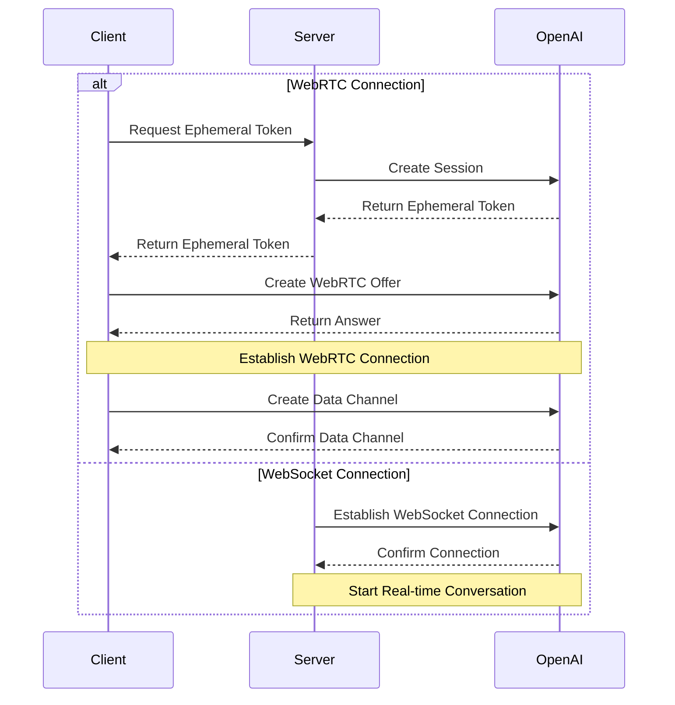

<Callout type="info" title="Official Documentation">
  - [OpenAI Realtime
  WebRTC](https://platform.openai.com/docs/guides/realtime-webrtc) - [OpenAI
  Realtime
  WebSocket](https://platform.openai.com/docs/guides/realtime-websocket)
</Callout>

## 📝 Overview

### Introduction

The OpenAI Realtime API offers two connection methods:

1.  WebRTC - For real-time audio and video interaction in browsers and mobile clients
2.  WebSocket - For server-to-server application integration

### Use Cases

- Real-time Voice Conversation
- Audio/Video Conferencing
- Real-time Translation
- Speech Transcription
- Real-time Code Generation
- Server-side Real-time Integration

### Key Features

- Bidirectional Audio Streaming
- Mixed Text and Audio Conversation
- Function Calling Support
- Automatic Voice Activity Detection (VAD)
- Audio Transcription Capability
- WebSocket Server-side Integration

## 🔐 Authentication and Security

### Authentication Methods

1.  Standard API Key (server-side only)
2.  Ephemeral Token (client-side use)

### Ephemeral Token

- Validity: 1 minute
- Usage Limit: Single connection
- Acquisition Method: Created via server-side API

```http
POST https://你的newapi服务器地址/v1/realtime/sessions
Content-Type: application/json
Authorization: Bearer $NEW_API_KEY

{
  "model": "gpt-4o-realtime-preview-2024-12-17",
  "voice": "verse"
}
```

### Security Recommendations

- Never expose standard API keys on the client-side
- Use HTTPS/WSS for communication
- Implement appropriate access control
- Monitor for unusual activity

## 🔌 Connection Establishment

### WebRTC Connection

- URL: `https://你的newapi服务器地址/v1/realtime`
- Query Parameter: `model`
- Request Headers:
  - `Authorization: Bearer EPHEMERAL_KEY`
  - `Content-Type: application/sdp`

### WebSocket Connection

- URL: `wss://你的newapi服务器地址/v1/realtime`
- Query Parameter: `model`
- Request Headers:
  - `Authorization: Bearer YOUR_API_KEY`
  - `OpenAI-Beta: realtime=v1`

### Connection Flow



### Data Channel

- Name: `oai-events`
- Purpose: Event Transmission
- Format: JSON

### Audio Stream

- Input: `addTrack()`
- Output: `ontrack` event

## 💬 Conversation Interaction

### Conversation Modes

1.  Pure Text Conversation
2.  Voice Conversation
3.  Mixed Conversation

### Session Management

- Create Session
- Update Session
- End Session
- Session Configuration

### Event Types

- Text Events
- Audio Events
- Function Calls
- Status Updates
- Error Events

## ⚙️ Configuration Options

### Audio Configuration

- Input Formats
  - `pcm16`
  - `g711_ulaw`
  - `g711_alaw`
- Output Formats
  - `pcm16`
  - `g711_ulaw`
  - `g711_alaw`
- Voice Types
  - `alloy`
  - `echo`
  - `shimmer`

### Model Configuration

- Temperature
- Max Output Length
- System Prompt
- Tool Configuration

### VAD Configuration

- Threshold
- Silence Duration
- Prefix Padding

## 💡 Request Examples

### WebRTC Connection ❌

#### Client-side Implementation (Browser)

```javascript
async function init() {
  // Get ephemeral key from server - see server code below
  const tokenResponse = await fetch('/session');
  const data = await tokenResponse.json();
  const EPHEMERAL_KEY = data.client_secret.value;

  // Create peer connection
  const pc = new RTCPeerConnection();

  // Set up remote audio playback from the model
  const audioEl = document.createElement('audio');
  audioEl.autoplay = true;
  pc.ontrack = (e) => (audioEl.srcObject = e.streams[0]);

  // Add local audio track from browser microphone input
  const ms = await navigator.mediaDevices.getUserMedia({
    audio: true,
  });
  pc.addTrack(ms.getTracks()[0]);

  // Set up data channel for sending and receiving events
  const dc = pc.createDataChannel('oai-events');
  dc.addEventListener('message', (e) => {
    // Real-time server events are received here!
    console.log(e);
  });

  // Initiate session using Session Description Protocol (SDP)
  const offer = await pc.createOffer();
  await pc.setLocalDescription(offer);

  const baseUrl = 'https://你的newapi服务器地址/v1/realtime';
  const model = 'gpt-4o-realtime-preview-2024-12-17';
  const sdpResponse = await fetch(`${baseUrl}?model=${model}`, {
    method: 'POST',
    body: offer.sdp,
    headers: {
      Authorization: `Bearer ${EPHEMERAL_KEY}`,
      'Content-Type': 'application/sdp',
    },
  });

  const answer = {
    type: 'answer',
    sdp: await sdpResponse.text(),
  };
  await pc.setRemoteDescription(answer);
}

init();
```

#### Server-side Implementation (Node.js)

```javascript
import express from 'express';

const app = express();

// Create an endpoint to generate an ephemeral token
// This endpoint works with the client code above
app.get('/session', async (req, res) => {
  const r = await fetch('https://你的newapi服务器地址/v1/realtime/sessions', {
    method: 'POST',
    headers: {
      Authorization: `Bearer ${process.env.NEW_API_KEY}`,
      'Content-Type': 'application/json',
    },
    body: JSON.stringify({
      model: 'gpt-4o-realtime-preview-2024-12-17',
      voice: 'verse',
    }),
  });
  const data = await r.json();

  // Send the JSON received from the OpenAI REST API back to the client
  res.send(data);
});

app.listen(3000);
```

#### WebRTC Event Sending and Receiving Example

```javascript
// Create data channel from peer connection
const dc = pc.createDataChannel('oai-events');

// Listen for server events on the data channel
// Event data needs to be parsed from a JSON string
dc.addEventListener('message', (e) => {
  const realtimeEvent = JSON.parse(e.data);
  console.log(realtimeEvent);
});

// Send client event: serialize a valid client event into
// JSON and send it via the data channel
const responseCreate = {
  type: 'response.create',
  response: {
    modalities: ['text'],
    instructions: 'Write a haiku about code',
  },
};
dc.send(JSON.stringify(responseCreate));
```

### WebSocket Connection ✅

#### Node.js (ws module)

```javascript
import WebSocket from 'ws';

const url =
  'wss://你的newapi服务器地址/v1/realtime?model=gpt-4o-realtime-preview-2024-12-17';
const ws = new WebSocket(url, {
  headers: {
    Authorization: 'Bearer ' + process.env.NEW_API_KEY,
    'OpenAI-Beta': 'realtime=v1',
  },
});

ws.on('open', function open() {
  console.log('Connected to server.');
});

ws.on('message', function incoming(message) {
  console.log(JSON.parse(message.toString()));
});
```

#### Python (websocket-client)

```python
# The websocket-client library needs to be installed:
# pip install websocket-client

import os
import json
import websocket

NEW_API_KEY = os.environ.get("NEW_API_KEY")

url = "wss://你的newapi服务器地址/v1/realtime?model=gpt-4o-realtime-preview-2024-12-17"
headers = [
    "Authorization: Bearer " + NEW_API_KEY,
    "OpenAI-Beta: realtime=v1"
]

def on_open(ws):
    print("Connected to server.")

def on_message(ws, message):
    data = json.loads(message)
    print("Received event:", json.dumps(data, indent=2))

ws = websocket.WebSocketApp(
    url,
    header=headers,
    on_open=on_open,
    on_message=on_message,
)

ws.run_forever()
```

#### Browser (Standard WebSocket)

```javascript
/*
Note: In client environments such as browsers, we recommend using WebRTC.
However, in browser-like environments such as Deno and Cloudflare Workers,
the standard WebSocket interface can also be used.
*/

const ws = new WebSocket(
  'wss://你的newapi服务器地址/v1/realtime?model=gpt-4o-realtime-preview-2024-12-17',
  [
    'realtime',
    // Authentication
    'openai-insecure-api-key.' + NEW_API_KEY,
    // Optional
    'openai-organization.' + OPENAI_ORG_ID,
    'openai-project.' + OPENAI_PROJECT_ID,
    // Beta protocol, required
    'openai-beta.realtime-v1',
  ]
);

ws.on('open', function open() {
  console.log('Connected to server.');
});

ws.on('message', function incoming(message) {
  console.log(message.data);
});
```

#### Message Sending and Receiving Example

##### Node.js/Browser

```javascript
// Receive server events
ws.on('message', function incoming(message) {
  // Message data needs to be parsed from JSON
  const serverEvent = JSON.parse(message.data);
  console.log(serverEvent);
});

// Send event, create a JSON data structure conforming to client event format
const event = {
  type: 'response.create',
  response: {
    modalities: ['audio', 'text'],
    instructions: 'Give me a haiku about code.',
  },
};
ws.send(JSON.stringify(event));
```

##### Python

```python
# Send client event, serialize dictionary to JSON
def on_open(ws):
    print("Connected to server.")

    event = {
        "type": "response.create",
        "response": {
            "modalities": ["text"],
            "instructions": "Please assist the user."
        }
    }
    ws.send(json.dumps(event))

# Receiving messages requires parsing the message payload from JSON
def on_message(ws, message):
    data = json.loads(message)
    print("Received event:", json.dumps(data, indent=2))
```

## ⚠️ Error Handling

### Common Errors

1.  Connection Errors
    - Network issues
    - Authentication failure
    - Configuration errors
2.  Audio Errors
    - Device permissions
    - Unsupported format
    - Codec issues
3.  Session Errors
    - Token expiration
    - Session timeout
    - Concurrency limits

### Error Recovery

1.  Automatic Reconnection
2.  Session Recovery
3.  Error Retries
4.  Graceful Degradation

## 📝 Event Reference

### Common Request Headers

All events must include the following request headers:

| Header        | Type   | Description          | Example Value       |
| ------------- | ------ | -------------------- | ------------------- |
| Authorization | String | Authentication Token | Bearer $NEW_API_KEY |
| OpenAI-Beta   | String | API Version          | realtime=v1         |

### Client Events

#### session.update

Updates the default configuration of a session.

| Parameter                          | Type             | Required | Description                                     | Example Value/Options                 |
| :--------------------------------- | :--------------- | :------- | :---------------------------------------------- | :------------------------------------ |
| event_id                           | String           | No       | Client-generated event identifier               | event_123                             |
| type                               | String           | No       | Event type                                      | session.update                        |
| modalities                         | Array of Strings | No       | Modalities the model can respond with           | `["text", "audio"]`                   |
| instructions                       | String           | No       | System instructions prepended to the model call | "Your knowledge cutoff is 2023-10..." |
| voice                              | String           | No       | Voice type used by the model                    | alloy, echo, shimmer                  |
| input_audio_format                 | String           | No       | Input audio format                              | pcm16, g711_ulaw, g711_alaw           |
| output_audio_format                | String           | No       | Output audio format                             | pcm16, g711_ulaw, g711_alaw           |
| input_audio_transcription.model    | String           | No       | Model used for transcription                    | whisper-1                             |
| turn_detection.type                | String           | No       | Voice detection type                            | server_vad                            |
| turn_detection.threshold           | Number           | No       | VAD activation threshold (0.0-1.0)              | 0.8                                   |
| turn_detection.prefix_padding_ms   | Integer          | No       | Audio duration to include before speech starts  | 500                                   |
| turn_detection.silence_duration_ms | Integer          | No       | Silence duration to detect speech stop          | 1000                                  |
| tools                              | Array            | No       | List of tools available to the model            | `[]`                                  |
| tool_choice                        | String           | No       | Method for the model to choose tools            | auto/none/required                    |
| temperature                        | Number           | No       | Model sampling temperature                      | 0.8                                   |
| max_output_tokens                  | String/Integer   | No       | Maximum number of tokens for a single response  | "inf"/4096                            |

#### input_audio_buffer.append

Appends audio data to the input audio buffer.

| Parameter | Type   | Required | Description                       | Example Value             |
| :-------- | :----- | :------- | :-------------------------------- | :------------------------ |
| event_id  | String | No       | Client-generated event identifier | event_456                 |
| type      | String | No       | Event type                        | input_audio_buffer.append |
| audio     | String | No       | Base64 encoded audio data         | Base64EncodedAudioData    |

#### input_audio_buffer.commit

Commits the audio data in the buffer as a user message.

| Parameter | Type   | Required | Description                       | Example Value             |
| :-------- | :----- | :------- | :-------------------------------- | :------------------------ |
| event_id  | String | No       | Client-generated event identifier | event_789                 |
| type      | String | No       | Event type                        | input_audio_buffer.commit |

#### input_audio_buffer.clear

Clears all audio data from the input audio buffer.

| Parameter | Type   | Required | Description                       | Example Value            |
| :-------- | :----- | :------- | :-------------------------------- | :----------------------- |
| event_id  | String | No       | Client-generated event identifier | event_012                |
| type      | String | No       | Event type                        | input_audio_buffer.clear |

#### conversation.item.create

Adds a new conversation item to the conversation.

| Parameter        | Type   | Required | Description                                              | Example Value                              |
| :--------------- | :----- | :------- | :------------------------------------------------------- | :----------------------------------------- |
| event_id         | String | No       | Client-generated event identifier                        | event_345                                  |
| type             | String | No       | Event type                                               | conversation.item.create                   |
| previous_item_id | String | No       | The new conversation item will be inserted after this ID | null                                       |
| item.id          | String | No       | Unique identifier for the conversation item              | msg_001                                    |
| item.type        | String | No       | Conversation item type                                   | message/function_call/function_call_output |
| item.status      | String | No       | Conversation item status                                 | completed/in_progress/incomplete           |
| item.role        | String | No       | Role of the message sender                               | user/assistant/system                      |
| item.content     | Array  | No       | Message content                                          | `[text/audio/transcript]`                  |
| item.call_id     | String | No       | ID of the function call                                  | call_001                                   |
| item.name        | String | No       | Name of the function being called                        | function_name                              |
| item.arguments   | String | No       | Arguments for the function call                          | `{"param": "value"}`                       |
| item.output      | String | No       | Output result of the function call                       | `{"result": "value"}`                      |

#### conversation.item.truncate

Truncates audio content in an assistant message.

| Parameter     | Type    | Required | Description                                  | Example Value              |
| :------------ | :------ | :------- | :------------------------------------------- | :------------------------- |
| event_id      | String  | No       | Client-generated event identifier            | event_678                  |
| type          | String  | No       | Event type                                   | conversation.item.truncate |
| item_id       | String  | No       | ID of the assistant message item to truncate | msg_002                    |
| content_index | Integer | No       | Index of the content part to truncate        | 0                          |
| audio_end_ms  | Integer | No       | End time point for audio truncation          | 1500                       |

#### conversation.item.delete

Deletes the specified conversation item from the conversation history.

| Parameter | Type   | Required | Description                           | Example Value            |
| :-------- | :----- | :------- | :------------------------------------ | :----------------------- |
| event_id  | String | No       | Client-generated event identifier     | event_901                |
| type      | String | No       | Event type                            | conversation.item.delete |
| item_id   | String | No       | ID of the conversation item to delete | msg_003                  |

#### response.create

Triggers response generation.

| Parameter                    | Type             | Required | Description                          | Example Value                     |
| :--------------------------- | :--------------- | :------- | :----------------------------------- | :-------------------------------- |
| event_id                     | String           | No       | Client-generated event identifier    | event_234                         |
| type                         | String           | No       | Event type                           | response.create                   |
| response.modalities          | Array of Strings | No       | Modalities for the response          | `["text", "audio"]`               |
| response.instructions        | String           | No       | Instructions for the model           | "Please assist the user."         |
| response.voice               | String           | No       | Voice type used by the model         | alloy/echo/shimmer                |
| response.output_audio_format | String           | No       | Output audio format                  | pcm16                             |
| response.tools               | Array            | No       | List of tools available to the model | `["type", "name", "description"]` |
| response.tool_choice         | String           | No       | Method for the model to choose tools | auto                              |
| response.temperature         | Number           | No       | Sampling temperature                 | 0.7                               |
| response.max_output_tokens   | Integer/String   | No       | Maximum number of output tokens      | 150/"inf"                         |

#### response.cancel

Cancels ongoing response generation.

| Parameter | Type   | Required | Description                       | Example Value   |
| :-------- | :----- | :------- | :-------------------------------- | :-------------- |
| event_id  | String | No       | Client-generated event identifier | event_567       |
| type      | String | No       | Event type                        | response.cancel |

### Server Events

#### error

Event returned when an error occurs.

| Parameter      | Type             | Required | Description                            | Example Value                      |
| :------------- | :--------------- | :------- | :------------------------------------- | :--------------------------------- |
| event_id       | Array of Strings | No       | Unique identifier for the server event | `["event_890"]`                    |
| type           | String           | No       | Event type                             | error                              |
| error.type     | String           | No       | Error type                             | invalid_request_error/server_error |
| error.code     | String           | No       | Error code                             | invalid_event                      |
| error.message  | String           | No       | Human-readable error message           | "The 'type' field is missing."     |
| error.param    | String           | No       | Parameter related to the error         | null                               |
| error.event_id | String           | No       | ID of the related event                | event_567                          |

#### conversation.item.input_audio_transcription.completed

This event is returned when input audio transcription is enabled and transcription is successful.

| Parameter     | Type    | Required | Description                                | Example Value                                         |
| :------------ | :------ | :------- | :----------------------------------------- | :---------------------------------------------------- |
| event_id      | String  | No       | Unique identifier for the server event     | event_2122                                            |
| type          | String  | No       | Event type                                 | conversation.item.input_audio_transcription.completed |
| item_id       | String  | No       | ID of the user message item                | msg_003                                               |
| content_index | Integer | No       | Index of the content part containing audio | 0                                                     |
| transcript    | String  | No       | Transcribed text content                   | "Hello, how are you?"                                 |

#### conversation.item.input_audio_transcription.failed

This event is returned when input audio transcription is configured, but the transcription request for a user message fails.

| Parameter     | Type             | Required | Description                                | Example Value                                            |
| :------------ | :--------------- | :------- | :----------------------------------------- | :------------------------------------------------------- |
| event_id      | Array of Strings | No       | Unique identifier for the server event     | `["conversation.item.input_audio_transcription.failed"]` |
| type          | Array of Strings | No       | Event type                                 | `["conversation.item.input_audio_transcription.failed"]` |
| item_id       | String           | No       | ID of the user message item                | msg_003                                                  |
| content_index | Integer          | No       | Index of the content part containing audio | 0                                                        |
| error.type    | String           | No       | Error type                                 | transcription_error                                      |
| error.code    | String           | No       | Error code                                 | audio_unintelligible                                     |
| error.message | String           | No       | Human-readable error message               | "The audio could not be transcribed."                    |
| error.param   | String           | No       | Parameter related to the error             | null                                                     |

#### conversation.item.truncated

This event is returned when the client truncates a previous assistant audio message item.

| Parameter     | Type    | Required | Description                                                | Example Value               |
| :------------ | :------ | :------- | :--------------------------------------------------------- | :-------------------------- |
| event_id      | String  | No       | Unique identifier for the server event                     | event_2526                  |
| type          | String  | No       | Event type                                                 | conversation.item.truncated |
| item_id       | String  | No       | ID of the truncated assistant message item                 | msg_004                     |
| content_index | Integer | No       | Index of the truncated content part                        | 0                           |
| audio_end_ms  | Integer | No       | Time point (in milliseconds) where the audio was truncated | 1500                        |

#### conversation.item.deleted

This event is returned when an item in the conversation is deleted.

| Parameter | Type   | Required | Description                            | Example Value             |
| :-------- | :----- | :------- | :------------------------------------- | :------------------------ |
| event_id  | String | No       | Unique identifier for the server event | event_2728                |
| type      | String | No       | Event type                             | conversation.item.deleted |
| item_id   | String | No       | ID of the deleted conversation item    | msg_005                   |

#### input_audio_buffer.committed

This event is returned when data in the audio buffer is committed.

| Parameter        | Type   | Required | Description                                                                                     | Example Value                |
| :--------------- | :----- | :------- | :---------------------------------------------------------------------------------------------- | :--------------------------- |
| event_id         | String | No       | Unique identifier for the server event                                                          | event_1121                   |
| type             | String | No       | Event type                                                                                      | input_audio_buffer.committed |
| previous_item_id | String | No       | The new conversation item will be inserted after the conversation item corresponding to this ID | msg_001                      |
| item_id          | String | No       | ID of the user message item to be created                                                       | msg_002                      |

#### input_audio_buffer.cleared

This event is returned when the client clears the input audio buffer.

| Parameter | Type   | Required | Description                            | Example Value              |
| :-------- | :----- | :------- | :------------------------------------- | :------------------------- |
| event_id  | String | No       | Unique identifier for the server event | event_1314                 |
| type      | String | No       | Event type                             | input_audio_buffer.cleared |

#### input_audio_buffer.speech_started

In server-side voice activity detection mode, this event is returned when speech input is detected.

| Parameter      | Type    | Required | Description                                                         | Example Value                     |
| :------------- | :------ | :------- | :------------------------------------------------------------------ | :-------------------------------- |
| event_id       | String  | No       | Unique identifier for the server event                              | event_1516                        |
| type           | String  | No       | Event type                                                          | input_audio_buffer.speech_started |
| audio_start_ms | Integer | No       | Milliseconds from the start of the session until speech is detected | 1000                              |
| item_id        | String  | No       | ID of the user message item that will be created when speech stops  | msg_003                           |

#### input_audio_buffer.speech_stopped

In server-side voice activity detection mode, this event is returned when speech input stops.

| Parameter      | Type    | Required | Description                                                              | Example Value                     |
| :------------- | :------ | :------- | :----------------------------------------------------------------------- | :-------------------------------- |
| event_id       | String  | No       | Unique identifier for the server event                                   | event_1718                        |
| type           | String  | No       | Event type                                                               | input_audio_buffer.speech_stopped |
| audio_start_ms | Integer | No       | Milliseconds from the start of the session until speech stop is detected | 2000                              |
| item_id        | String  | No       | ID of the user message item to be created                                | msg_003                           |

#### response.created

This event is returned when a new response is created.

| Parameter               | Type             | Required | Description                                    | Example Value     |
| :---------------------- | :--------------- | :------- | :--------------------------------------------- | :---------------- |
| event_id                | String           | No       | Unique identifier for the server event         | event_2930        |
| type                    | String           | No       | Event type                                     | response.created  |
| response.id             | String           | No       | Unique identifier for the response             | resp_001          |
| response.object         | String           | No       | Object type                                    | realtime.response |
| response.status         | String           | No       | Status of the response                         | in_progress       |
| response.status_details | Object           | No       | Additional details about the status            | null              |
| response.output         | Array of Strings | No       | List of output items generated by the response | `["[]"]`          |
| response.usage          | Object           | No       | Usage statistics for the response              | null              |

#### response.done

This event is returned when the response completes streaming.

| Parameter                    | Type             | Required | Description                                    | Example Value                         |
| :--------------------------- | :--------------- | :------- | :--------------------------------------------- | :------------------------------------ |
| event_id                     | String           | No       | Unique identifier for the server event         | event_3132                            |
| type                         | String           | No       | Event type                                     | response.done                         |
| response.id                  | String           | No       | Unique identifier for the response             | resp_001                              |
| response.object              | String           | No       | Object type                                    | realtime.response                     |
| response.status              | String           | No       | Final status of the response                   | completed/cancelled/failed/incomplete |
| response.status_details      | Object           | No       | Additional details about the status            | null                                  |
| response.output              | Array of Strings | No       | List of output items generated by the response | `["[...]"]`                           |
| response.usage.total_tokens  | Integer          | No       | Total token count                              | 50                                    |
| response.usage.input_tokens  | Integer          | No       | Input token count                              | 20                                    |
| response.usage.output_tokens | Integer          | No       | Output token count                             | 30                                    |

#### response.output_item.added

This event is returned when a new output item is created during response generation.

| Parameter    | Type   | Required | Description                                         | Example Value                              |
| :----------- | :----- | :------- | :-------------------------------------------------- | :----------------------------------------- |
| event_id     | String | No       | Unique identifier for the server event              | event_3334                                 |
| type         | String | No       | Event type                                          | response.output_item.added                 |
| response_id  | String | No       | ID of the response to which the output item belongs | resp_001                                   |
| output_index | String | No       | Index of the output item in the response            | 0                                          |
| item.id      | String | No       | Unique identifier for the output item               | msg_007                                    |
| item.object  | String | No       | Object type                                         | realtime.item                              |
| item.type    | String | No       | Output item type                                    | message/function_call/function_call_output |
| item.status  | String | No       | Output item status                                  | in_progress/completed                      |
| item.role    | String | No       | Role associated with the output item                | assistant                                  |
| item.content | Array  | No       | Content of the output item                          | `["type", "text", "audio", "transcript"]`  |

#### response.output_item.done

This event is returned when an output item completes streaming.

| Parameter    | Type   | Required | Description                                         | Example Value                              |
| :----------- | :----- | :------- | :-------------------------------------------------- | :----------------------------------------- |
| event_id     | String | No       | Unique identifier for the server event              | event_3536                                 |
| type         | String | No       | Event type                                          | response.output_item.done                  |
| response_id  | String | No       | ID of the response to which the output item belongs | resp_001                                   |
| output_index | String | No       | Index of the output item in the response            | 0                                          |
| item.id      | String | No       | Unique identifier for the output item               | msg_007                                    |
| item.object  | String | No       | Object type                                         | realtime.item                              |
| item.type    | String | No       | Output item type                                    | message/function_call/function_call_output |
| item.status  | String | No       | Final status of the output item                     | completed/incomplete                       |
| item.role    | String | No       | Role associated with the output item                | assistant                                  |
| item.content | Array  | No       | Content of the output item                          | `["type", "text", "audio", "transcript"]`  |

#### response.content_part.added

This event is returned when a new content part is added to an assistant message item during response generation.

| Parameter       | Type    | Required | Description                                                   | Example Value               |
| :-------------- | :------ | :------- | :------------------------------------------------------------ | :-------------------------- |
| event_id        | String  | No       | Unique identifier for the server event                        | event_3738                  |
| type            | String  | No       | Event type                                                    | response.content_part.added |
| response_id     | String  | No       | ID of the response                                            | resp_001                    |
| item_id         | String  | No       | ID of the message item to which the content part is added     | msg_007                     |
| output_index    | Integer | No       | Index of the output item in the response                      | 0                           |
| content_index   | Integer | No       | Index of the content part in the message item's content array | 0                           |
| part.type       | String  | No       | Content type                                                  | text/audio                  |
| part.text       | String  | No       | Text content                                                  | "Hello"                     |
| part.audio      | String  | No       | Base64 encoded audio data                                     | "base64_encoded_audio_data" |
| part.transcript | String  | No       | Transcribed text of the audio                                 | "Hello"                     |

#### response.content_part.done

This event is returned when a content part in an assistant message item completes streaming.

| Parameter       | Type    | Required | Description                                                   | Example Value               |
| :-------------- | :------ | :------- | :------------------------------------------------------------ | :-------------------------- |
| event_id        | String  | No       | Unique identifier for the server event                        | event_3940                  |
| type            | String  | No       | Event type                                                    | response.content_part.done  |
| response_id     | String  | No       | ID of the response                                            | resp_001                    |
| item_id         | String  | No       | ID of the message item to which the content part is added     | msg_007                     |
| output_index    | Integer | No       | Index of the output item in the response                      | 0                           |
| content_index   | Integer | No       | Index of the content part in the message item's content array | 0                           |
| part.type       | String  | No       | Content type                                                  | text/audio                  |
| part.text       | String  | No       | Text content                                                  | "Hello"                     |
| part.audio      | String  | No       | Base64 encoded audio data                                     | "base64_encoded_audio_data" |
| part.transcript | String  | No       | Transcribed text of the audio                                 | "Hello"                     |

#### response.text.delta

This event is returned when the text value of a "text" type content part is updated.

| Parameter     | Type    | Required | Description                                                   | Example Value       |
| :------------ | :------ | :------- | :------------------------------------------------------------ | :------------------ |
| event_id      | String  | No       | Unique identifier for the server event                        | event_4142          |
| type          | String  | No       | Event type                                                    | response.text.delta |
| response_id   | String  | No       | ID of the response                                            | resp_001            |
| item_id       | String  | No       | ID of the message item                                        | msg_007             |
| output_index  | Integer | No       | Index of the output item in the response                      | 0                   |
| content_index | Integer | No       | Index of the content part in the message item's content array | 0                   |
| delta         | String  | No       | Text delta update content                                     | "Sure, I can h"     |

#### response.text.done

This event is returned when the text streaming of a "text" type content part is completed.

| Parameter     | Type    | Required | Description                                                   | Example Value                 |
| :------------ | :------ | :------- | :------------------------------------------------------------ | :---------------------------- |
| event_id      | String  | No       | Unique identifier for the server event                        | event_4344                    |
| type          | String  | No       | Event type                                                    | response.text.done            |
| response_id   | String  | No       | ID of the response                                            | resp_001                      |
| item_id       | String  | No       | ID of the message item                                        | msg_007                       |
| output_index  | Integer | No       | Index of the output item in the response                      | 0                             |
| content_index | Integer | No       | Index of the content part in the message item's content array | 0                             |
| delta         | String  | No       | Final complete text content                                   | "Sure, I can help with that." |

#### response.audio_transcript.delta

This event is returned when the model-generated audio output transcription content is updated.

| Parameter     | Type    | Required | Description                                                   | Example Value                   |
| :------------ | :------ | :------- | :------------------------------------------------------------ | :------------------------------ |
| event_id      | String  | No       | Unique identifier for the server event                        | event_4546                      |
| type          | String  | No       | Event type                                                    | response.audio_transcript.delta |
| response_id   | String  | No       | ID of the response                                            | resp_001                        |
| item_id       | String  | No       | ID of the message item                                        | msg_008                         |
| output_index  | Integer | No       | Index of the output item in the response                      | 0                               |
| content_index | Integer | No       | Index of the content part in the message item's content array | 0                               |
| delta         | String  | No       | Delta update content for the transcribed text                 | "Hello, how can I a"            |

#### response.audio_transcript.done

This event is returned when the model-generated audio output transcription completes streaming.

| Parameter     | Type    | Required | Description                                                   | Example Value                        |
| :------------ | :------ | :------- | :------------------------------------------------------------ | :----------------------------------- |
| event_id      | String  | No       | Unique identifier for the server event                        | event_4748                           |
| type          | String  | No       | Event type                                                    | response.audio_transcript.done       |
| response_id   | String  | No       | ID of the response                                            | resp_001                             |
| item_id       | String  | No       | ID of the message item                                        | msg_008                              |
| output_index  | Integer | No       | Index of the output item in the response                      | 0                                    |
| content_index | Integer | No       | Index of the content part in the message item's content array | 0                                    |
| transcript    | String  | No       | Final complete transcribed text of the audio                  | "Hello, how can I assist you today?" |

#### response.audio.delta

This event is returned when the model-generated audio content is updated.

| Parameter     | Type    | Required | Description                                                   | Example Value             |
| :------------ | :------ | :------- | :------------------------------------------------------------ | :------------------------ |
| event_id      | String  | No       | Unique identifier for the server event                        | event_4950                |
| type          | String  | No       | Event type                                                    | response.audio.delta      |
| response_id   | String  | No       | ID of the response                                            | resp_001                  |
| item_id       | String  | No       | ID of the message item                                        | msg_008                   |
| output_index  | Integer | No       | Index of the output item in the response                      | 0                         |
| content_index | Integer | No       | Index of the content part in the message item's content array | 0                         |
| delta         | String  | No       | Base64 encoded audio data delta                               | "Base64EncodedAudioDelta" |

#### response.audio.done

This event is returned when the model-generated audio is completed.

| Parameter     | Type    | Required | Description                                                   | Example Value       |
| :------------ | :------ | :------- | :------------------------------------------------------------ | :------------------ |
| event_id      | String  | No       | Unique identifier for the server event                        | event_5152          |
| type          | String  | No       | Event type                                                    | response.audio.done |
| response_id   | String  | No       | ID of the response                                            | resp_001            |
| item_id       | String  | No       | ID of the message item                                        | msg_008             |
| output_index  | Integer | No       | Index of the output item in the response                      | 0                   |
| content_index | Integer | No       | Index of the content part in the message item's content array | 0                   |

### Function Calls

#### response.function_call_arguments.delta

This event is returned when the model-generated function call arguments are updated.

| Parameter    | Type    | Required | Description                                      | Example Value                          |
| :----------- | :------ | :------- | :----------------------------------------------- | :------------------------------------- |
| event_id     | String  | No       | Unique identifier for the server event           | event_5354                             |
| type         | String  | No       | Event type                                       | response.function_call_arguments.delta |
| response_id  | String  | No       | ID of the response                               | resp_002                               |
| item_id      | String  | No       | ID of the message item                           | fc_001                                 |
| output_index | Integer | No       | Index of the output item in the response         | 0                                      |
| call_id      | String  | No       | ID of the function call                          | call_001                               |
| delta        | String  | No       | JSON-formatted delta for function call arguments | `{"location": "San"}`                  |

#### response.function_call_arguments.done

This event is returned when the model-generated function call arguments complete streaming.

| Parameter    | Type    | Required | Description                                          | Example Value                         |
| :----------- | :------ | :------- | :--------------------------------------------------- | :------------------------------------ |
| event_id     | String  | No       | Unique identifier for the server event               | event_5556                            |
| type         | String  | No       | Event type                                           | response.function_call_arguments.done |
| response_id  | String  | No       | ID of the response                                   | resp_002                              |
| item_id      | String  | No       | ID of the message item                               | fc_001                                |
| output_index | Integer | No       | Index of the output item in the response             | 0                                     |
| call_id      | String  | No       | ID of the function call                              | call_001                              |
| arguments    | String  | No       | Final complete function call arguments (JSON format) | `{"location": "San Francisco"}`       |

### Other Status Updates

#### rate_limits.updated

Triggered after each "response.done" event to indicate updated rate limits.

| Parameter   | Type             | Required | Description                            | Example Value                                                                       |
| :---------- | :--------------- | :------- | :------------------------------------- | :---------------------------------------------------------------------------------- |
| event_id    | String           | No       | Unique identifier for the server event | event_5758                                                                          |
| type        | String           | No       | Event type                             | rate_limits.updated                                                                 |
| rate_limits | Array of Objects | No       | List of rate limit information         | `[{"name": "requests_per_min", "limit": 60, "remaining": 45, "reset_seconds": 35}]` |

#### conversation.created

This event is returned when a conversation is created.

| Parameter    | Type   | Required | Description                            | Example Value                                           |
| :----------- | :----- | :------- | :------------------------------------- | :------------------------------------------------------ |
| event_id     | String | No       | Unique identifier for the server event | event_9101                                              |
| type         | String | No       | Event type                             | conversation.created                                    |
| conversation | Object | No       | Conversation resource object           | `{"id": "conv_001", "object": "realtime.conversation"}` |

#### conversation.item.created

This event is returned when a conversation item is created.

| Parameter        | Type   | Required | Description                            | Example Value                                                                                                                                            |
| :--------------- | :----- | :------- | :------------------------------------- | :------------------------------------------------------------------------------------------------------------------------------------------------------- |
| event_id         | String | No       | Unique identifier for the server event | event_1920                                                                                                                                               |
| type             | String | No       | Event type                             | conversation.item.created                                                                                                                                |
| previous_item_id | String | No       | ID of the previous conversation item   | msg_002                                                                                                                                                  |
| item             | Object | No       | Conversation item object               | `{"id": "msg_003", "object": "realtime.item", "type": "message", "status": "completed", "role": "user", "content": [{"type": "text", "text": "Hello"}]}` |

#### session.created

This event is returned when a session is created.

| Parameter | Type   | Required | Description                            | Example Value                                                                                         |
| :-------- | :----- | :------- | :------------------------------------- | :---------------------------------------------------------------------------------------------------- |
| event_id  | String | No       | Unique identifier for the server event | event_1234                                                                                            |
| type      | String | No       | Event type                             | session.created                                                                                       |
| session   | Object | No       | Session object                         | `{"id": "sess_001", "object": "realtime.session", "model": "gpt-4", "modalities": ["text", "audio"]}` |

#### session.updated

This event is returned when a session is updated.

| Parameter | Type   | Required | Description                            | Example Value                                                                                         |
| :-------- | :----- | :------- | :------------------------------------- | :---------------------------------------------------------------------------------------------------- |
| event_id  | String | No       | Unique identifier for the server event | event_5678                                                                                            |
| type      | String | No       | Event type                             | session.updated                                                                                       |
| session   | Object | No       | Updated session object                 | `{"id": "sess_001", "object": "realtime.session", "model": "gpt-4", "modalities": ["text", "audio"]}` |

### Rate Limit Event Parameters Table

| Parameter     | Type    | Required | Description          | Example Value    |
| :------------ | :------ | :------- | :------------------- | :--------------- |
| name          | String  | Yes      | Limit name           | requests_per_min |
| limit         | Integer | Yes      | Limit value          | 60               |
| remaining     | Integer | Yes      | Remaining available  | 45               |
| reset_seconds | Integer | Yes      | Reset time (seconds) | 35               |

### Function Call Parameters Table

| Parameter   | Type   | Required | Description                   | Example Value                             |
| :---------- | :----- | :------- | :---------------------------- | :---------------------------------------- |
| type        | String | Yes      | Function type                 | function                                  |
| name        | String | Yes      | Function name                 | get_weather                               |
| description | String | No       | Function description          | Get the current weather                   |
| parameters  | Object | Yes      | Function parameter definition | `{"type": "object", "properties": {...}}` |

### Audio Format Parameters Table

| Parameter       | Type    | Description        | Options                          |
| :-------------- | :------ | :----------------- | :------------------------------- |
| sample_rate     | Integer | Sample rate        | 8000, 16000, 24000, 44100, 48000 |
| channels        | Integer | Number of channels | 1 (mono), 2 (stereo)             |
| bits_per_sample | Integer | Bits per sample    | 16 (pcm16), 8 (g711)             |
| encoding        | String  | Encoding method    | pcm16, g711_ulaw, g711_alaw      |

### Voice Activity Detection Parameters Table

| Parameter           | Type    | Description                               | Default Value | Range     |
| :------------------ | :------ | :---------------------------------------- | :------------ | :-------- |
| threshold           | Float   | VAD activation threshold                  | 0.5           | 0.0-1.0   |
| prefix_padding_ms   | Integer | Speech prefix padding (milliseconds)      | 500           | 0-5000    |
| silence_duration_ms | Integer | Silence detection duration (milliseconds) | 1000          | 100-10000 |

### Tool Choice Parameters Table

| Parameter   | Type   | Description             | Options                                   |
| :---------- | :----- | :---------------------- | :---------------------------------------- |
| tool_choice | String | Tool choice method      | auto, none, required                      |
| tools       | Array  | List of available tools | `[{type, name, description, parameters}]` |

### Model Configuration Parameters Table

| Parameter         | Type             | Description           | Range/Options        | Default Value |
| :---------------- | :--------------- | :-------------------- | :------------------- | :------------ |
| temperature       | Float            | Sampling temperature  | 0.0-2.0              | 1.0           |
| max_output_tokens | Integer/String   | Maximum output length | 1-4096/"inf"         | "inf"         |
| modalities        | Array of Strings | Response modalities   | `["text", "audio"]`  | `["text"]`    |
| voice             | String           | Voice type            | alloy, echo, shimmer | alloy         |

### Common Event Parameters Table

| Parameter | Type    | Required | Description                           | Example Value  |
| :-------- | :------ | :------- | :------------------------------------ | :------------- |
| event_id  | String  | Yes      | Unique identifier for the event       | event_123      |
| type      | String  | Yes      | Event type                            | session.update |
| timestamp | Integer | No       | Timestamp of the event (milliseconds) | 1677649363000  |

### Session Status Parameters Table

| Parameter | Type   | Description       | Options                                              |
| :-------- | :----- | :---------------- | :--------------------------------------------------- |
| status    | String | Session status    | active, ended, error                                 |
| error     | Object | Error information | `{"type": "error_type", "message": "error message"}` |
| metadata  | Object | Session metadata  | `{"client_id": "web", "session_type": "chat"}`       |

### Conversation Item Status Parameters Table

| Parameter | Type   | Description              | Options                                      |
| :-------- | :----- | :----------------------- | :------------------------------------------- |
| status    | String | Conversation item status | completed, in_progress, incomplete           |
| role      | String | Sender role              | user, assistant, system                      |
| type      | String | Conversation item type   | message, function_call, function_call_output |

### Content Type Parameters Table

| Parameter | Type   | Description     | Options                 |
| :-------- | :----- | :-------------- | :---------------------- |
| type      | String | Content type    | text, audio, transcript |
| format    | String | Content format  | plain, markdown, html   |
| encoding  | String | Encoding method | utf-8, base64           |

### Response Status Parameters Table

| Parameter      | Type   | Description      | Options                                                         |
| :------------- | :----- | :--------------- | :-------------------------------------------------------------- |
| status         | String | Response status  | completed, cancelled, failed, incomplete                        |
| status_details | Object | Status details   | `{"reason": "user_cancelled"}`                                  |
| usage          | Object | Usage statistics | `{"total_tokens": 50, "input_tokens": 20, "output_tokens": 30}` |

### Audio Transcription Parameters Table

| Parameter | Type    | Description                      | Example Value                  |
| :-------- | :------ | :------------------------------- | :----------------------------- |
| enabled   | Boolean | Whether transcription is enabled | true                           |
| model     | String  | Transcription model              | whisper-1                      |
| language  | String  | Transcription language           | en, zh, auto                   |
| prompt    | String  | Transcription prompt             | "Transcript of a conversation" |

### Audio Stream Parameters Table

| Parameter   | Type    | Description              | Options             |
| :---------- | :------ | :----------------------- | :------------------ |
| chunk_size  | Integer | Audio chunk size (bytes) | 1024, 2048, 4096    |
| latency     | String  | Latency mode             | low, balanced, high |
| compression | String  | Compression method       | none, opus, mp3     |

### WebRTC Configuration Parameters Table

| Parameter          | Type    | Description                       | Default Value                                |
| :----------------- | :------ | :-------------------------------- | :------------------------------------------- |
| ice_servers        | Array   | List of ICE servers               | `[{"urls": "stun:stun.l.google.com:19302"}]` |
| audio_constraints  | Object  | Audio constraints                 | `{"echoCancellation": true}`                 |
| connection_timeout | Integer | Connection timeout (milliseconds) | 30000                                        |
