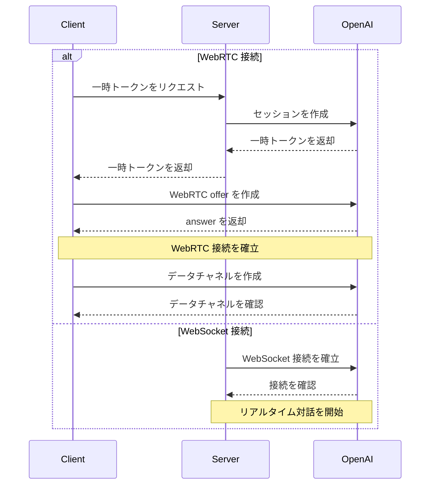

---
title: OpenAI リアルタイム対話インターフェース
---

{/* TODO: Convert to Callout - info: 公式ドキュメント */} - [OpenAI Realtime WebRTC](https://platform.openai.com/docs/guides/realtime-webrtc) - [OpenAI Realtime WebSocket](https://platform.openai.com/docs/guides/realtime-websocket)

## 📝 概要

### はじめに

OpenAI Realtime API は、以下の2つの接続方法を提供します。

1. WebRTC - ブラウザおよびモバイルクライアント向けのリアルタイム音声・ビデオインタラクション

2. WebSocket - サーバー間アプリケーション統合向け

### ユースケース

- リアルタイム音声対話
- 音声・ビデオ会議
- リアルタイム翻訳
- 音声書き起こし
- リアルタイムコード生成
- サーバーサイドのリアルタイム統合

### 主要機能

- 双方向オーディオストリーム転送
- テキストとオーディオの混合対話
- 関数呼び出しのサポート
- 自動音声検出 (VAD)
- 音声書き起こし機能
- WebSocket サーバーサイド統合

## 🔐 認証とセキュリティ

### 認証方式

1. 標準 API キー (サーバーサイドでのみ使用)
2. 一時トークン (クライアントサイドで使用)

### 一時トークン

- 有効期限: 1分
- 使用制限: 単一接続
- 取得方法: サーバーサイド API を介して作成

```http
POST https://あなたのnewapiサーバーアドレス/v1/realtime/sessions
Content-Type: application/json
Authorization: Bearer $NEW_API_KEY

\{
  "model": "gpt-4o-realtime-preview-2024-12-17",
  "voice": "verse"
}
```

### セキュリティに関する推奨事項

- 標準 API キーをクライアントサイドで決して公開しないでください
- HTTPS/WSS を使用して通信してください
- 適切なアクセス制御を実装してください
- 異常なアクティビティを監視してください

## 🔌 接続の確立

### WebRTC 接続

- URL: `https://あなたのnewapiサーバーアドレス/v1/realtime`
- クエリパラメータ: `model`
- リクエストヘッダー:
  - `Authorization: Bearer EPHEMERAL_KEY`
  - `Content-Type: application/sdp`

### WebSocket 接続

- URL: `wss://あなたのnewapiサーバーアドレス/v1/realtime`
- クエリパラメータ: `model`
- リクエストヘッダー:
  - `Authorization: Bearer YOUR_API_KEY`
  - `OpenAI-Beta: realtime=v1`

### 接続フロー



### データチャネル

- 名称: `oai-events`
- 用途: イベント転送
- 形式: JSON

### オーディオストリーム

- 入力: `addTrack()`
- 出力: `ontrack` イベント

## 💬 対話のやり取り

### 対話モード

1. 純粋なテキスト対話
2. 音声対話
3. 混合対話

### セッション管理

- セッションの作成
- セッションの更新
- セッションの終了
- セッション設定

### イベントタイプ

- テキストイベント
- オーディオイベント
- 関数呼び出し
- ステータス更新
- エラーイベント

## ⚙️ 設定オプション

### オーディオ設定

- 入力形式
  - `pcm16`
  - `g711_ulaw`
  - `g711_alaw`
- 出力形式
  - `pcm16`
  - `g711_ulaw`
  - `g711_alaw`
- 音声タイプ
  - `alloy`
  - `echo`
  - `shimmer`

### モデル設定

- 温度 (Temperature)
- 最大出力長
- システムプロンプト
- ツール設定

### VAD 設定

- 閾値 (Threshold)
- 無音持続時間
- プレフィックスパディング

## 💡 リクエスト例

### WebRTC 接続 ❌

#### クライアント実装 (ブラウザ)

```javascript
async function init() \{
  // サーバーから一時キーを取得 - 下記のサーバーコードを参照
  const tokenResponse = await fetch("/session");
  const data = await tokenResponse.json();
  const EPHEMERAL_KEY = data.client_secret.value;

  // 対等接続を作成
  const pc = new RTCPeerConnection();

  // モデルから返されたリモートオーディオを再生するように設定
  const audioEl = document.createElement("audio");
  audioEl.autoplay = true;
  pc.ontrack = e => audioEl.srcObject = e.streams[0];

  // ブラウザのマイク入力のローカルトラックを追加
  const ms = await navigator.mediaDevices.getUserMedia({
    audio: true
  });
  pc.addTrack(ms.getTracks()[0]);

  // イベントを送受信するためのデータチャネルを設定
  const dc = pc.createDataChannel("oai-events");
  dc.addEventListener("message", (e) => \{
    // ここでリアルタイムサーバーイベントを受信します！
    console.log(e);
  });

  // セッション記述プロトコル(SDP)を使用してセッションを開始
  const offer = await pc.createOffer();
  await pc.setLocalDescription(offer);

  const baseUrl = "https://あなたのnewapiサーバーアドレス/v1/realtime";
  const model = "gpt-4o-realtime-preview-2024-12-17";
  const sdpResponse = await fetch(`${baseUrl}?model=${model}`, {
    method: "POST",
    body: offer.sdp,
    headers: {
      Authorization: `Bearer ${EPHEMERAL_KEY}`,
      "Content-Type": "application/sdp"
    },
  });

  const answer = {
    type: "answer",
    sdp: await sdpResponse.text(),
  };
  await pc.setRemoteDescription(answer);
}

init();
```

#### サーバーサイド実装 (Node.js)

```javascript
import express from "express";

const app = express();

// 一時トークンを生成するためのエンドポイントを作成
// このエンドポイントは上記のクライアントコードと連携して使用されます
app.get("/session", async (req, res) => {
  const r = await fetch("https://あなたのnewapiサーバーアドレス/v1/realtime/sessions", {
    method: "POST",
    headers: \{
      "Authorization": `Bearer ${process.env.NEW_API_KEY}`,
      "Content-Type": "application/json",
    },
    body: JSON.stringify({
      model: "gpt-4o-realtime-preview-2024-12-17",
      voice: "verse",
    }),
  });
  const data = await r.json();

  // OpenAI REST APIから受け取ったJSONをクライアントに返送
  res.send(data);
});

app.listen(3000);
```

#### WebRTC イベント送受信例

```javascript
// 対等接続からデータチャネルを作成
const dc = pc.createDataChannel('oai-events');

// データチャネル上のサーバーイベントをリッスン
// イベントデータはJSON文字列から解析する必要があります
dc.addEventListener('message', (e) => {
  const realtimeEvent = JSON.parse(e.data);
  console.log(realtimeEvent);
});

// クライアントイベントを送信: 有効なクライアントイベントを
// JSONにシリアライズし、データチャネル経由で送信します
const responseCreate = {
  type: 'response.create',
  response: {
    modalities: ['text'],
    instructions: 'Write a haiku about code',
  },
};
dc.send(JSON.stringify(responseCreate));
```

### WebSocket 接続 ✅

#### Node.js (wsモジュール)

```javascript
import WebSocket from "ws";

const url = "wss://あなたのnewapiサーバーアドレス/v1/realtime?model=gpt-4o-realtime-preview-2024-12-17";
const ws = new WebSocket(url, {
  headers: \{
    "Authorization": "Bearer " + process.env.NEW_API_KEY,
    "OpenAI-Beta": "realtime=v1",
  },
});

ws.on("open", function open() {
  console.log("Connected to server.");
});

ws.on("message", function incoming(message) {
  console.log(JSON.parse(message.toString()));
});
```

#### Python (websocket-client)

```python
# websocket-client ライブラリのインストールが必要です:
# pip install websocket-client

import os
import json
import websocket

NEW_API_KEY = os.environ.get("NEW_API_KEY")

url = "wss://あなたのnewapiサーバーアドレス/v1/realtime?model=gpt-4o-realtime-preview-2024-12-17"
headers = [
    "Authorization: Bearer " + NEW_API_KEY,
    "OpenAI-Beta: realtime=v1"
]

def on_open(ws):
    print("Connected to server.")

def on_message(ws, message):
    data = json.loads(message)
    print("Received event:", json.dumps(data, indent=2))

ws = websocket.WebSocketApp(
    url,
    header=headers,
    on_open=on_open,
    on_message=on_message,
)

ws.run_forever()
```

#### ブラウザ (標準WebSocket)

```javascript
/*
注意: ブラウザなどのクライアント環境では、WebRTCの使用を推奨します。
ただし、DenoやCloudflare Workersなどのブラウザ類似環境では、
標準WebSocketインターフェースも使用できます。
*/

const ws = new WebSocket(
  'wss://あなたのnewapiサーバーアドレス/v1/realtime?model=gpt-4o-realtime-preview-2024-12-17',
  [
    'realtime',
    // 認証
    'openai-insecure-api-key.' + NEW_API_KEY,
    // オプション
    'openai-organization.' + OPENAI_ORG_ID,
    'openai-project.' + OPENAI_PROJECT_ID,
    // Betaプロトコル、必須
    'openai-beta.realtime-v1',
  ]
);

ws.on('open', function open() {
  console.log('Connected to server.');
});

ws.on('message', function incoming(message) {
  console.log(message.data);
});
```

#### メッセージ送受信例

##### Node.js/ブラウザ

```javascript
// サーバーイベントを受信
ws.on("message", function incoming(message) \{
  // メッセージデータはJSONから解析する必要があります
  const serverEvent = JSON.parse(message.data)
  console.log(serverEvent);
});

// イベントを送信、クライアントイベント形式に準拠したJSONデータ構造を作成
const event = {
  type: "response.create",
  response: {
    modalities: ["audio", "text"],
    instructions: "Give me a haiku about code.",
  }
};
ws.send(JSON.stringify(event));
```

##### Python

```python
# クライアントイベントを送信、辞書をJSONにシリアライズ
def on_open(ws):
    print("Connected to server.")

    event = \{
        "type": "response.create",
        "response": \{
            "modalities": ["text"],
            "instructions": "Please assist the user."
        }
    }
    ws.send(json.dumps(event))

# メッセージを受信するには、メッセージペイロードをJSONから解析する必要があります
def on_message(ws, message):
    data = json.loads(message)
    print("Received event:", json.dumps(data, indent=2))
```

## ⚠️ エラー処理

### 一般的なエラー

1. 接続エラー
   - ネットワークの問題
   - 認証の失敗
   - 設定エラー
2. オーディオエラー
   - デバイス権限
   - 形式の非サポート
   - コーデックの問題
3. セッションエラー
   - トークンの期限切れ
   - セッションタイムアウト
   - 同時接続制限

### エラー回復

1. 自動再接続
2. セッション回復
3. エラー再試行
4. フォールバック処理

## 📝 イベントリファレンス

### 一般的なリクエストヘッダー

すべてのイベントには、以下のリクエストヘッダーを含める必要があります。

| リクエストヘッダー | タイプ | 説明           | 例                  |
| ------------------ | ------ | -------------- | ------------------- |
| Authorization      | 文字列 | 認証トークン   | Bearer $NEW_API_KEY |
| OpenAI-Beta        | 文字列 | API バージョン | realtime=v1         |

### クライアントイベント

#### session.update

セッションのデフォルト設定を更新します。

| パラメータ                         | タイプ      | 必須 | 説明                                             | 例/オプション値                       |
| ---------------------------------- | ----------- | ---- | ------------------------------------------------ | ------------------------------------- |
| event_id                           | 文字列      | 否   | クライアント生成のイベント識別子                 | event_123                             |
| type                               | 文字列      | 否   | イベントタイプ                                   | session.update                        |
| modalities                         | 文字列配列  | 否   | モデルが応答できるモダリティタイプ               | ["text", "audio"]                     |
| instructions                       | 文字列      | 否   | モデル呼び出しの前にプリセットされるシステム指示 | "Your knowledge cutoff is 2023-10..." |
| voice                              | 文字列      | 否   | モデルが使用する音声タイプ                       | alloy、echo、shimmer                  |
| input_audio_format                 | 文字列      | 否   | 入力オーディオ形式                               | pcm16、g711_ulaw、g711_alaw           |
| output_audio_format                | 文字列      | 否   | 出力オーディオ形式                               | pcm16、g711_ulaw、g711_alaw           |
| input_audio_transcription.model    | 文字列      | 否   | 書き起こしに使用するモデル                       | whisper-1                             |
| turn_detection.type                | 文字列      | 否   | 音声検出タイプ                                   | server_vad                            |
| turn_detection.threshold           | 数値        | 否   | VAD アクティベーション閾値(0.0-1.0)              | 0.8                                   |
| turn_detection.prefix_padding_ms   | 整数        | 否   | 音声開始前に含めるオーディオの長さ               | 500                                   |
| turn_detection.silence_duration_ms | 整数        | 否   | 音声停止を検出する無音の持続時間                 | 1000                                  |
| tools                              | 配列        | 否   | モデルが利用可能なツールリスト                   | []                                    |
| tool_choice                        | 文字列      | 否   | モデルがツールを選択する方法                     | auto/none/required                    |
| temperature                        | 数値        | 否   | モデルのサンプリング温度                         | 0.8                                   |
| max_output_tokens                  | 文字列/整数 | 否   | 1回の応答の最大トークン数                        | "inf"/4096                            |

#### input_audio_buffer.append

入力オーディオバッファにオーディオデータを追加します。

| パラメータ | タイプ | 必須 | 説明                                   | 例                        |
| ---------- | ------ | ---- | -------------------------------------- | ------------------------- |
| event_id   | 文字列 | 否   | クライアント生成のイベント識別子       | event_456                 |
| type       | 文字列 | 否   | イベントタイプ                         | input_audio_buffer.append |
| audio      | 文字列 | 否   | Base64エンコードされたオーディオデータ | Base64EncodedAudioData    |

#### input_audio_buffer.commit

バッファ内のオーディオデータをユーザーメッセージとしてコミットします。

| パラメータ | タイプ | 必須 | 説明                             | 例                        |
| ---------- | ------ | ---- | -------------------------------- | ------------------------- |
| event_id   | 文字列 | 否   | クライアント生成のイベント識別子 | event_789                 |
| type       | 文字列 | 否   | イベントタイプ                   | input_audio_buffer.commit |

#### input_audio_buffer.clear

入力オーディオバッファ内のすべてのオーディオデータをクリアします。

| パラメータ | タイプ | 必須 | 説明                             | 例                       |
| ---------- | ------ | ---- | -------------------------------- | ------------------------ |
| event_id   | 文字列 | 否   | クライアント生成のイベント識別子 | event_012                |
| type       | 文字列 | 否   | イベントタイプ                   | input_audio_buffer.clear |

#### conversation.item.create

対話に新しい対話項目を追加します。

| パラメータ       | タイプ | 必須 | 説明                                     | 例                                         |
| ---------------- | ------ | ---- | ---------------------------------------- | ------------------------------------------ |
| event_id         | 文字列 | 否   | クライアント生成のイベント識別子         | event_345                                  |
| type             | 文字列 | 否   | イベントタイプ                           | conversation.item.create                   |
| previous_item_id | 文字列 | 否   | 新しい対話項目がこのIDの後に挿入されます | null                                       |
| item.id          | 文字列 | 否   | 対話項目の一意の識別子                   | msg_001                                    |
| item.type        | 文字列 | 否   | 対話項目タイプ                           | message/function_call/function_call_output |
| item.status      | 文字列 | 否   | 対話項目ステータス                       | completed/in_progress/incomplete           |
| item.role        | 文字列 | 否   | メッセージ送信者のロール                 | user/assistant/system                      |
| item.content     | 配列   | 否   | メッセージ内容                           | [text/audio/transcript]                    |
| item.call_id     | 文字列 | 否   | 関数呼び出しのID                         | call_001                                   |
| item.name        | 文字列 | 否   | 呼び出された関数名                       | function_name                              |
| item.arguments   | 文字列 | 否   | 関数呼び出しの引数                       | \{"param": "value"}                        |
| item.output      | 文字列 | 否   | 関数呼び出しの出力結果                   | \{"result": "value"}                       |

#### conversation.item.truncate

アシスタントメッセージ内のオーディオコンテンツを切り詰めます (truncate)。

| パラメータ    | タイプ | 必須 | 説明                                     | 例                         |
| ------------- | ------ | ---- | ---------------------------------------- | -------------------------- |
| event_id      | 文字列 | 否   | クライアント生成のイベント識別子         | event_678                  |
| type          | 文字列 | 否   | イベントタイプ                           | conversation.item.truncate |
| item_id       | 文字列 | 否   | 切り詰めるアシスタントメッセージ項目のID | msg_002                    |
| content_index | 整数   | 否   | 切り詰めるコンテンツ部分のインデックス   | 0                          |
| audio_end_ms  | 整数   | 否   | オーディオ切り詰めの終了時点             | 1500                       |

#### conversation.item.delete

対話履歴から指定された対話項目を削除します。

| パラメータ | タイプ | 必須 | 説明                             | 例                       |
| ---------- | ------ | ---- | -------------------------------- | ------------------------ |
| event_id   | 文字列 | 否   | クライアント生成のイベント識別子 | event_901                |
| type       | 文字列 | 否   | イベントタイプ                   | conversation.item.delete |
| item_id    | 文字列 | 否   | 削除する対話項目のID             | msg_003                  |

#### response.create

応答生成をトリガーします。

| パラメータ                   | タイプ      | 必須 | 説明                             | 例                              |
| ---------------------------- | ----------- | ---- | -------------------------------- | ------------------------------- |
| event_id                     | 文字列      | 否   | クライアント生成のイベント識別子 | event_234                       |
| type                         | 文字列      | 否   | イベントタイプ                   | response.create                 |
| response.modalities          | 文字列配列  | 否   | 応答のモダリティタイプ           | ["text", "audio"]               |
| response.instructions        | 文字列      | 否   | モデルへの指示                   | "Please assist the user."       |
| response.voice               | 文字列      | 否   | モデルが使用する音声タイプ       | alloy/echo/shimmer              |
| response.output_audio_format | 文字列      | 否   | 出力オーディオ形式               | pcm16                           |
| response.tools               | 配列        | 否   | モデルが利用可能なツールリスト   | ["type", "name", "description"] |
| response.tool_choice         | 文字列      | 否   | モデルがツールを選択する方法     | auto                            |
| response.temperature         | 数値        | 否   | サンプリング温度                 | 0.7                             |
| response.max_output_tokens   | 整数/文字列 | 否   | 最大出力トークン数               | 150/"inf"                       |

#### response.cancel

進行中の応答生成をキャンセルします。

| パラメータ | タイプ | 必須 | 説明                             | 例              |
| ---------- | ------ | ---- | -------------------------------- | --------------- |
| event_id   | 文字列 | 否   | クライアント生成のイベント識別子 | event_567       |
| type       | 文字列 | 否   | イベントタイプ                   | response.cancel |

### サーバーイベント

#### error

エラーが発生したときに返されるイベント。

| パラメータ     | タイプ     | 必須 | 説明                           | 例                                 |
| -------------- | ---------- | ---- | ------------------------------ | ---------------------------------- |
| event_id       | 文字列配列 | 否   | サーバーイベントの一意の識別子 | ["event_890"]                      |
| type           | 文字列     | 否   | イベントタイプ                 | error                              |
| error.type     | 文字列     | 否   | エラータイプ                   | invalid_request_error/server_error |
| error.code     | 文字列     | 否   | エラーコード                   | invalid_event                      |
| error.message  | 文字列     | 否   | 人間が読めるエラーメッセージ   | "The 'type' field is missing."     |
| error.param    | 文字列     | 否   | エラーに関連するパラメータ     | null                               |
| error.event_id | 文字列     | 否   | 関連イベントのID               | event_567                          |

#### conversation.item.input_audio_transcription.completed

入力オーディオ書き起こし機能が有効で、書き起こしが成功したときに返されるイベント。

| パラメータ    | タイプ | 必須 | 説明                                         | 例                                                    |
| ------------- | ------ | ---- | -------------------------------------------- | ----------------------------------------------------- |
| event_id      | 文字列 | 否   | サーバーイベントの一意の識別子               | event_2122                                            |
| type          | 文字列 | 否   | イベントタイプ                               | conversation.item.input_audio_transcription.completed |
| item_id       | 文字列 | 否   | ユーザーメッセージ項目のID                   | msg_003                                               |
| content_index | 整数   | 否   | オーディオを含むコンテンツ部分のインデックス | 0                                                     |
| transcript    | 文字列 | 否   | 書き起こされたテキスト内容                   | "Hello, how are you?"                                 |

#### conversation.item.input_audio_transcription.failed

入力オーディオ書き起こし機能が設定されているが、ユーザーメッセージの書き起こしリクエストが失敗したときに返されるイベント。

| パラメータ    | タイプ     | 必須 | 説明                                         | 例                                                     |
| ------------- | ---------- | ---- | -------------------------------------------- | ------------------------------------------------------ |
| event_id      | 文字列     | 否   | サーバーイベントの一意の識別子               | event_2324                                             |
| type          | 文字列配列 | 否   | イベントタイプ                               | ["conversation.item.input_audio_transcription.failed"] |
| item_id       | 文字列     | 否   | ユーザーメッセージ項目のID                   | msg_003                                                |
| content_index | 整数       | 否   | オーディオを含むコンテンツ部分のインデックス | 0                                                      |
| error.type    | 文字列     | 否   | エラータイプ                                 | transcription_error                                    |
| error.code    | 文字列     | 否   | エラーコード                                 | audio_unintelligible                                   |
| error.message | 文字列     | 否   | 人間が読めるエラーメッセージ                 | "The audio could not be transcribed."                  |
| error.param   | 文字列     | 否   | エラーに関連するパラメータ                   | null                                                   |

#### conversation.item.truncated

クライアントが以前のアシスタントオーディオメッセージ項目を切り詰めたときに返されるイベント。

| パラメータ    | タイプ | 必須 | 説明                                         | 例                          |
| ------------- | ------ | ---- | -------------------------------------------- | --------------------------- |
| event_id      | 文字列 | 否   | サーバーイベントの一意の識別子               | event_2526                  |
| type          | 文字列 | 否   | イベントタイプ                               | conversation.item.truncated |
| item_id       | 文字列 | 否   | 切り詰められたアシスタントメッセージ項目のID | msg_004                     |
| content_index | 整数   | 否   | 切り詰められたコンテンツ部分のインデックス   | 0                           |
| audio_end_ms  | 整数   | 否   | オーディオが切り詰められた時点 (ミリ秒)      | 1500                        |

#### conversation.item.deleted

対話内の特定の項目が削除されたときに返されるイベント。

| パラメータ | タイプ | 必須 | 説明                           | 例                        |
| ---------- | ------ | ---- | ------------------------------ | ------------------------- |
| event_id   | 文字列 | 否   | サーバーイベントの一意の識別子 | event_2728                |
| type       | 文字列 | 否   | イベントタイプ                 | conversation.item.deleted |
| item_id    | 文字列 | 否   | 削除された対話項目のID         | msg_005                   |

#### input_audio_buffer.committed

オーディオバッファ内のデータがコミットされたときに返されるイベント。

| パラメータ       | タイプ | 必須 | 説明                                                       | 例                           |
| ---------------- | ------ | ---- | ---------------------------------------------------------- | ---------------------------- |
| event_id         | 文字列 | 否   | サーバーイベントの一意の識別子                             | event_1121                   |
| type             | 文字列 | 否   | イベントタイプ                                             | input_audio_buffer.committed |
| previous_item_id | 文字列 | 否   | 新しい対話項目がこのIDに対応する対話項目の後に挿入されます | msg_001                      |
| item_id          | 文字列 | 否   | 作成されるユーザーメッセージ項目のID                       | msg_002                      |

#### input_audio_buffer.cleared

クライアントが入力オーディオバッファをクリアしたときに返されるイベント。

| パラメータ | タイプ | 必須 | 説明                           | 例                         |
| ---------- | ------ | ---- | ------------------------------ | -------------------------- |
| event_id   | 文字列 | 否   | サーバーイベントの一意の識別子 | event_1314                 |
| type       | 文字列 | 否   | イベントタイプ                 | input_audio_buffer.cleared |

#### input_audio_buffer.speech_started

サーバー音声検出モードで、音声入力が検出されたときに返されるイベント。

| パラメータ     | タイプ | 必須 | 説明                                             | 例                                |
| -------------- | ------ | ---- | ------------------------------------------------ | --------------------------------- |
| event_id       | 文字列 | 否   | サーバーイベントの一意の識別子                   | event_1516                        |
| type           | 文字列 | 否   | イベントタイプ                                   | input_audio_buffer.speech_started |
| audio_start_ms | 整数   | 否   | セッション開始から音声が検出されるまでのミリ秒数 | 1000                              |
| item_id        | 文字列 | 否   | 音声停止時に作成されるユーザーメッセージ項目のID | msg_003                           |

#### input_audio_buffer.speech_stopped

サーバー音声検出モードで、音声入力の停止が検出されたときに返されるイベント。

| パラメータ     | タイプ | 必須 | 説明                                                 | 例                                |
| -------------- | ------ | ---- | ---------------------------------------------------- | --------------------------------- |
| event_id       | 文字列 | 否   | サーバーイベントの一意の識別子                       | event_1718                        |
| type           | 文字列 | 否   | イベントタイプ                                       | input_audio_buffer.speech_stopped |
| audio_start_ms | 整数   | 否   | セッション開始から音声停止が検出されるまでのミリ秒数 | 2000                              |
| item_id        | 文字列 | 否   | 作成されるユーザーメッセージ項目のID                 | msg_003                           |

#### response.created

新しい応答が作成されたときに返されるイベント。

| パラメータ              | タイプ       | 必須 | 説明                                   | 例                |
| ----------------------- | ------------ | ---- | -------------------------------------- | ----------------- |
| event_id                | 文字列       | 否   | サーバーイベントの一意の識別子         | event_2930        |
| type                    | 文字列       | 否   | イベントタイプ                         | response.created  |
| response.id             | 文字列       | 否   | 応答の一意の識別子                     | resp_001          |
| response.object         | 文字列       | 否   | オブジェクトタイプ                     | realtime.response |
| response.status         | 文字列       | 否   | 応答のステータス                       | in_progress       |
| response.status_details | オブジェクト | 否   | ステータスの追加詳細情報               | null              |
| response.output         | 文字列配列   | 否   | 応答によって生成された出力項目のリスト | ["[]"]            |
| response.usage          | オブジェクト | 否   | 応答の使用統計情報                     | null              |

#### response.done

応答がストリーミングを完了したときに返されるイベント。

| パラメータ                   | タイプ       | 必須 | 説明                                   | 例                                    |
| ---------------------------- | ------------ | ---- | -------------------------------------- | ------------------------------------- |
| event_id                     | 文字列       | 否   | サーバーイベントの一意の識別子         | event_3132                            |
| type                         | 文字列       | 否   | イベントタイプ                         | response.done                         |
| response.id                  | 文字列       | 否   | 応答の一意の識別子                     | resp_001                              |
| response.object              | 文字列       | 否   | オブジェクトタイプ                     | realtime.response                     |
| response.status              | 文字列       | 否   | 応答の最終ステータス                   | completed/cancelled/failed/incomplete |
| response.status_details      | オブジェクト | 否   | ステータスの追加詳細情報               | null                                  |
| response.output              | 文字列配列   | 否   | 応答によって生成された出力項目のリスト | ["[...]"]                             |
| response.usage.total_tokens  | 整数         | 否   | 合計トークン数                         | 50                                    |
| response.usage.input_tokens  | 整数         | 否   | 入力トークン数                         | 20                                    |
| response.usage.output_tokens | 整数         | 否   | 出力トークン数                         | 30                                    |

#### response.output_item.added

応答生成中に新しい出力項目が作成されたときに返されるイベント。

| パラメータ   | タイプ | 必須 | 説明                           | 例                                         |
| ------------ | ------ | ---- | ------------------------------ | ------------------------------------------ |
| event_id     | 文字列 | 否   | サーバーイベントの一意の識別子 | event_3334                                 |
| type         | 文字列 | 否   | イベントタイプ                 | response.output_item.added                 |
| response_id  | 文字列 | 否   | 出力項目が属する応答ID         | resp_001                                   |
| output_index | 文字列 | 否   | 応答内の出力項目のインデックス | 0                                          |
| item.id      | 文字列 | 否   | 出力項目の一意の識別子         | msg_007                                    |
| item.object  | 文字列 | 否   | オブジェクトタイプ             | realtime.item                              |
| item.type    | 文字列 | 否   | 出力項目タイプ                 | message/function_call/function_call_output |
| item.status  | 文字列 | 否   | 出力項目ステータス             | in_progress/completed                      |
| item.role    | 文字列 | 否   | 出力項目に関連付けられたロール | assistant                                  |
| item.content | 配列   | 否   | 出力項目の内容                 | ["type", "text", "audio", "transcript"]    |

#### response.output_item.done

出力項目がストリーミングを完了したときに返されるイベント。

| パラメータ   | タイプ | 必須 | 説明                           | 例                                         |
| ------------ | ------ | ---- | ------------------------------ | ------------------------------------------ |
| event_id     | 文字列 | 否   | サーバーイベントの一意の識別子 | event_3536                                 |
| type         | 文字列 | 否   | イベントタイプ                 | response.output_item.done                  |
| response_id  | 文字列 | 否   | 出力項目が属する応答ID         | resp_001                                   |
| output_index | 文字列 | 否   | 応答内の出力項目のインデックス | 0                                          |
| item.id      | 文字列 | 否   | 出力項目の一意の識別子         | msg_007                                    |
| item.object  | 文字列 | 否   | オブジェクトタイプ             | realtime.item                              |
| item.type    | 文字列 | 否   | 出力項目タイプ                 | message/function_call/function_call_output |
| item.status  | 文字列 | 否   | 出力項目の最終ステータス       | completed/incomplete                       |
| item.role    | 文字列 | 否   | 出力項目に関連付けられたロール | assistant                                  |
| item.content | 配列   | 否   | 出力項目の内容                 | ["type", "text", "audio", "transcript"]    |

#### response.content_part.added

応答生成中にアシスタントメッセージ項目に新しいコンテンツ部分が追加されたときに返されるイベント。

| パラメータ      | タイプ | 必須 | 説明                                                         | 例                          |
| --------------- | ------ | ---- | ------------------------------------------------------------ | --------------------------- |
| event_id        | 文字列 | 否   | サーバーイベントの一意の識別子                               | event_3738                  |
| type            | 文字列 | 否   | イベントタイプ                                               | response.content_part.added |
| response_id     | 文字列 | 否   | 応答のID                                                     | resp_001                    |
| item_id         | 文字列 | 否   | コンテンツ部分が追加されるメッセージ項目ID                   | msg_007                     |
| output_index    | 整数   | 否   | 応答内の出力項目のインデックス                               | 0                           |
| content_index   | 整数   | 否   | メッセージ項目コンテンツ配列内のコンテンツ部分のインデックス | 0                           |
| part.type       | 文字列 | 否   | コンテンツタイプ                                             | text/audio                  |
| part.text       | 文字列 | 否   | テキスト内容                                                 | "Hello"                     |
| part.audio      | 文字列 | 否   | Base64エンコードされたオーディオデータ                       | "base64_encoded_audio_data" |
| part.transcript | 文字列 | 否   | オーディオの書き起こしテキスト                               | "Hello"                     |

#### response.content_part.done

アシスタントメッセージ項目内のコンテンツ部分がストリーミングを完了したときに返されるイベント。

| パラメータ      | タイプ | 必須 | 説明                                                         | 例                          |
| --------------- | ------ | ---- | ------------------------------------------------------------ | --------------------------- |
| event_id        | 文字列 | 否   | サーバーイベントの一意の識別子                               | event_3940                  |
| type            | 文字列 | 否   | イベントタイプ                                               | response.content_part.done  |
| response_id     | 文字列 | 否   | 応答のID                                                     | resp_001                    |
| item_id         | 文字列 | 否   | コンテンツ部分が追加されるメッセージ項目ID                   | msg_007                     |
| output_index    | 整数   | 否   | 応答内の出力項目のインデックス                               | 0                           |
| content_index   | 整数   | 否   | メッセージ項目コンテンツ配列内のコンテンツ部分のインデックス | 0                           |
| part.type       | 文字列 | 否   | コンテンツタイプ                                             | text/audio                  |
| part.text       | 文字列 | 否   | テキスト内容                                                 | "Hello"                     |
| part.audio      | 文字列 | 否   | Base64エンコードされたオーディオデータ                       | "base64_encoded_audio_data" |
| part.transcript | 文字列 | 否   | オーディオの書き起こしテキスト                               | "Hello"                     |

#### response.text.delta

"text" タイプコンテンツ部分のテキスト値が更新されたときに返されるイベント。

| パラメータ    | タイプ | 必須 | 説明                                                         | 例                  |
| ------------- | ------ | ---- | ------------------------------------------------------------ | ------------------- |
| event_id      | 文字列 | 否   | サーバーイベントの一意の識別子                               | event_4142          |
| type          | 文字列 | 否   | イベントタイプ                                               | response.text.delta |
| response_id   | 文字列 | 否   | 応答のID                                                     | resp_001            |
| item_id       | 文字列 | 否   | メッセージ項目のID                                           | msg_007             |
| output_index  | 整数   | 否   | 応答内の出力項目のインデックス                               | 0                   |
| content_index | 整数   | 否   | メッセージ項目コンテンツ配列内のコンテンツ部分のインデックス | 0                   |
| delta         | 文字列 | 否   | テキスト増分更新内容                                         | "Sure, I can h"     |

#### response.text.done

"text" タイプコンテンツ部分のテキストストリーミングが完了したときに返されるイベント。

| パラメータ    | タイプ | 必須 | 説明                                                         | 例                            |
| ------------- | ------ | ---- | ------------------------------------------------------------ | ----------------------------- |
| event_id      | 文字列 | 否   | サーバーイベントの一意の識別子                               | event_4344                    |
| type          | 文字列 | 否   | イベントタイプ                                               | response.text.done            |
| response_id   | 文字列 | 否   | 応答のID                                                     | resp_001                      |
| item_id       | 文字列 | 否   | メッセージ項目のID                                           | msg_007                       |
| output_index  | 整数   | 否   | 応答内の出力項目のインデックス                               | 0                             |
| content_index | 整数   | 否   | メッセージ項目コンテンツ配列内のコンテンツ部分のインデックス | 0                             |
| delta         | 文字列 | 否   | 最終的な完全なテキスト内容                                   | "Sure, I can help with that." |

#### response.audio_transcript.delta

モデルが生成したオーディオ出力の書き起こし内容が更新されたときに返されるイベント。

| パラメータ    | タイプ | 必須 | 説明                                                         | 例                              |
| ------------- | ------ | ---- | ------------------------------------------------------------ | ------------------------------- |
| event_id      | 文字列 | 否   | サーバーイベントの一意の識別子                               | event_4546                      |
| type          | 文字列 | 否   | イベントタイプ                                               | response.audio_transcript.delta |
| response_id   | 文字列 | 否   | 応答のID                                                     | resp_001                        |
| item_id       | 文字列 | 否   | メッセージ項目のID                                           | msg_008                         |
| output_index  | 整数   | 否   | 応答内の出力項目のインデックス                               | 0                               |
| content_index | 整数   | 否   | メッセージ項目コンテンツ配列内のコンテンツ部分のインデックス | 0                               |
| delta         | 文字列 | 否   | 書き起こしテキストの増分更新内容                             | "Hello, how can I a"            |

#### response.audio_transcript.done

モデルが生成したオーディオ出力の書き起こしがストリーミングを完了したときに返されるイベント。

| パラメータ    | タイプ | 必須 | 説明                                                         | 例                                   |
| ------------- | ------ | ---- | ------------------------------------------------------------ | ------------------------------------ |
| event_id      | 文字列 | 否   | サーバーイベントの一意の識別子                               | event_4748                           |
| type          | 文字列 | 否   | イベントタイプ                                               | response.audio_transcript.done       |
| response_id   | 文字列 | 否   | 応答のID                                                     | resp_001                             |
| item_id       | 文字列 | 否   | メッセージ項目のID                                           | msg_008                              |
| output_index  | 整数   | 否   | 応答内の出力項目のインデックス                               | 0                                    |
| content_index | 整数   | 否   | メッセージ項目コンテンツ配列内のコンテンツ部分のインデックス | 0                                    |
| transcript    | 文字列 | 否   | オーディオの最終的な完全な書き起こしテキスト                 | "Hello, how can I assist you today?" |

#### response.audio.delta

モデルが生成したオーディオ内容が更新されたときに返されるイベント。

| パラメータ    | タイプ | 必須 | 説明                                                         | 例                        |
| ------------- | ------ | ---- | ------------------------------------------------------------ | ------------------------- |
| event_id      | 文字列 | 否   | サーバーイベントの一意の識別子                               | event_4950                |
| type          | 文字列 | 否   | イベントタイプ                                               | response.audio.delta      |
| response_id   | 文字列 | 否   | 応答のID                                                     | resp_001                  |
| item_id       | 文字列 | 否   | メッセージ項目のID                                           | msg_008                   |
| output_index  | 整数   | 否   | 応答内の出力項目のインデックス                               | 0                         |
| content_index | 整数   | 否   | メッセージ項目コンテンツ配列内のコンテンツ部分のインデックス | 0                         |
| delta         | 文字列 | 否   | Base64エンコードされたオーディオデータの増分                 | "Base64EncodedAudioDelta" |

#### response.audio.done

モデルが生成したオーディオが完了したときに返されるイベント。

| パラメータ    | タイプ | 必須 | 説明                                                         | 例                  |
| ------------- | ------ | ---- | ------------------------------------------------------------ | ------------------- |
| event_id      | 文字列 | 否   | サーバーイベントの一意の識別子                               | event_5152          |
| type          | 文字列 | 否   | イベントタイプ                                               | response.audio.done |
| response_id   | 文字列 | 否   | 応答のID                                                     | resp_001            |
| item_id       | 文字列 | 否   | メッセージ項目のID                                           | msg_008             |
| output_index  | 整数   | 否   | 応答内の出力項目のインデックス                               | 0                   |
| content_index | 整数   | 否   | メッセージ項目コンテンツ配列内のコンテンツ部分のインデックス | 0                   |

### 関数呼び出し

#### response.function_call_arguments.delta

モデルが生成した関数呼び出し引数が更新されたときに返されるイベント。

| パラメータ   | タイプ | 必須 | 説明                             | 例                                     |
| ------------ | ------ | ---- | -------------------------------- | -------------------------------------- |
| event_id     | 文字列 | 否   | サーバーイベントの一意の識別子   | event_5354                             |
| type         | 文字列 | 否   | イベントタイプ                   | response.function_call_arguments.delta |
| response_id  | 文字列 | 否   | 応答のID                         | resp_002                               |
| item_id      | 文字列 | 否   | メッセージ項目のID               | fc_001                                 |
| output_index | 整数   | 否   | 応答内の出力項目のインデックス   | 0                                      |
| call_id      | 文字列 | 否   | 関数呼び出しのID                 | call_001                               |
| delta        | 文字列 | 否   | JSON形式の関数呼び出し引数の増分 | "\{\"location\": \"San\""              |

#### response.function_call_arguments.done

モデルが生成した関数呼び出し引数がストリーミングを完了したときに返されるイベント。

| パラメータ   | タイプ | 必須 | 説明                                     | 例                                    |
| ------------ | ------ | ---- | ---------------------------------------- | ------------------------------------- |
| event_id     | 文字列 | 否   | サーバーイベントの一意の識別子           | event_5556                            |
| type         | 文字列 | 否   | イベントタイプ                           | response.function_call_arguments.done |
| response_id  | 文字列 | 否   | 応答のID                                 | resp_002                              |
| item_id      | 文字列 | 否   | メッセージ項目のID                       | fc_001                                |
| output_index | 整数   | 否   | 応答内の出力項目のインデックス           | 0                                     |
| call_id      | 文字列 | 否   | 関数呼び出しのID                         | call_001                              |
| arguments    | 文字列 | 否   | 最終的な完全な関数呼び出し引数(JSON形式) | "\{\"location\": \"San Francisco\"}"  |

### その他のステータス更新

#### rate_limits.updated

各 "response.done" イベントの後にトリガーされ、更新されたレート制限を示します。

| パラメータ  | タイプ           | 必須 | 説明                           | 例                                                                                 |
| ----------- | ---------------- | ---- | ------------------------------ | ---------------------------------------------------------------------------------- |
| event_id    | 文字列           | 否   | サーバーイベントの一意の識別子 | event_5758                                                                         |
| type        | 文字列           | 否   | イベントタイプ                 | rate_limits.updated                                                                |
| rate_limits | オブジェクト配列 | 否   | レート制限情報リスト           | [\{"name": "requests_per_min", "limit": 60, "remaining": 45, "reset_seconds": 35}] |

#### conversation.created

対話が作成されたときに返されるイベント。

| パラメータ   | タイプ       | 必須 | 説明                           | 例                                                     |
| ------------ | ------------ | ---- | ------------------------------ | ------------------------------------------------------ |
| event_id     | 文字列       | 否   | サーバーイベントの一意の識別子 | event_9101                                             |
| type         | 文字列       | 否   | イベントタイプ                 | conversation.created                                   |
| conversation | オブジェクト | 否   | 対話リソースオブジェクト       | \{"id": "conv_001", "object": "realtime.conversation"} |

#### conversation.item.created

対話項目が作成されたときに返されるイベント。

| パラメータ       | タイプ       | 必須 | 説明                           | 例                                                                                                                                                       |
| ---------------- | ------------ | ---- | ------------------------------ | -------------------------------------------------------------------------------------------------------------------------------------------------------- |
| event_id         | 文字列       | 否   | サーバーイベントの一意の識別子 | event_1920                                                                                                                                               |
| type             | 文字列       | 否   | イベントタイプ                 | conversation.item.created                                                                                                                                |
| previous_item_id | 文字列       | 否   | 前の対話項目のID               | msg_002                                                                                                                                                  |
| item             | オブジェクト | 否   | 対話項目オブジェクト           | \{"id": "msg_003", "object": "realtime.item", "type": "message", "status": "completed", "role": "user", "content": [\{"type": "text", "text": "Hello"}]} |

#### session.created

セッションが作成されたときに返されるイベント。

| パラメータ | タイプ       | 必須 | 説明                           | 例                                                                                                   |
| ---------- | ------------ | ---- | ------------------------------ | ---------------------------------------------------------------------------------------------------- |
| event_id   | 文字列       | 否   | サーバーイベントの一意の識別子 | event_1234                                                                                           |
| type       | 文字列       | 否   | イベントタイプ                 | session.created                                                                                      |
| session    | オブジェクト | 否   | セッションオブジェクト         | \{"id": "sess_001", "object": "realtime.session", "model": "gpt-4", "modalities": ["text", "audio"]} |

#### session.updated

セッションが更新されたときに返されるイベント。

| パラメータ | タイプ       | 必須 | 説明                             | 例                                                                                                   |
| ---------- | ------------ | ---- | -------------------------------- | ---------------------------------------------------------------------------------------------------- |
| event_id   | 文字列       | 否   | サーバーイベントの一意の識別子   | event_5678                                                                                           |
| type       | 文字列       | 否   | イベントタイプ                   | session.updated                                                                                      |
| session    | オブジェクト | 否   | 更新されたセッションオブジェクト | \{"id": "sess_001", "object": "realtime.session", "model": "gpt-4", "modalities": ["text", "audio"]} |

### レート制限イベントパラメータ表

| パラメータ    | タイプ | 必須 | 説明             | 例               |
| ------------- | ------ | ---- | ---------------- | ---------------- |
| name          | 文字列 | 是   | 制限名           | requests_per_min |
| limit         | 整数   | 是   | 制限値           | 60               |
| remaining     | 整数   | 是   | 残り利用可能量   | 45               |
| reset_seconds | 整数   | 是   | リセット時間(秒) | 35               |

### 関数呼び出しパラメータ表

| パラメータ  | タイプ       | 必須 | 説明               | 例                                        |
| ----------- | ------------ | ---- | ------------------ | ----------------------------------------- |
| type        | 文字列       | 是   | 関数タイプ         | function                                  |
| name        | 文字列       | 是   | 関数名             | get_weather                               |
| description | 文字列       | 否   | 関数説明           | Get the current weather                   |
| parameters  | オブジェクト | 是   | 関数パラメータ定義 | \{"type": "object", "properties": \{...}} |

### オーディオ形式パラメータ表

| パラメータ      | タイプ | 説明                     | オプション値                     |
| --------------- | ------ | ------------------------ | -------------------------------- |
| sample_rate     | 整数   | サンプリングレート       | 8000, 16000, 24000, 44100, 48000 |
| channels        | 整数   | チャンネル数             | 1 (モノラル), 2 (ステレオ)       |
| bits_per_sample | 整数   | サンプルあたりのビット数 | 16 (pcm16), 8 (g711)             |
| encoding        | 文字列 | エンコーディング方式     | pcm16, g711_ulaw, g711_alaw      |

### 音声検出パラメータ表

| パラメータ          | タイプ       | 説明                                 | デフォルト値 | 範囲      |
| ------------------- | ------------ | ------------------------------------ | ------------ | --------- |
| threshold           | 浮動小数点数 | VAD アクティベーション閾値           | 0.5          | 0.0-1.0   |
| prefix_padding_ms   | 整数         | 音声プレフィックスパディング(ミリ秒) | 500          | 0-5000    |
| silence_duration_ms | 整数         | 無音検出持続時間(ミリ秒)             | 1000         | 100-10000 |

### ツール選択パラメータ表

| パラメータ  | タイプ | 説明                 | オプション値                            |
| ----------- | ------ | -------------------- | --------------------------------------- |
| tool_choice | 文字列 | ツール選択方式       | auto, none, required                    |
| tools       | 配列   | 利用可能ツールリスト | [{type, name, description, parameters}] |

### モデル設定パラメータ表

| パラメータ        | タイプ       | 説明             | 範囲/オプション値    | デフォルト値 |
| ----------------- | ------------ | ---------------- | -------------------- | ------------ |
| temperature       | 浮動小数点数 | サンプリング温度 | 0.0-2.0              | 1.0          |
| max_output_tokens | 整数/文字列  | 最大出力長       | 1-4096/"inf"         | "inf"        |
| modalities        | 文字列配列   | 応答モダリティ   | ["text", "audio"]    | ["text"]     |
| voice             | 文字列       | 音声タイプ       | alloy, echo, shimmer | alloy        |

### イベント共通パラメータ表

| パラメータ | タイプ | 必須 | 説明                                 | 例             |
| ---------- | ------ | ---- | ------------------------------------ | -------------- |
| event_id   | 文字列 | 是   | イベントの一意の識別子               | event_123      |
| type       | 文字列 | 是   | イベントタイプ                       | session.update |
| timestamp  | 整数   | 否   | イベント発生のタイムスタンプ(ミリ秒) | 1677649363000  |

### セッションステータスパラメータ表

| パラメータ | タイプ       | 説明                 | オプション値                                        |
| ---------- | ------------ | -------------------- | --------------------------------------------------- |
| status     | 文字列       | セッションステータス | active, ended, error                                |
| error      | オブジェクト | エラー情報           | \{"type": "error_type", "message": "error message"} |
| metadata   | オブジェクト | セッションメタデータ | \{"client_id": "web", "session_type": "chat"}       |

### 対話項目ステータスパラメータ表

| パラメータ | タイプ | 説明               | オプション値                                 |
| ---------- | ------ | ------------------ | -------------------------------------------- |
| status     | 文字列 | 対話項目ステータス | completed, in_progress, incomplete           |
| role       | 文字列 | 送信者ロール       | user, assistant, system                      |
| type       | 文字列 | 対話項目タイプ     | message, function_call, function_call_output |

### コンテンツタイプパラメータ表

| パラメータ | タイプ | 説明                 | オプション値            |
| ---------- | ------ | -------------------- | ----------------------- |
| type       | 文字列 | コンテンツタイプ     | text, audio, transcript |
| format     | 文字列 | コンテンツ形式       | plain, markdown, html   |
| encoding   | 文字列 | エンコーディング方式 | utf-8, base64           |

### 応答ステータスパラメータ表

| パラメータ     | タイプ       | 説明           | オプション値                                                   |
| -------------- | ------------ | -------------- | -------------------------------------------------------------- |
| status         | 文字列       | 応答ステータス | completed, cancelled, failed, incomplete                       |
| status_details | オブジェクト | ステータス詳細 | \{"reason": "user_cancelled"}                                  |
| usage          | オブジェクト | 使用統計       | \{"total_tokens": 50, "input_tokens": 20, "output_tokens": 30} |

### オーディオ書き起こしパラメータ表

| パラメータ | タイプ   | 説明                     | 例                             |
| ---------- | -------- | ------------------------ | ------------------------------ |
| enabled    | ブール値 | 書き起こしを有効にするか | true                           |
| model      | 文字列   | 書き起こしモデル         | whisper-1                      |
| language   | 文字列   | 書き起こし言語           | en, zh, auto                   |
| prompt     | 文字列   | 書き起こしプロンプト     | "Transcript of a conversation" |

### オーディオストリームパラメータ表

| パラメータ  | タイプ | 説明                             | オプション値        |
| ----------- | ------ | -------------------------------- | ------------------- |
| chunk_size  | 整数   | オーディオチャンクサイズ(バイト) | 1024, 2048, 4096    |
| latency     | 文字列 | 遅延モード                       | low, balanced, high |
| compression | 文字列 | 圧縮方式                         | none, opus, mp3     |

### WebRTC 設定パラメータ表

| パラメータ         | タイプ       | 説明                     | デフォルト値                                |
| ------------------ | ------------ | ------------------------ | ------------------------------------------- |
| ice_servers        | 配列         | ICE サーバーリスト       | [\{"urls": "stun:stun.l.google.com:19302"}] |
| audio_constraints  | オブジェクト | オーディオ制約           | \{"echoCancellation": true}                 |
| connection_timeout | 整数         | 接続タイムアウト(ミリ秒) | 30000                                       |
