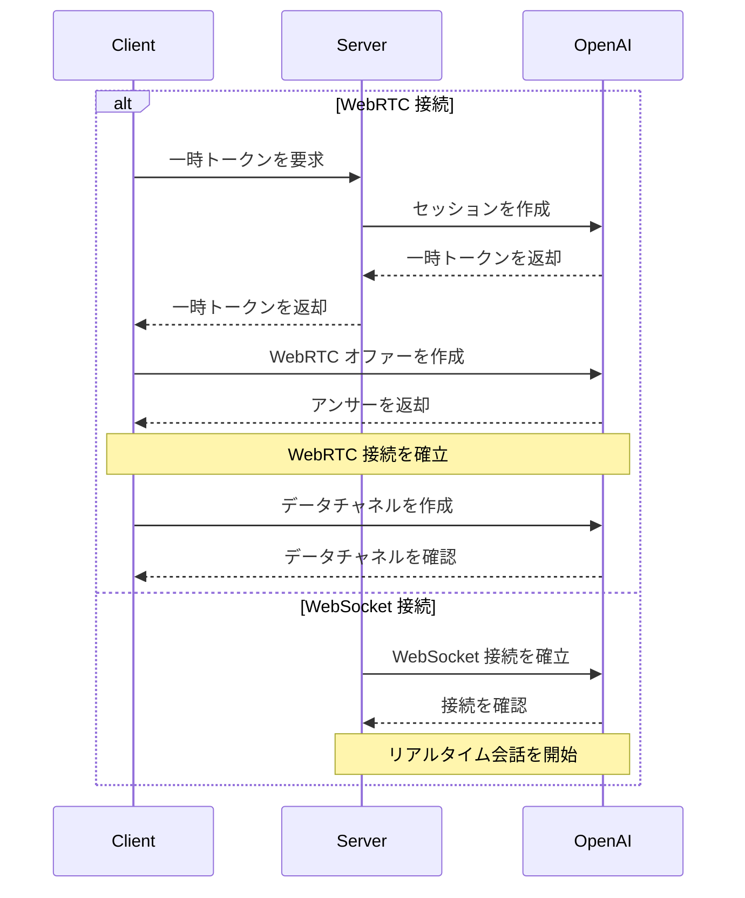

<Callout type="info" title="公式ドキュメント">
  - [OpenAI Realtime
  WebRTC](https://platform.openai.com/docs/guides/realtime-webrtc) - [OpenAI
  Realtime
  WebSocket](https://platform.openai.com/docs/guides/realtime-websocket)
</Callout>

## 📝 概要

### はじめに

OpenAI Realtime API は、以下の2つの接続方法を提供します。

1. WebRTC - ブラウザおよびモバイルクライアント向けのリアルタイム音声・ビデオインタラクション

2. WebSocket - サーバー間アプリケーション統合向け

### ユースケース

- リアルタイム音声会話
- 音声・ビデオ会議
- リアルタイム翻訳
- 音声文字変換
- リアルタイムコード生成
- サーバーサイドリアルタイム統合

### 主要な機能

- 双方向オーディオストリーム転送
- テキストと音声のハイブリッド会話
- 関数呼び出しサポート
- 自動音声検出 (VAD)
- 音声文字変換機能
- WebSocket サーバーサイド統合

## 🔐 認証とセキュリティ

### 認証方法

1. 標準 API キー (サーバーサイドのみ使用)
2. 一時トークン (クライアントサイド使用)

### 一時トークン

- 有効期限: 1分
- 使用制限: 単一接続
- 取得方法: サーバーサイド API を介して作成

```http
POST https://你的newapi服务器地址/v1/realtime/sessions
Content-Type: application/json
Authorization: Bearer $NEW_API_KEY

{
  "model": "gpt-4o-realtime-preview-2024-12-17",
  "voice": "verse"
}
```

### セキュリティに関する推奨事項

- クライアントで標準 API キーを絶対に公開しないでください
- HTTPS/WSS を使用して通信する
- 適切なアクセス制御を実装する
- 異常なアクティビティを監視する

## 🔌 接続の確立

### WebRTC 接続

- URL: `https://あなたのnewapiサーバーアドレス/v1/realtime`
- クエリパラメータ: `model`
- リクエストヘッダー:
  - `Authorization: Bearer EPHEMERAL_KEY`
  - `Content-Type: application/sdp`

### WebSocket 接続

- URL: `wss://あなたのnewapiサーバーアドレス/v1/realtime`
- クエリパラメータ: `model`
- リクエストヘッダー:
  - `Authorization: Bearer YOUR_API_KEY`
  - `OpenAI-Beta: realtime=v1`

### 接続フロー



### データチャネル

- 名称: `oai-events`
- 用途: イベント転送
- 形式: JSON

### オーディオストリーム

- 入力: `addTrack()`
- 出力: `ontrack` イベント

## 💬 会話インタラクション

### 会話モード

1. 純粋なテキスト会話
2. 音声会話
3. ハイブリッド会話

### セッション管理

- セッションの作成
- セッションの更新
- セッションの終了
- セッション設定

### イベントタイプ

- テキストイベント
- オーディオイベント
- 関数呼び出し
- ステータス更新
- エラーイベント

## ⚙️ 設定オプション

### オーディオ設定

- 入力形式
  - `pcm16`
  - `g711_ulaw`
  - `g711_alaw`
- 出力形式
  - `pcm16`
  - `g711_ulaw`
  - `g711_alaw`
- 音声タイプ
  - `alloy`
  - `echo`
  - `shimmer`

### モデル設定

- 温度
- 最大出力長
- システムプロンプト
- ツール設定

### VAD 設定

- 閾値
- 無音時間
- プレフィックスパディング

## 💡 リクエスト例

### WebRTC 接続 ❌

#### クライアント実装 (ブラウザ)

```javascript
async function init() {
  // 从服务器获取临时密钥 - 参见下方服务器代码
  const tokenResponse = await fetch('/session');
  const data = await tokenResponse.json();
  const EPHEMERAL_KEY = data.client_secret.value;

  // 创建对等连接
  const pc = new RTCPeerConnection();

  // 设置播放模型返回的远程音频
  const audioEl = document.createElement('audio');
  audioEl.autoplay = true;
  pc.ontrack = (e) => (audioEl.srcObject = e.streams[0]);

  // 添加浏览器麦克风输入的本地音频轨道
  const ms = await navigator.mediaDevices.getUserMedia({
    audio: true,
  });
  pc.addTrack(ms.getTracks()[0]);

  // 设置用于发送和接收事件的数据通道
  const dc = pc.createDataChannel('oai-events');
  dc.addEventListener('message', (e) => {
    // 这里接收实时服务器事件！
    console.log(e);
  });

  // 使用会话描述协议(SDP)启动会话
  const offer = await pc.createOffer();
  await pc.setLocalDescription(offer);

  const baseUrl = 'https://あなたのnewapiサーバーアドレス/v1/realtime';
  const model = 'gpt-4o-realtime-preview-2024-12-17';
  const sdpResponse = await fetch(`${baseUrl}?model=${model}`, {
    method: 'POST',
    body: offer.sdp,
    headers: {
      Authorization: `Bearer ${EPHEMERAL_KEY}`,
      'Content-Type': 'application/sdp',
    },
  });

  const answer = {
    type: 'answer',
    sdp: await sdpResponse.text(),
  };
  await pc.setRemoteDescription(answer);
}

init();
```

#### サーバーサイド実装 (Node.js)

```javascript
import express from 'express';

const app = express();

// 创建一个端点用于生成临时令牌
// 该端点与上面的客户端代码配合使用
app.get('/session', async (req, res) => {
  const r = await fetch(
    'https://あなたのnewapiサーバーアドレス/v1/realtime/sessions',
    {
      method: 'POST',
      headers: {
        Authorization: `Bearer ${process.env.NEW_API_KEY}`,
        'Content-Type': 'application/json',
      },
      body: JSON.stringify({
        model: 'gpt-4o-realtime-preview-2024-12-17',
        voice: 'verse',
      }),
    }
  );
  const data = await r.json();

  // 将从OpenAI REST API收到的JSON发送回客户端
  res.send(data);
});

app.listen(3000);
```

#### WebRTC イベント送受信例

```javascript
// 从对等连接创建数据通道
const dc = pc.createDataChannel('oai-events');

// 监听数据通道上的服务器事件
// 事件数据需要从JSON字符串解析
dc.addEventListener('message', (e) => {
  const realtimeEvent = JSON.parse(e.data);
  console.log(realtimeEvent);
});

// 发送客户端事件：将有效的客户端事件序列化为
// JSON，并通过数据通道发送
const responseCreate = {
  type: 'response.create',
  response: {
    modalities: ['text'],
    instructions: 'Write a haiku about code',
  },
};
dc.send(JSON.stringify(responseCreate));
```

### WebSocket 接続 ✅

#### Node.js (wsモジュール)

```javascript
import WebSocket from 'ws';

const url =
  'wss://あなたのnewapiサーバーアドレス/v1/realtime?model=gpt-4o-realtime-preview-2024-12-17';
const ws = new WebSocket(url, {
  headers: {
    Authorization: 'Bearer ' + process.env.NEW_API_KEY,
    'OpenAI-Beta': 'realtime=v1',
  },
});

ws.on('open', function open() {
  console.log('Connected to server.');
});

ws.on('message', function incoming(message) {
  console.log(JSON.parse(message.toString()));
});
```

#### Python (websocket-client)

```python
# 需要安装 websocket-client 库:
# pip install websocket-client

import os
import json
import websocket

NEW_API_KEY = os.environ.get("NEW_API_KEY")

url = "wss://あなたのnewapiサーバーアドレス/v1/realtime?model=gpt-4o-realtime-preview-2024-12-17"
headers = [
    "Authorization: Bearer " + NEW_API_KEY,
    "OpenAI-Beta: realtime=v1"
]

def on_open(ws):
    print("Connected to server.")

def on_message(ws, message):
    data = json.loads(message)
    print("Received event:", json.dumps(data, indent=2))

ws = websocket.WebSocketApp(
    url,
    header=headers,
    on_open=on_open,
    on_message=on_message,
)

ws.run_forever()
```

#### ブラウザ (標準WebSocket)

```javascript
/*
注意：在浏览器等客户端环境中，我们建议使用WebRTC。
但在Deno和Cloudflare Workers等类浏览器环境中，
也可以使用标准WebSocket接口。
*/

const ws = new WebSocket(
  'wss://あなたのnewapiサーバーアドレス/v1/realtime?model=gpt-4o-realtime-preview-2024-12-17',
  [
    'realtime',
    // 认证
    'openai-insecure-api-key.' + NEW_API_KEY,
    // 可选
    'openai-organization.' + OPENAI_ORG_ID,
    'openai-project.' + OPENAI_PROJECT_ID,
    // Beta协议，必需
    'openai-beta.realtime-v1',
  ]
);

ws.on('open', function open() {
  console.log('Connected to server.');
});

ws.on('message', function incoming(message) {
  console.log(message.data);
});
```

#### メッセージ送受信例

##### Node.js/ブラウザ

```javascript
// 接收服务器事件
ws.on('message', function incoming(message) {
  // 需要从JSON解析消息数据
  const serverEvent = JSON.parse(message.data);
  console.log(serverEvent);
});

// 发送事件，创建符合客户端事件格式的JSON数据结构
const event = {
  type: 'response.create',
  response: {
    modalities: ['audio', 'text'],
    instructions: 'Give me a haiku about code.',
  },
};
ws.send(JSON.stringify(event));
```

##### Python

```python
# 发送客户端事件，将字典序列化为JSON
def on_open(ws):
    print("Connected to server.")

    event = {
        "type": "response.create",
        "response": {
            "modalities": ["text"],
            "instructions": "Please assist the user."
        }
    }
    ws.send(json.dumps(event))

# 接收消息需要从JSON解析消息负载
def on_message(ws, message):
    data = json.loads(message)
    print("Received event:", json.dumps(data, indent=2))
```

## ⚠️ エラー処理

### よくあるエラー

1. 接続エラー
   - ネットワークの問題
   - 認証失敗
   - 設定エラー
2. オーディオエラー
   - デバイス権限
   - 形式がサポートされていません
   - コーデックの問題
3. セッションエラー
   - トークンの期限切れ
   - セッションタイムアウト
   - 同時実行制限

### エラーからの回復

1. 自動再接続
2. セッション回復
3. エラーのリトライ
4. フォールバック処理

## 📝 イベントリファレンス

### 共通リクエストヘッダー

すべてのイベントには以下のリクエストヘッダーを含める必要があります:

| リクエストヘッダー | 型     | 説明           | 例                  |
| ------------------ | ------ | -------------- | ------------------- |
| Authorization      | 文字列 | 認証トークン   | Bearer $NEW_API_KEY |
| OpenAI-Beta        | 文字列 | API バージョン | realtime=v1         |

### クライアントイベント

#### session.update

セッションのデフォルト設定を更新します。

| パラメータ                         | 型          | 必須   | 説明                                             | 例/選択可能な値                       |
| ---------------------------------- | ----------- | ------ | ------------------------------------------------ | ------------------------------------- |
| event_id                           | 文字列      | いいえ | クライアントが生成したイベント識別子             | event_123                             |
| type                               | 文字列      | いいえ | イベントタイプ                                   | session.update                        |
| modalities                         | 文字列配列  | いいえ | モデルが応答できるモダリティタイプ               | `["text", "audio"]`                   |
| instructions                       | 文字列      | いいえ | モデル呼び出しの前にプリセットされるシステム指示 | "Your knowledge cutoff is 2023-10..." |
| voice                              | 文字列      | いいえ | モデルが使用する音声タイプ                       | alloy、echo、shimmer                  |
| input_audio_format                 | 文字列      | いいえ | 入力オーディオ形式                               | pcm16、g711_ulaw、g711_alaw           |
| output_audio_format                | 文字列      | いいえ | 出力オーディオ形式                               | pcm16、g711_ulaw、g711_alaw           |
| input_audio_transcription.model    | 文字列      | いいえ | 文字起こしに使用するモデル                       | whisper-1                             |
| turn_detection.type                | 文字列      | いいえ | 音声検出タイプ                                   | server_vad                            |
| turn_detection.threshold           | 数値        | いいえ | VAD アクティベーション閾値 (0.0-1.0)             | 0.8                                   |
| turn_detection.prefix_padding_ms   | 整数        | いいえ | 音声開始前に含めるオーディオの長さ               | 500                                   |
| turn_detection.silence_duration_ms | 整数        | いいえ | 音声停止を検出する無音の継続時間                 | 1000                                  |
| tools                              | 配列        | いいえ | モデルが利用できるツールリスト                   | `[]`                                  |
| tool_choice                        | 文字列      | いいえ | モデルがツールを選択する方法                     | auto/none/required                    |
| temperature                        | 数値        | いいえ | モデルのサンプリング温度                         | 0.8                                   |
| max_output_tokens                  | 文字列/整数 | いいえ | 1回の応答での最大トークン数                      | "inf"/4096                            |

#### input_audio_buffer.append

入力オーディオバッファにオーディオデータを追加します。

| パラメータ | 型     | 必須   | 説明                                    | 例                        |
| ---------- | ------ | ------ | --------------------------------------- | ------------------------- |
| event_id   | 文字列 | いいえ | クライアントが生成したイベント識別子    | event_456                 |
| type       | 文字列 | いいえ | イベントタイプ                          | input_audio_buffer.append |
| audio      | 文字列 | いいえ | Base64 エンコードされたオーディオデータ | Base64EncodedAudioData    |

#### input_audio_buffer.commit

バッファ内のオーディオデータをユーザーメッセージとしてコミットします。

| パラメータ | 型     | 必須   | 説明                                 | 例                        |
| ---------- | ------ | ------ | ------------------------------------ | ------------------------- |
| event_id   | 文字列 | いいえ | クライアントが生成したイベント識別子 | event_789                 |
| type       | 文字列 | いいえ | イベントタイプ                       | input_audio_buffer.commit |

#### input_audio_buffer.clear

入力オーディオバッファ内のすべてのオーディオデータをクリアします。

| パラメータ | 型     | 必須   | 説明                                 | 例                       |
| ---------- | ------ | ------ | ------------------------------------ | ------------------------ |
| event_id   | 文字列 | いいえ | クライアントが生成したイベント識別子 | event_012                |
| type       | 文字列 | いいえ | イベントタイプ                       | input_audio_buffer.clear |

#### conversation.item.create

会話に新しい会話アイテムを追加します。

| パラメータ       | 型     | 必須   | 説明                                           | 例                                         |
| ---------------- | ------ | ------ | ---------------------------------------------- | ------------------------------------------ |
| event_id         | 文字列 | いいえ | クライアントが生成したイベント識別子           | event_345                                  |
| type             | 文字列 | いいえ | イベントタイプ                                 | conversation.item.create                   |
| previous_item_id | 文字列 | いいえ | 新しい会話アイテムがこの ID の後に挿入されます | null                                       |
| item.id          | 文字列 | いいえ | 会話アイテムの一意の識別子                     | msg_001                                    |
| item.type        | 文字列 | いいえ | 会話アイテムのタイプ                           | message/function_call/function_call_output |
| item.status      | 文字列 | いいえ | 会話アイテムのステータス                       | completed/in_progress/incomplete           |
| item.role        | 文字列 | いいえ | メッセージ送信者のロール                       | user/assistant/system                      |
| item.content     | 配列   | いいえ | メッセージ内容                                 | `[text/audio/transcript]`                  |
| item.call_id     | 文字列 | いいえ | 関数呼び出しの ID                              | call_001                                   |
| item.name        | 文字列 | いいえ | 呼び出された関数名                             | function_name                              |
| item.arguments   | 文字列 | いいえ | 関数呼び出しの引数                             | `{"param": "value"}`                       |
| item.output      | 文字列 | いいえ | 関数呼び出しの出力結果                         | `{"result": "value"}`                      |

#### conversation.item.truncate

アシスタントメッセージ内のオーディオコンテンツを切り詰めます。

| パラメータ    | 型     | 必須   | 説明                                          | 例                         |
| ------------- | ------ | ------ | --------------------------------------------- | -------------------------- |
| event_id      | 文字列 | いいえ | クライアントが生成したイベント識別子          | event_678                  |
| type          | 文字列 | いいえ | イベントタイプ                                | conversation.item.truncate |
| item_id       | 文字列 | いいえ | 切り詰めるアシスタントメッセージアイテムの ID | msg_002                    |
| content_index | 整数   | いいえ | 切り詰めるコンテンツ部分のインデックス        | 0                          |
| audio_end_ms  | 整数   | いいえ | オーディオ切り詰めの終了時点                  | 1500                       |

#### conversation.item.delete

会話履歴から指定された会話アイテムを削除します。

| パラメータ | 型     | 必須   | 説明                                 | 例                       |
| ---------- | ------ | ------ | ------------------------------------ | ------------------------ |
| event_id   | 文字列 | いいえ | クライアントが生成したイベント識別子 | event_901                |
| type       | 文字列 | いいえ | イベントタイプ                       | conversation.item.delete |
| item_id    | 文字列 | いいえ | 削除する会話アイテムの ID            | msg_003                  |

#### response.create

応答生成をトリガーします。

| パラメータ                   | 型          | 必須   | 説明                                 | 例                                |
| ---------------------------- | ----------- | ------ | ------------------------------------ | --------------------------------- |
| event_id                     | 文字列      | いいえ | クライアントが生成したイベント識別子 | event_234                         |
| type                         | 文字列      | いいえ | イベントタイプ                       | response.create                   |
| response.modalities          | 文字列配列  | いいえ | 応答のモダリティタイプ               | `["text", "audio"]`               |
| response.instructions        | 文字列      | いいえ | モデルへの指示                       | "Please assist the user."         |
| response.voice               | 文字列      | いいえ | モデルが使用する音声タイプ           | alloy/echo/shimmer                |
| response.output_audio_format | 文字列      | いいえ | 出力オーディオ形式                   | pcm16                             |
| response.tools               | 配列        | いいえ | モデルが利用できるツールリスト       | `["type", "name", "description"]` |
| response.tool_choice         | 文字列      | いいえ | モデルがツールを選択する方法         | auto                              |
| response.temperature         | 数値        | いいえ | サンプリング温度                     | 0.7                               |
| response.max_output_tokens   | 整数/文字列 | いいえ | 最大出力トークン数                   | 150/"inf"                         |

#### response.cancel

進行中の応答生成をキャンセルします。

| パラメータ | 型     | 必須   | 説明                                 | 例              |
| ---------- | ------ | ------ | ------------------------------------ | --------------- |
| event_id   | 文字列 | いいえ | クライアントが生成したイベント識別子 | event_567       |
| type       | 文字列 | いいえ | イベントタイプ                       | response.cancel |

### サーバーサイドイベント

#### error

エラーが発生したときに返されるイベント。

| パラメータ     | 型         | 必須   | 説明                                 | 例                                 |
| -------------- | ---------- | ------ | ------------------------------------ | ---------------------------------- |
| event_id       | 文字列配列 | いいえ | サーバーサイドイベントの一意の識別子 | `["event_890"]`                    |
| type           | 文字列     | いいえ | イベントタイプ                       | error                              |
| error.type     | 文字列     | いいえ | エラータイプ                         | invalid_request_error/server_error |
| error.code     | 文字列     | いいえ | エラーコード                         | invalid_event                      |
| error.message  | 文字列     | いいえ | 人間が読めるエラーメッセージ         | "The 'type' field is missing."     |
| error.param    | 文字列     | いいえ | エラーに関連するパラメータ           | null                               |
| error.event_id | 文字列     | いいえ | 関連イベントの ID                    | event_567                          |

#### conversation.item.input_audio_transcription.completed

入力オーディオ文字起こし機能が有効で、文字起こしが成功したときにこのイベントが返されます。

| パラメータ    | 型     | 必須   | 説明                                         | 例                                                    |
| ------------- | ------ | ------ | -------------------------------------------- | ----------------------------------------------------- |
| event_id      | 文字列 | いいえ | サーバーサイドイベントの一意の識別子         | event_2122                                            |
| type          | 文字列 | いいえ | イベントタイプ                               | conversation.item.input_audio_transcription.completed |
| item_id       | 文字列 | いいえ | ユーザーメッセージアイテムの ID              | msg_003                                               |
| content_index | 整数   | いいえ | オーディオを含むコンテンツ部分のインデックス | 0                                                     |
| transcript    | 文字列 | いいえ | 文字起こしされたテキストコンテンツ           | "Hello, how are you?"                                 |

#### conversation.item.input_audio_transcription.failed

入力オーディオ文字起こし機能が設定されているものの、ユーザーメッセージの文字起こしリクエストが失敗したときにこのイベントが返されます。

| パラメータ    | 型         | 必須   | 説明                                         | 例                                                       |
| ------------- | ---------- | ------ | -------------------------------------------- | -------------------------------------------------------- |
| event_id      | 文字列配列 | いいえ | サーバーサイドイベントの一意の識別子         | event_2324                                               |
| type          | 文字列配列 | いいえ | イベントタイプ                               | `["conversation.item.input_audio_transcription.failed"]` |
| item_id       | 文字列     | いいえ | ユーザーメッセージアイテムの ID              | msg_003                                                  |
| content_index | 整数       | いいえ | オーディオを含むコンテンツ部分のインデックス | 0                                                        |
| error.type    | 文字列     | いいえ | エラータイプ                                 | transcription_error                                      |
| error.code    | 文字列     | いいえ | エラーコード                                 | audio_unintelligible                                     |
| error.message | 文字列     | いいえ | 人間が読めるエラーメッセージ                 | "The audio could not be transcribed."                    |
| error.param   | 文字列     | いいえ | エラーに関連するパラメータ                   | null                                                     |

#### conversation.item.truncated

クライアントが以前のアシスタントオーディオメッセージアイテムを切り詰めたときにこのイベントが返されます。

| パラメータ    | 型     | 必須   | 説明                                              | 例                          |
| ------------- | ------ | ------ | ------------------------------------------------- | --------------------------- |
| event_id      | 文字列 | いいえ | サーバーサイドイベントの一意の識別子              | event_2526                  |
| type          | 文字列 | いいえ | イベントタイプ                                    | conversation.item.truncated |
| item_id       | 文字列 | いいえ | 切り詰められたアシスタントメッセージアイテムの ID | msg_004                     |
| content_index | 整数   | いいえ | 切り詰められたコンテンツ部分のインデックス        | 0                           |
| audio_end_ms  | 整数   | いいえ | オーディオが切り詰められた時間点 (ミリ秒)         | 1500                        |

#### conversation.item.deleted

会話内の特定のアイテムが削除されたときにこのイベントが返されます。

| パラメータ | 型     | 必須   | 説明                                 | 例                        |
| ---------- | ------ | ------ | ------------------------------------ | ------------------------- |
| event_id   | 文字列 | いいえ | サーバーサイドイベントの一意の識別子 | event_2728                |
| type       | 文字列 | いいえ | イベントタイプ                       | conversation.item.deleted |
| item_id    | 文字列 | いいえ | 削除された会話アイテムの ID          | msg_005                   |

#### input_audio_buffer.committed

オーディオバッファ内のデータがコミットされたときにこのイベントが返されます。

| パラメータ       | 型     | 必須   | 説明                                                                 | 例                           |
| ---------------- | ------ | ------ | -------------------------------------------------------------------- | ---------------------------- |
| event_id         | 文字列 | いいえ | サーバーサイドイベントの一意の識別子                                 | event_1121                   |
| type             | 文字列 | いいえ | イベントタイプ                                                       | input_audio_buffer.committed |
| previous_item_id | 文字列 | いいえ | 新しい会話アイテムがこの ID に対応する会話アイテムの後に挿入されます | msg_001                      |
| item_id          | 文字列 | いいえ | 作成されるユーザーメッセージアイテムの ID                            | msg_002                      |

#### input_audio_buffer.cleared

クライアントが入力オーディオバッファをクリアしたときにこのイベントが返されます。

| パラメータ | 型     | 必須   | 説明                                 | 例                         |
| ---------- | ------ | ------ | ------------------------------------ | -------------------------- |
| event_id   | 文字列 | いいえ | サーバーサイドイベントの一意の識別子 | event_1314                 |
| type       | 文字列 | いいえ | イベントタイプ                       | input_audio_buffer.cleared |

#### input_audio_buffer.speech_started

サーバー音声検出モードで、音声入力が検出されたときにこのイベントが返されます。

| パラメータ     | 型     | 必須   | 説明                                                  | 例                                |
| -------------- | ------ | ------ | ----------------------------------------------------- | --------------------------------- |
| event_id       | 文字列 | いいえ | サーバーサイドイベントの一意の識別子                  | event_1516                        |
| type           | 文字列 | いいえ | イベントタイプ                                        | input_audio_buffer.speech_started |
| audio_start_ms | 整数   | いいえ | セッション開始から音声が検出されるまでのミリ秒数      | 1000                              |
| item_id        | 文字列 | いいえ | 音声停止時に作成されるユーザーメッセージアイテムの ID | msg_003                           |

#### input_audio_buffer.speech_stopped

サーバー音声検出モードで、音声入力の停止が検出されたときにこのイベントが返されます。

| パラメータ     | 型     | 必須   | 説明                                                 | 例                                |
| -------------- | ------ | ------ | ---------------------------------------------------- | --------------------------------- |
| event_id       | 文字列 | いいえ | サーバーサイドイベントの一意の識別子                 | event_1718                        |
| type           | 文字列 | いいえ | イベントタイプ                                       | input_audio_buffer.speech_stopped |
| audio_start_ms | 整数   | いいえ | セッション開始から音声停止が検出されるまでのミリ秒数 | 2000                              |
| item_id        | 文字列 | いいえ | 作成されるユーザーメッセージアイテムの ID            | msg_003                           |

#### response.created

新しい応答が作成されたときにこのイベントが返されます。

| パラメータ              | 型           | 必須   | 説明                                       | 例                |
| ----------------------- | ------------ | ------ | ------------------------------------------ | ----------------- |
| event_id                | 文字列       | いいえ | サーバーサイドイベントの一意の識別子       | event_2930        |
| type                    | 文字列       | いいえ | イベントタイプ                             | response.created  |
| response.id             | 文字列       | いいえ | 応答の一意の識別子                         | resp_001          |
| response.object         | 文字列       | いいえ | オブジェクトタイプ                         | realtime.response |
| response.status         | 文字列       | いいえ | 応答のステータス                           | in_progress       |
| response.status_details | オブジェクト | いいえ | ステータスの追加詳細情報                   | null              |
| response.output         | 文字列配列   | いいえ | 応答によって生成された出力アイテムのリスト | `["[]"]`          |
| response.usage          | オブジェクト | いいえ | 応答の使用統計情報                         | null              |

#### response.done

応答のストリーミングが完了したときにこのイベントが返されます。

| パラメータ                   | 型           | 必須   | 説明                                       | 例                                    |
| ---------------------------- | ------------ | ------ | ------------------------------------------ | ------------------------------------- |
| event_id                     | 文字列       | いいえ | サーバーサイドイベントの一意の識別子       | event_3132                            |
| type                         | 文字列       | いいえ | イベントタイプ                             | response.done                         |
| response.id                  | 文字列       | いいえ | 応答の一意の識別子                         | resp_001                              |
| response.object              | 文字列       | いいえ | オブジェクトタイプ                         | realtime.response                     |
| response.status              | 文字列       | いいえ | 応答の最終ステータス                       | completed/cancelled/failed/incomplete |
| response.status_details      | オブジェクト | いいえ | ステータスの追加詳細情報                   | null                                  |
| response.output              | 文字列配列   | いいえ | 応答によって生成された出力アイテムのリスト | `["[...]"]`                           |
| response.usage.total_tokens  | 整数         | いいえ | 合計トークン数                             | 50                                    |
| response.usage.input_tokens  | 整数         | いいえ | 入力トークン数                             | 20                                    |
| response.usage.output_tokens | 整数         | いいえ | 出力トークン数                             | 30                                    |

#### response.output_item.added

応答生成中に新しい出力アイテムが作成されたときにこのイベントが返されます。

| パラメータ   | 型     | 必須   | 説明                                 | 例                                         |
| ------------ | ------ | ------ | ------------------------------------ | ------------------------------------------ |
| event_id     | 文字列 | いいえ | サーバーサイドイベントの一意の識別子 | event_3334                                 |
| type         | 文字列 | いいえ | イベントタイプ                       | response.output_item.added                 |
| response_id  | 文字列 | いいえ | 出力アイテムが属する応答 ID          | resp_001                                   |
| output_index | 文字列 | いいえ | 応答内の出力アイテムのインデックス   | 0                                          |
| item.id      | 文字列 | いいえ | 出力アイテムの一意の識別子           | msg_007                                    |
| item.object  | 文字列 | いいえ | オブジェクトタイプ                   | realtime.item                              |
| item.type    | 文字列 | いいえ | 出力アイテムタイプ                   | message/function_call/function_call_output |
| item.status  | 文字列 | いいえ | 出力アイテムのステータス             | in_progress/completed                      |
| item.role    | 文字列 | いいえ | 出力アイテムに関連付けられたロール   | assistant                                  |
| item.content | 配列   | いいえ | 出力アイテムのコンテンツ             | `["type", "text", "audio", "transcript"]`  |

#### response.output_item.done

出力アイテムのストリーミングが完了したときにこのイベントが返されます。

| パラメータ   | 型     | 必須   | 説明                                 | 例                                         |
| ------------ | ------ | ------ | ------------------------------------ | ------------------------------------------ |
| event_id     | 文字列 | いいえ | サーバーサイドイベントの一意の識別子 | event_3536                                 |
| type         | 文字列 | いいえ | イベントタイプ                       | response.output_item.done                  |
| response_id  | 文字列 | いいえ | 出力アイテムが属する応答 ID          | resp_001                                   |
| output_index | 文字列 | いいえ | 応答内の出力アイテムのインデックス   | 0                                          |
| item.id      | 文字列 | いいえ | 出力アイテムの一意の識別子           | msg_007                                    |
| item.object  | 文字列 | いいえ | オブジェクトタイプ                   | realtime.item                              |
| item.type    | 文字列 | いいえ | 出力アイテムタイプ                   | message/function_call/function_call_output |
| item.status  | 文字列 | いいえ | 出力アイテムの最終ステータス         | completed/incomplete                       |
| item.role    | 文字列 | いいえ | 出力アイテムに関連付けられたロール   | assistant                                  |
| item.content | 配列   | いいえ | 出力アイテムのコンテンツ             | `["type", "text", "audio", "transcript"]`  |

#### response.content_part.added

応答生成中にアシスタントメッセージアイテムに新しいコンテンツ部分が追加されたときにこのイベントが返されます。

| パラメータ      | 型     | 必須   | 説明                                                             | 例                          |
| --------------- | ------ | ------ | ---------------------------------------------------------------- | --------------------------- |
| event_id        | 文字列 | いいえ | サーバーサイドイベントの一意の識別子                             | event_3738                  |
| type            | 文字列 | いいえ | イベントタイプ                                                   | response.content_part.added |
| response_id     | 文字列 | いいえ | 応答の ID                                                        | resp_001                    |
| item_id         | 文字列 | いいえ | コンテンツ部分が追加されたメッセージアイテム ID                  | msg_007                     |
| output_index    | 整数   | いいえ | 応答内の出力アイテムのインデックス                               | 0                           |
| content_index   | 整数   | いいえ | メッセージアイテムコンテンツ配列内のコンテンツ部分のインデックス | 0                           |
| part.type       | 文字列 | いいえ | コンテンツタイプ                                                 | text/audio                  |
| part.text       | 文字列 | いいえ | テキストコンテンツ                                               | "Hello"                     |
| part.audio      | 文字列 | いいえ | Base64 エンコードされたオーディオデータ                          | "base64_encoded_audio_data" |
| part.transcript | 文字列 | いいえ | オーディオの文字起こしテキスト                                   | "Hello"                     |

#### response.content_part.done

アシスタントメッセージアイテム内のコンテンツ部分のストリーミングが完了したときにこのイベントが返されます。

| パラメータ      | 型     | 必須   | 説明                                                             | 例                          |
| --------------- | ------ | ------ | ---------------------------------------------------------------- | --------------------------- |
| event_id        | 文字列 | いいえ | サーバーサイドイベントの一意の識別子                             | event_3940                  |
| type            | 文字列 | いいえ | イベントタイプ                                                   | response.content_part.done  |
| response_id     | 文字列 | いいえ | 応答の ID                                                        | resp_001                    |
| item_id         | 文字列 | いいえ | コンテンツ部分が追加されたメッセージアイテム ID                  | msg_007                     |
| output_index    | 整数   | いいえ | 応答内の出力アイテムのインデックス                               | 0                           |
| content_index   | 整数   | いいえ | メッセージアイテムコンテンツ配列内のコンテンツ部分のインデックス | 0                           |
| part.type       | 文字列 | いいえ | コンテンツタイプ                                                 | text/audio                  |
| part.text       | 文字列 | いいえ | テキストコンテンツ                                               | "Hello"                     |
| part.audio      | 文字列 | いいえ | Base64 エンコードされたオーディオデータ                          | "base64_encoded_audio_data" |
| part.transcript | 文字列 | いいえ | オーディオの文字起こしテキスト                                   | "Hello"                     |

#### response.text.delta

「text」タイプのコンテンツ部分のテキスト値が更新されたときにこのイベントが返されます。

| パラメータ    | 型     | 必須   | 説明                                                             | 例                  |
| ------------- | ------ | ------ | ---------------------------------------------------------------- | ------------------- |
| event_id      | 文字列 | いいえ | サーバーサイドイベントの一意の識別子                             | event_4142          |
| type          | 文字列 | いいえ | イベントタイプ                                                   | response.text.delta |
| response_id   | 文字列 | いいえ | 応答の ID                                                        | resp_001            |
| item_id       | 文字列 | いいえ | メッセージアイテムの ID                                          | msg_007             |
| output_index  | 整数   | いいえ | 応答内の出力アイテムのインデックス                               | 0                   |
| content_index | 整数   | いいえ | メッセージアイテムコンテンツ配列内のコンテンツ部分のインデックス | 0                   |
| delta         | 文字列 | いいえ | テキスト増分更新コンテンツ                                       | "Sure, I can h"     |

#### response.text.done

「text」タイプのコンテンツ部分のテキストストリーミングが完了したときにこのイベントが返されます。

| パラメータ    | 型     | 必須   | 説明                                                             | 例                            |
| ------------- | ------ | ------ | ---------------------------------------------------------------- | ----------------------------- |
| event_id      | 文字列 | いいえ | サーバーサイドイベントの一意の識別子                             | event_4344                    |
| type          | 文字列 | いいえ | イベントタイプ                                                   | response.text.done            |
| response_id   | 文字列 | いいえ | 応答の ID                                                        | resp_001                      |
| item_id       | 文字列 | いいえ | メッセージアイテムの ID                                          | msg_007                       |
| output_index  | 整数   | いいえ | 応答内の出力アイテムのインデックス                               | 0                             |
| content_index | 整数   | いいえ | メッセージアイテムコンテンツ配列内のコンテンツ部分のインデックス | 0                             |
| delta         | 文字列 | いいえ | 最終的な完全なテキストコンテンツ                                 | "Sure, I can help with that." |

#### response.audio_transcript.delta

モデルが生成したオーディオ出力の文字起こしコンテンツが更新されたときにこのイベントが返されます。

| パラメータ    | 型     | 必須   | 説明                                                             | 例                              |
| ------------- | ------ | ------ | ---------------------------------------------------------------- | ------------------------------- |
| event_id      | 文字列 | いいえ | サーバーサイドイベントの一意の識別子                             | event_4546                      |
| type          | 文字列 | いいえ | イベントタイプ                                                   | response.audio_transcript.delta |
| response_id   | 文字列 | いいえ | 応答の ID                                                        | resp_001                        |
| item_id       | 文字列 | いいえ | メッセージアイテムの ID                                          | msg_008                         |
| output_index  | 整数   | いいえ | 応答内の出力アイテムのインデックス                               | 0                               |
| content_index | 整数   | いいえ | メッセージアイテムコンテンツ配列内のコンテンツ部分のインデックス | 0                               |
| delta         | 文字列 | いいえ | 文字起こしテキストの増分更新コンテンツ                           | "Hello, how can I a"            |

#### response.audio_transcript.done

モデルが生成したオーディオ出力の文字起こしストリーミングが完了したときにこのイベントが返されます。

| パラメータ    | 型     | 必須   | 説明                                                             | 例                                   |
| ------------- | ------ | ------ | ---------------------------------------------------------------- | ------------------------------------ |
| event_id      | 文字列 | いいえ | サーバーサイドイベントの一意の識別子                             | event_4748                           |
| type          | 文字列 | いいえ | イベントタイプ                                                   | response.audio_transcript.done       |
| response_id   | 文字列 | いいえ | 応答の ID                                                        | resp_001                             |
| item_id       | 文字列 | いいえ | メッセージアイテムの ID                                          | msg_008                              |
| output_index  | 整数   | いいえ | 応答内の出力アイテムのインデックス                               | 0                                    |
| content_index | 整数   | いいえ | メッセージアイテムコンテンツ配列内のコンテンツ部分のインデックス | 0                                    |
| transcript    | 文字列 | いいえ | オーディオの最終的な完全な文字起こしテキスト                     | "Hello, how can I assist you today?" |

#### response.audio.delta

モデルが生成したオーディオコンテンツが更新されたときにこのイベントが返されます。

| パラメータ    | 型     | 必須   | 説明                                                             | 例                        |
| ------------- | ------ | ------ | ---------------------------------------------------------------- | ------------------------- |
| event_id      | 文字列 | いいえ | サーバーサイドイベントの一意の識別子                             | event_4950                |
| type          | 文字列 | いいえ | イベントタイプ                                                   | response.audio.delta      |
| response_id   | 文字列 | いいえ | 応答の ID                                                        | resp_001                  |
| item_id       | 文字列 | いいえ | メッセージアイテムの ID                                          | msg_008                   |
| output_index  | 整数   | いいえ | 応答内の出力アイテムのインデックス                               | 0                         |
| content_index | 整数   | いいえ | メッセージアイテムコンテンツ配列内のコンテンツ部分のインデックス | 0                         |
| delta         | 文字列 | いいえ | Base64 エンコードされたオーディオデータの増分                    | "Base64EncodedAudioDelta" |

#### response.audio.done

モデルが生成したオーディオが完了したときにこのイベントが返されます。

| パラメータ    | 型     | 必須   | 説明                                                             | 例                  |
| ------------- | ------ | ------ | ---------------------------------------------------------------- | ------------------- |
| event_id      | 文字列 | いいえ | サーバーサイドイベントの一意の識別子                             | event_5152          |
| type          | 文字列 | いいえ | イベントタイプ                                                   | response.audio.done |
| response_id   | 文字列 | いいえ | 応答の ID                                                        | resp_001            |
| item_id       | 文字列 | いいえ | メッセージアイテムの ID                                          | msg_008             |
| output_index  | 整数   | いいえ | 応答内の出力アイテムのインデックス                               | 0                   |
| content_index | 整数   | いいえ | メッセージアイテムコンテンツ配列内のコンテンツ部分のインデックス | 0                   |

### 関数呼び出し

#### response.function_call_arguments.delta

モデルが生成した関数呼び出し引数が更新されたときにこのイベントが返されます。

| パラメータ   | 型     | 必須   | 説明                                 | 例                                     |
| ------------ | ------ | ------ | ------------------------------------ | -------------------------------------- |
| event_id     | 文字列 | いいえ | サーバーサイドイベントの一意の識別子 | event_5354                             |
| type         | 文字列 | いいえ | イベントタイプ                       | response.function_call_arguments.delta |
| response_id  | 文字列 | いいえ | 応答の ID                            | resp_002                               |
| item_id      | 文字列 | いいえ | メッセージアイテムの ID              | fc_001                                 |
| output_index | 整数   | いいえ | 応答内の出力アイテムのインデックス   | 0                                      |
| call_id      | 文字列 | いいえ | 関数呼び出しの ID                    | call_001                               |
| delta        | 文字列 | いいえ | JSON 形式の関数呼び出し引数の増分    | `{"location": "San"}`                  |

#### response.function_call_arguments.done

モデルが生成した関数呼び出し引数のストリーミングが完了したときにこのイベントが返されます。

| パラメータ   | 型     | 必須   | 説明                                       | 例                                    |
| ------------ | ------ | ------ | ------------------------------------------ | ------------------------------------- |
| event_id     | 文字列 | いいえ | サーバーサイドイベントの一意の識別子       | event_5556                            |
| type         | 文字列 | いいえ | イベントタイプ                             | response.function_call_arguments.done |
| response_id  | 文字列 | いいえ | 応答の ID                                  | resp_002                              |
| item_id      | 文字列 | いいえ | メッセージアイテムの ID                    | fc_001                                |
| output_index | 整数   | いいえ | 応答内の出力アイテムのインデックス         | 0                                     |
| call_id      | 文字列 | いいえ | 関数呼び出しの ID                          | call_001                              |
| arguments    | 文字列 | いいえ | 最終的な完全な関数呼び出し引数 (JSON 形式) | `{"location": "San Francisco"}`       |

### その他のステータス更新

#### rate_limits.updated

各「response.done」イベントの後にトリガーされ、更新されたレート制限を示します。

| パラメータ  | 型               | 必須   | 説明                                 | 例                                                                                  |
| ----------- | ---------------- | ------ | ------------------------------------ | ----------------------------------------------------------------------------------- |
| event_id    | 文字列           | いいえ | サーバーサイドイベントの一意の識別子 | event_5758                                                                          |
| type        | 文字列           | いいえ | イベントタイプ                       | rate_limits.updated                                                                 |
| rate_limits | オブジェクト配列 | いいえ | レート制限情報リスト                 | `[{"name": "requests_per_min", "limit": 60, "remaining": 45, "reset_seconds": 35}]` |

#### conversation.created

会話が作成されたときにこのイベントが返されます。

| パラメータ   | 型           | 必須   | 説明                                 | 例                                                      |
| ------------ | ------------ | ------ | ------------------------------------ | ------------------------------------------------------- |
| event_id     | 文字列       | いいえ | サーバーサイドイベントの一意の識別子 | event_9101                                              |
| type         | 文字列       | いいえ | イベントタイプ                       | conversation.created                                    |
| conversation | オブジェクト | いいえ | 会話リソースオブジェクト             | `{"id": "conv_001", "object": "realtime.conversation"}` |

#### conversation.item.created

会話アイテムが作成されたときにこのイベントが返されます。

| パラメータ       | 型           | 必須   | 説明                                 | 例                                                                                                                                                       |
| ---------------- | ------------ | ------ | ------------------------------------ | -------------------------------------------------------------------------------------------------------------------------------------------------------- |
| event_id         | 文字列       | いいえ | サーバーサイドイベントの一意の識別子 | event_1920                                                                                                                                               |
| type             | 文字列       | いいえ | イベントタイプ                       | conversation.item.created                                                                                                                                |
| previous_item_id | 文字列       | いいえ | 前の会話アイテムの ID                | msg_002                                                                                                                                                  |
| item             | オブジェクト | いいえ | 会話アイテムオブジェクト             | `{"id": "msg_003", "object": "realtime.item", "type": "message", "status": "completed", "role": "user", "content": [{"type": "text", "text": "Hello"}]}` |

#### session.created

セッションが作成されたときにこのイベントが返されます。

| パラメータ | 型           | 必須   | 説明                                 | 例                                                                                                    |
| ---------- | ------------ | ------ | ------------------------------------ | ----------------------------------------------------------------------------------------------------- |
| event_id   | 文字列       | いいえ | サーバーサイドイベントの一意の識別子 | event_1234                                                                                            |
| type       | 文字列       | いいえ | イベントタイプ                       | session.created                                                                                       |
| session    | オブジェクト | いいえ | セッションオブジェクト               | `{"id": "sess_001", "object": "realtime.session", "model": "gpt-4", "modalities": ["text", "audio"]}` |

#### session.updated

セッションが更新されたときにこのイベントが返されます。

| パラメータ | 型           | 必須   | 説明                                 | 例                                                                                                    |
| ---------- | ------------ | ------ | ------------------------------------ | ----------------------------------------------------------------------------------------------------- |
| event_id   | 文字列       | いいえ | サーバーサイドイベントの一意の識別子 | event_5678                                                                                            |
| type       | 文字列       | いいえ | イベントタイプ                       | session.updated                                                                                       |
| session    | オブジェクト | いいえ | 更新されたセッションオブジェクト     | `{"id": "sess_001", "object": "realtime.session", "model": "gpt-4", "modalities": ["text", "audio"]}` |

### レート制限イベントパラメータ表

| パラメータ    | 型     | 必須 | 説明              | 例               |
| ------------- | ------ | ---- | ----------------- | ---------------- |
| name          | 文字列 | はい | 制限名            | requests_per_min |
| limit         | 整数   | はい | 制限値            | 60               |
| remaining     | 整数   | はい | 残り利用可能量    | 45               |
| reset_seconds | 整数   | はい | リセット時間 (秒) | 35               |

### 関数呼び出しパラメータ表

| パラメータ  | 型           | 必須   | 説明               | 例                                        |
| ----------- | ------------ | ------ | ------------------ | ----------------------------------------- |
| type        | 文字列       | はい   | 関数タイプ         | function                                  |
| name        | 文字列       | はい   | 関数名             | get_weather                               |
| description | 文字列       | いいえ | 関数説明           | Get the current weather                   |
| parameters  | オブジェクト | はい   | 関数パラメータ定義 | `{"type": "object", "properties": {...}}` |

### オーディオ形式パラメータ表

| パラメータ      | 型     | 説明                     | 選択可能な値                     |
| --------------- | ------ | ------------------------ | -------------------------------- |
| sample_rate     | 整数   | サンプリングレート       | 8000, 16000, 24000, 44100, 48000 |
| channels        | 整数   | チャンネル数             | 1 (モノラル), 2 (ステレオ)       |
| bits_per_sample | 整数   | サンプルあたりのビット数 | 16 (pcm16), 8 (g711)             |
| encoding        | 文字列 | エンコーディング方式     | pcm16, g711_ulaw, g711_alaw      |

### 音声検出パラメータ表

| パラメータ          | 型           | 説明                                  | デフォルト値 | 範囲      |
| ------------------- | ------------ | ------------------------------------- | ------------ | --------- |
| threshold           | 浮動小数点数 | VAD アクティベーション閾値            | 0.5          | 0.0-1.0   |
| prefix_padding_ms   | 整数         | 音声プレフィックスパディング (ミリ秒) | 500          | 0-5000    |
| silence_duration_ms | 整数         | 無音検出時間 (ミリ秒)                 | 1000         | 100-10000 |

### ツール選択パラメータ表

| パラメータ  | 型     | 説明                   | 選択可能な値                              |
| ----------- | ------ | ---------------------- | ----------------------------------------- |
| tool_choice | 文字列 | ツール選択方式         | auto, none, required                      |
| tools       | 配列   | 利用可能なツールリスト | `[{type, name, description, parameters}]` |

### モデル設定パラメータ表

| パラメータ        | 型           | 説明             | 範囲/選択可能な値    | デフォルト値 |
| ----------------- | ------------ | ---------------- | -------------------- | ------------ |
| temperature       | 浮動小数点数 | サンプリング温度 | 0.0-2.0              | 1.0          |
| max_output_tokens | 整数/文字列  | 最大出力長       | 1-4096/"inf"         | "inf"        |
| modalities        | 文字列配列   | 応答モダリティ   | `["text", "audio"]`  | `["text"]`   |
| voice             | 文字列       | 音声タイプ       | alloy, echo, shimmer | alloy        |

### イベント共通パラメータ表

| パラメータ | 型     | 必須   | 説明                                  | 例             |
| ---------- | ------ | ------ | ------------------------------------- | -------------- |
| event_id   | 文字列 | はい   | イベントの一意の識別子                | event_123      |
| type       | 文字列 | はい   | イベントタイプ                        | session.update |
| timestamp  | 整数   | いいえ | イベント発生のタイムスタンプ (ミリ秒) | 1677649363000  |

### セッションステータスパラメータ表

| パラメータ | 型           | 説明                 | 選択可能な値                                         |
| ---------- | ------------ | -------------------- | ---------------------------------------------------- |
| status     | 文字列       | セッションステータス | active, ended, error                                 |
| error      | オブジェクト | エラー情報           | `{"type": "error_type", "message": "error message"}` |
| metadata   | オブジェクト | セッションメタデータ | `{"client_id": "web", "session_type": "chat"}`       |

### 会話アイテムステータスパラメータ表

| パラメータ | 型     | 説明                   | 選択可能な値                                 |
| ---------- | ------ | ---------------------- | -------------------------------------------- |
| status     | 文字列 | 会話アイテムステータス | completed, in_progress, incomplete           |
| role       | 文字列 | 送信者ロール           | user, assistant, system                      |
| type       | 文字列 | 会話アイテムタイプ     | message, function_call, function_call_output |

### コンテンツタイプパラメータ表

| パラメータ | 型     | 説明                 | 選択可能な値            |
| ---------- | ------ | -------------------- | ----------------------- |
| type       | 文字列 | コンテンツタイプ     | text, audio, transcript |
| format     | 文字列 | コンテンツ形式       | plain, markdown, html   |
| encoding   | 文字列 | エンコーディング方式 | utf-8, base64           |

### 応答ステータスパラメータ表

| パラメータ     | 型           | 説明           | 選択可能な値                                                    |
| -------------- | ------------ | -------------- | --------------------------------------------------------------- |
| status         | 文字列       | 応答ステータス | completed, cancelled, failed, incomplete                        |
| status_details | オブジェクト | ステータス詳細 | `{"reason": "user_cancelled"}`                                  |
| usage          | オブジェクト | 使用統計       | `{"total_tokens": 50, "input_tokens": 20, "output_tokens": 30}` |

### オーディオ文字起こしパラメータ表

| パラメータ | 型       | 説明                           | 例                             |
| ---------- | -------- | ------------------------------ | ------------------------------ |
| enabled    | ブール値 | 文字起こしを有効にするかどうか | true                           |
| model      | 文字列   | 文字起こしモデル               | whisper-1                      |
| language   | 文字列   | 文字起こし言語                 | en, zh, auto                   |
| prompt     | 文字列   | 文字起こしプロンプト           | "Transcript of a conversation" |

### オーディオストリームパラメータ表

| パラメータ  | 型     | 説明                              | 選択可能な値        |
| ----------- | ------ | --------------------------------- | ------------------- |
| chunk_size  | 整数   | オーディオチャンクサイズ (バイト) | 1024, 2048, 4096    |
| latency     | 文字列 | 遅延モード                        | low, balanced, high |
| compression | 文字列 | 圧縮方式                          | none, opus, mp3     |

### WebRTC 設定パラメータ表

| パラメータ         | 型           | 説明                      | デフォルト値                                 |
| ------------------ | ------------ | ------------------------- | -------------------------------------------- |
| ice_servers        | 配列         | ICE サーバーリスト        | `[{"urls": "stun:stun.l.google.com:19302"}]` |
| audio_constraints  | オブジェクト | オーディオ制約            | `{"echoCancellation": true}`                 |
| connection_timeout | 整数         | 接続タイムアウト (ミリ秒) | 30000                                        |
