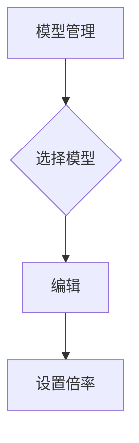

---
title: 価格比率とグループ管理
---

価格倍率（比率）は、Cherry Studioにおいて、異なるユーザー、異なるチャネル、異なるモデルの価格を制御するために使用されるコアメカニズムです。倍率を設定することで、コストと利益を柔軟に調整できます。

---

## 1. 価格比率の基本概念

倍率は乗数ファクターであり、デフォルト値は `1.0` です。

- 倍率が `1.0` に設定されている場合、ユーザーが消費する額度は、チャネルが実際に消費するトークン数と一致します。
- 倍率が `1.2` に設定されている場合、ユーザーが消費する額度は、チャネルが実際に消費するトークン数の 1.2 倍になります。これは通常、利益を増やすために使用されます。
- 倍率が `0.8` に設定されている場合、ユーザーが消費する額度は、チャネルが実際に消費するトークン数の 0.8 倍になります。これは通常、プロモーションまたは割引を提供するために使用されます。

---

## 2. グループ管理

グループ管理により、ユーザー、トークン、またはチャネルを分類し、各分類に異なる価格倍率を適用できます。

### 2.1 ユーザーグループ

ユーザーグループは、主に異なるレベルのユーザー（例：一般ユーザー、VIPユーザー、テストユーザー）を区別し、差別化された価格サービスを提供するために使用されます。

**操作手順:**

1. `システム設定` -> `ユーザーグループ` に移動します。
2. `新しいグループを作成` をクリックし、グループ名とデフォルト倍率を入力します。
3. ユーザー管理インターフェースで、特定のユーザーをそのグループに割り当てます。

### 2.2 チャネルグループ

チャネルグループは、異なる API チャネルの分類管理に使用されます。たとえば、価格が高いすべてのチャネルを1つのグループにまとめ、そのグループに統一された倍率を設定してコストをカバーすることができます。

**操作手順:**

1. `チャネル管理` -> `チャネルグループ` に移動します。
2. `新しいグループを作成` をクリックし、グループ名を入力します。
3. チャネル管理インターフェースで、特定のチャネルをそのグループに割り当てます。

---

## 3. 倍率の適用優先順位

リクエストが発生した際、システムは以下の優先順位に従って、最も正確な倍率設定を検索し、適用します。

1. **モデルレベル倍率 (最高優先順位):** 特定のモデル（例：`gpt-4o`）に対して設定された倍率。
2. **チャネルレベル倍率:** 特定のチャネルに対して設定された倍率。
3. **ユーザーレベル倍率:** 特定のユーザーに対して設定された倍率。
4. **チャネルグループ倍率:** チャネルグループに対して設定された倍率。
5. **ユーザーグループ倍率:** ユーザーグループに対して設定された倍率。
6. **グローバルデフォルト倍率 (最低優先順位):** システムのデフォルト倍率（通常は `1.0`）。

**例:**

ユーザー A が VIP グループ（倍率 0.9）に属しているが、管理者がユーザー A に対して個別に倍率 0.8 を設定した場合、システムは 0.8 を使用します。

---

## 4. Cherry Studio で倍率を設定する方法

### 4.1 モデル倍率の設定

モデル倍率により、特定のモデル（どのチャネルを通じて呼び出されたかに関わらず）に対して価格調整を行うことができます。

1. `モデル管理` に移動します。
2. 対象のモデルを見つけ、編集ボタンをクリックします。
3. `倍率設定` フィールドに新しい倍率値を入力します。



### 4.2 チャネル倍率の設定

チャネル倍率は、その特定のチャネルに対してのみ適用され、チャネルグループ倍率よりも優先順位が高くなります。

1. `チャネル管理` に移動します。
2. 対象のチャネルを見つけ、編集ボタンをクリックします。
3. `倍率設定` フィールドに新しい倍率値を入力します。

### 4.3 ユーザー倍率の設定

ユーザー倍率は、個々のユーザーに対して設定され、ユーザーグループ倍率よりも優先順位が高くなります。

1. `ユーザー管理` に移動します。
2. 対象のユーザーを見つけ、編集ボタンをクリックします。
3. `倍率設定` フィールドに新しい倍率値を入力します。

---

## 5. まとめ

グループと倍率設定を柔軟に活用することで、きめ細かな価格制御とコスト管理を実現できます。

{/*  - 画像が利用できません */}

```

```
