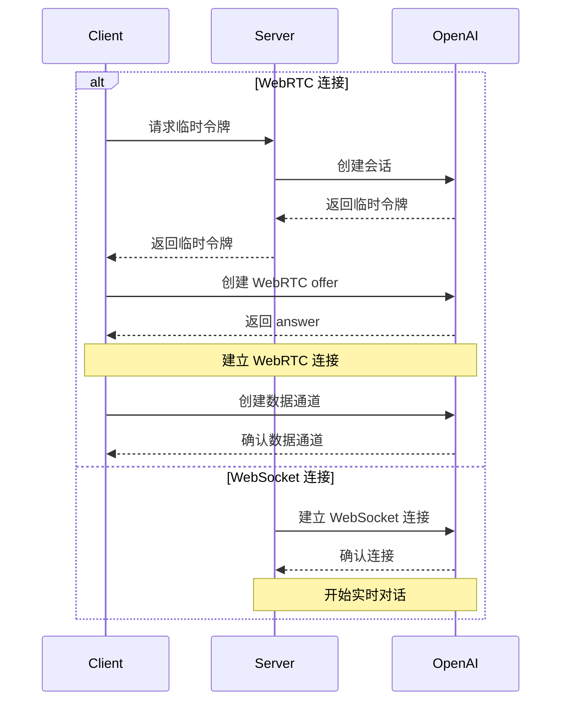

{/* TODO: Convert to Callout - info: 官方文档 */} - [OpenAI Realtime WebRTC](https://platform.openai.com/docs/guides/realtime-webrtc) - [OpenAI Realtime WebSocket](https://platform.openai.com/docs/guides/realtime-websocket)

## 📝 概述

### 简介

OpenAI Realtime API 提供两种连接方式：

1. WebRTC - 适用于浏览器和移动客户端的实时音视频交互

2. WebSocket - 适用于服务器到服务器的应用程序集成

### 使用场景

- 实时语音对话
- 音视频会议
- 实时翻译
- 语音转写
- 实时代码生成
- 服务器端实时集成

### 主要特性

- 双向音频流传输
- 文本和音频混合对话
- 函数调用支持
- 自动语音检测(VAD)
- 音频转写功能
- WebSocket 服务器端集成

## 🔐 认证与安全

### 认证方式

1. 标准 API 密钥 (仅服务器端使用)
2. 临时令牌 (客户端使用)

### 临时令牌

- 有效期: 1分钟
- 使用限制: 单个连接
- 获取方式: 通过服务器端 API 创建

```http
POST https://你的newapi服务器地址/v1/realtime/sessions
Content-Type: application/json
Authorization: Bearer $NEW_API_KEY

\{
  "model": "gpt-4o-realtime-preview-2024-12-17",
  "voice": "verse"
}
```

### 安全建议

- 永远不要在客户端暴露标准 API 密钥
- 使用 HTTPS/WSS 进行通信
- 实现适当的访问控制
- 监控异常活动

## 🔌 连接建立

### WebRTC 连接

- URL: `https://你的newapi服务器地址/v1/realtime`
- 查询参数: `model`
- 请求头:
  - `Authorization: Bearer EPHEMERAL_KEY`
  - `Content-Type: application/sdp`

### WebSocket 连接

- URL: `wss://你的newapi服务器地址/v1/realtime`
- 查询参数: `model`
- 请求头:
  - `Authorization: Bearer YOUR_API_KEY`
  - `OpenAI-Beta: realtime=v1`

### 连接流程



### 数据通道

- 名称: `oai-events`
- 用途: 事件传输
- 格式: JSON

### 音频流

- 输入: `addTrack()`
- 输出: `ontrack` 事件

## 💬 对话交互

### 对话模式

1. 纯文本对话
2. 语音对话
3. 混合对话

### 会话管理

- 创建会话
- 更新会话
- 结束会话
- 会话配置

### 事件类型

- 文本事件
- 音频事件
- 函数调用
- 状态更新
- 错误事件

## ⚙️ 配置选项

### 音频配置

- 输入格式
  - `pcm16`
  - `g711_ulaw`
  - `g711_alaw`
- 输出格式
  - `pcm16`
  - `g711_ulaw`
  - `g711_alaw`
- 语音类型
  - `alloy`
  - `echo`
  - `shimmer`

### 模型配置

- 温度
- 最大输出长度
- 系统提示词
- 工具配置

### VAD 配置

- 阈值
- 静音时长
- 前缀填充

## 💡 请求示例

### WebRTC 连接 ❌

#### 客户端实现 (浏览器)

```javascript
async function init() \{
  // 从服务器获取临时密钥 - 参见下方服务器代码
  const tokenResponse = await fetch("/session");
  const data = await tokenResponse.json();
  const EPHEMERAL_KEY = data.client_secret.value;

  // 创建对等连接
  const pc = new RTCPeerConnection();

  // 设置播放模型返回的远程音频
  const audioEl = document.createElement("audio");
  audioEl.autoplay = true;
  pc.ontrack = e => audioEl.srcObject = e.streams[0];

  // 添加浏览器麦克风输入的本地音频轨道
  const ms = await navigator.mediaDevices.getUserMedia({
    audio: true
  });
  pc.addTrack(ms.getTracks()[0]);

  // 设置用于发送和接收事件的数据通道
  const dc = pc.createDataChannel("oai-events");
  dc.addEventListener("message", (e) => \{
    // 这里接收实时服务器事件！
    console.log(e);
  });

  // 使用会话描述协议(SDP)启动会话
  const offer = await pc.createOffer();
  await pc.setLocalDescription(offer);

  const baseUrl = "https://你的newapi服务器地址/v1/realtime";
  const model = "gpt-4o-realtime-preview-2024-12-17";
  const sdpResponse = await fetch(`${baseUrl}?model=${model}`, {
    method: "POST",
    body: offer.sdp,
    headers: {
      Authorization: `Bearer ${EPHEMERAL_KEY}`,
      "Content-Type": "application/sdp"
    },
  });

  const answer = {
    type: "answer",
    sdp: await sdpResponse.text(),
  };
  await pc.setRemoteDescription(answer);
}

init();
```

#### 服务器端实现 (Node.js)

```javascript
import express from "express";

const app = express();

// 创建一个端点用于生成临时令牌
// 该端点与上面的客户端代码配合使用
app.get("/session", async (req, res) => {
  const r = await fetch("https://你的newapi服务器地址/v1/realtime/sessions", {
    method: "POST",
    headers: \{
      "Authorization": `Bearer ${process.env.NEW_API_KEY}`,
      "Content-Type": "application/json",
    },
    body: JSON.stringify({
      model: "gpt-4o-realtime-preview-2024-12-17",
      voice: "verse",
    }),
  });
  const data = await r.json();

  // 将从OpenAI REST API收到的JSON发送回客户端
  res.send(data);
});

app.listen(3000);
```

#### WebRTC 事件收发示例

```javascript
// 从对等连接创建数据通道
const dc = pc.createDataChannel('oai-events');

// 监听数据通道上的服务器事件
// 事件数据需要从JSON字符串解析
dc.addEventListener('message', (e) => {
  const realtimeEvent = JSON.parse(e.data);
  console.log(realtimeEvent);
});

// 发送客户端事件：将有效的客户端事件序列化为
// JSON，并通过数据通道发送
const responseCreate = {
  type: 'response.create',
  response: {
    modalities: ['text'],
    instructions: 'Write a haiku about code',
  },
};
dc.send(JSON.stringify(responseCreate));
```

### WebSocket 连接 ✅

#### Node.js (ws模块)

```javascript
import WebSocket from "ws";

const url = "wss://你的newapi服务器地址/v1/realtime?model=gpt-4o-realtime-preview-2024-12-17";
const ws = new WebSocket(url, {
  headers: \{
    "Authorization": "Bearer " + process.env.NEW_API_KEY,
    "OpenAI-Beta": "realtime=v1",
  },
});

ws.on("open", function open() {
  console.log("Connected to server.");
});

ws.on("message", function incoming(message) {
  console.log(JSON.parse(message.toString()));
});
```

#### Python (websocket-client)

```python
# 需要安装 websocket-client 库:
# pip install websocket-client

import os
import json
import websocket

NEW_API_KEY = os.environ.get("NEW_API_KEY")

url = "wss://你的newapi服务器地址/v1/realtime?model=gpt-4o-realtime-preview-2024-12-17"
headers = [
    "Authorization: Bearer " + NEW_API_KEY,
    "OpenAI-Beta: realtime=v1"
]

def on_open(ws):
    print("Connected to server.")

def on_message(ws, message):
    data = json.loads(message)
    print("Received event:", json.dumps(data, indent=2))

ws = websocket.WebSocketApp(
    url,
    header=headers,
    on_open=on_open,
    on_message=on_message,
)

ws.run_forever()
```

#### 浏览器 (标准WebSocket)

```javascript
/*
注意：在浏览器等客户端环境中，我们建议使用WebRTC。
但在Deno和Cloudflare Workers等类浏览器环境中，
也可以使用标准WebSocket接口。
*/

const ws = new WebSocket(
  'wss://你的newapi服务器地址/v1/realtime?model=gpt-4o-realtime-preview-2024-12-17',
  [
    'realtime',
    // 认证
    'openai-insecure-api-key.' + NEW_API_KEY,
    // 可选
    'openai-organization.' + OPENAI_ORG_ID,
    'openai-project.' + OPENAI_PROJECT_ID,
    // Beta协议，必需
    'openai-beta.realtime-v1',
  ]
);

ws.on('open', function open() {
  console.log('Connected to server.');
});

ws.on('message', function incoming(message) {
  console.log(message.data);
});
```

#### 消息收发示例

##### Node.js/浏览器

```javascript
// 接收服务器事件
ws.on("message", function incoming(message) \{
  // 需要从JSON解析消息数据
  const serverEvent = JSON.parse(message.data)
  console.log(serverEvent);
});

// 发送事件，创建符合客户端事件格式的JSON数据结构
const event = {
  type: "response.create",
  response: {
    modalities: ["audio", "text"],
    instructions: "Give me a haiku about code.",
  }
};
ws.send(JSON.stringify(event));
```

##### Python

```python
# 发送客户端事件，将字典序列化为JSON
def on_open(ws):
    print("Connected to server.")

    event = \{
        "type": "response.create",
        "response": \{
            "modalities": ["text"],
            "instructions": "Please assist the user."
        }
    }
    ws.send(json.dumps(event))

# 接收消息需要从JSON解析消息负载
def on_message(ws, message):
    data = json.loads(message)
    print("Received event:", json.dumps(data, indent=2))
```

## ⚠️ 错误处理

### 常见错误

1. 连接错误
   - 网络问题
   - 认证失败
   - 配置错误
2. 音频错误
   - 设备权限
   - 格式不支持
   - 编解码问题
3. 会话错误
   - 令牌过期
   - 会话超时
   - 并发限制

### 错误恢复

1. 自动重连
2. 会话恢复
3. 错误重试
4. 降级处理

## 📝 事件参考

### 通用请求头

所有事件都需要包含以下请求头:

| 请求头        | 类型   | 说明     | 示例值              |
| ------------- | ------ | -------- | ------------------- |
| Authorization | 字符串 | 认证令牌 | Bearer $NEW_API_KEY |
| OpenAI-Beta   | 字符串 | API 版本 | realtime=v1         |

### 客户端事件

#### session.update

更新会话的默认配置。

| 参数                               | 类型        | 必需 | 说明                       | 示例值/可选值                         |
| ---------------------------------- | ----------- | ---- | -------------------------- | ------------------------------------- |
| event_id                           | 字符串      | 否   | 客户端生成的事件标识符     | event_123                             |
| type                               | 字符串      | 否   | 事件类型                   | session.update                        |
| modalities                         | 字符串数组  | 否   | 模型可以响应的模态类型     | ["text", "audio"]                     |
| instructions                       | 字符串      | 否   | 预置到模型调用前的系统指令 | "Your knowledge cutoff is 2023-10..." |
| voice                              | 字符串      | 否   | 模型使用的语音类型         | alloy、echo、shimmer                  |
| input_audio_format                 | 字符串      | 否   | 输入音频格式               | pcm16、g711_ulaw、g711_alaw           |
| output_audio_format                | 字符串      | 否   | 输出音频格式               | pcm16、g711_ulaw、g711_alaw           |
| input_audio_transcription.model    | 字符串      | 否   | 用于转写的模型             | whisper-1                             |
| turn_detection.type                | 字符串      | 否   | 语音检测类型               | server_vad                            |
| turn_detection.threshold           | 数字        | 否   | VAD 激活阈值(0.0-1.0)      | 0.8                                   |
| turn_detection.prefix_padding_ms   | 整数        | 否   | 语音开始前包含的音频时长   | 500                                   |
| turn_detection.silence_duration_ms | 整数        | 否   | 检测语音停止的静音持续时间 | 1000                                  |
| tools                              | 数组        | 否   | 模型可用的工具列表         | []                                    |
| tool_choice                        | 字符串      | 否   | 模型选择工具的方式         | auto/none/required                    |
| temperature                        | 数字        | 否   | 模型采样温度               | 0.8                                   |
| max_output_tokens                  | 字符串/整数 | 否   | 单次响应最大token数        | "inf"/4096                            |

#### input_audio_buffer.append

向输入音频缓冲区追加音频数据。

| 参数     | 类型   | 必需 | 说明                   | 示例值                    |
| -------- | ------ | ---- | ---------------------- | ------------------------- |
| event_id | 字符串 | 否   | 客户端生成的事件标识符 | event_456                 |
| type     | 字符串 | 否   | 事件类型               | input_audio_buffer.append |
| audio    | 字符串 | 否   | Base64编码的音频数据   | Base64EncodedAudioData    |

#### input_audio_buffer.commit

将缓冲区中的音频数据提交为用户消息。

| 参数     | 类型   | 必需 | 说明                   | 示例值                    |
| -------- | ------ | ---- | ---------------------- | ------------------------- |
| event_id | 字符串 | 否   | 客户端生成的事件标识符 | event_789                 |
| type     | 字符串 | 否   | 事件类型               | input_audio_buffer.commit |

#### input_audio_buffer.clear

清空输入音频缓冲区中的所有音频数据。

| 参数     | 类型   | 必需 | 说明                   | 示例值                   |
| -------- | ------ | ---- | ---------------------- | ------------------------ |
| event_id | 字符串 | 否   | 客户端生成的事件标识符 | event_012                |
| type     | 字符串 | 否   | 事件类型               | input_audio_buffer.clear |

#### conversation.item.create

向对话中添加新的对话项。

| 参数             | 类型   | 必需 | 说明                     | 示例值                                     |
| ---------------- | ------ | ---- | ------------------------ | ------------------------------------------ |
| event_id         | 字符串 | 否   | 客户端生成的事件标识符   | event_345                                  |
| type             | 字符串 | 否   | 事件类型                 | conversation.item.create                   |
| previous_item_id | 字符串 | 否   | 新对话项将插入在此ID之后 | null                                       |
| item.id          | 字符串 | 否   | 对话项的唯一标识符       | msg_001                                    |
| item.type        | 字符串 | 否   | 对话项类型               | message/function_call/function_call_output |
| item.status      | 字符串 | 否   | 对话项状态               | completed/in_progress/incomplete           |
| item.role        | 字符串 | 否   | 消息发送者的角色         | user/assistant/system                      |
| item.content     | 数组   | 否   | 消息内容                 | [text/audio/transcript]                    |
| item.call_id     | 字符串 | 否   | 函数调用的ID             | call_001                                   |
| item.name        | 字符串 | 否   | 被调用的函数名称         | function_name                              |
| item.arguments   | 字符串 | 否   | 函数调用的参数           | \{"param": "value"}                        |
| item.output      | 字符串 | 否   | 函数调用的输出结果       | \{"result": "value"}                       |

#### conversation.item.truncate

截断助手消息中的音频内容。

| 参数          | 类型   | 必需 | 说明                   | 示例值                     |
| ------------- | ------ | ---- | ---------------------- | -------------------------- |
| event_id      | 字符串 | 否   | 客户端生成的事件标识符 | event_678                  |
| type          | 字符串 | 否   | 事件类型               | conversation.item.truncate |
| item_id       | 字符串 | 否   | 要截断的助手消息项的ID | msg_002                    |
| content_index | 整数   | 否   | 要截断的内容部分的索引 | 0                          |
| audio_end_ms  | 整数   | 否   | 音频截断的结束时间点   | 1500                       |

#### conversation.item.delete

从对话历史中删除指定的对话项。

| 参数     | 类型   | 必需 | 说明                   | 示例值                   |
| -------- | ------ | ---- | ---------------------- | ------------------------ |
| event_id | 字符串 | 否   | 客户端生成的事件标识符 | event_901                |
| type     | 字符串 | 否   | 事件类型               | conversation.item.delete |
| item_id  | 字符串 | 否   | 要删除的对话项的ID     | msg_003                  |

#### response.create

触发响应生成。

| 参数                         | 类型        | 必需 | 说明                   | 示例值                          |
| ---------------------------- | ----------- | ---- | ---------------------- | ------------------------------- |
| event_id                     | 字符串      | 否   | 客户端生成的事件标识符 | event_234                       |
| type                         | 字符串      | 否   | 事件类型               | response.create                 |
| response.modalities          | 字符串数组  | 否   | 响应的模态类型         | ["text", "audio"]               |
| response.instructions        | 字符串      | 否   | 给模型的指令           | "Please assist the user."       |
| response.voice               | 字符串      | 否   | 模型使用的语音类型     | alloy/echo/shimmer              |
| response.output_audio_format | 字符串      | 否   | 输出音频格式           | pcm16                           |
| response.tools               | 数组        | 否   | 模型可用的工具列表     | ["type", "name", "description"] |
| response.tool_choice         | 字符串      | 否   | 模型选择工具的方式     | auto                            |
| response.temperature         | 数字        | 否   | 采样温度               | 0.7                             |
| response.max_output_tokens   | 整数/字符串 | 否   | 最大输出token数        | 150/"inf"                       |

#### response.cancel

取消正在进行中的响应生成。

| 参数     | 类型   | 必需 | 说明                   | 示例值          |
| -------- | ------ | ---- | ---------------------- | --------------- |
| event_id | 字符串 | 否   | 客户端生成的事件标识符 | event_567       |
| type     | 字符串 | 否   | 事件类型               | response.cancel |

### 服务端事件

#### error

当发生错误时返回的事件。

| 参数           | 类型       | 必需 | 说明                   | 示例值                             |
| -------------- | ---------- | ---- | ---------------------- | ---------------------------------- |
| event_id       | 字符串数组 | 否   | 服务端事件的唯一标识符 | ["event_890"]                      |
| type           | 字符串     | 否   | 事件类型               | error                              |
| error.type     | 字符串     | 否   | 错误类型               | invalid_request_error/server_error |
| error.code     | 字符串     | 否   | 错误代码               | invalid_event                      |
| error.message  | 字符串     | 否   | 人类可读的错误消息     | "The 'type' field is missing."     |
| error.param    | 字符串     | 否   | 与错误相关的参数       | null                               |
| error.event_id | 字符串     | 否   | 相关事件的ID           | event_567                          |

#### conversation.item.input_audio_transcription.completed

当启用输入音频转写功能并且转写成功时返回此事件。

| 参数          | 类型   | 必需 | 说明                     | 示例值                                                |
| ------------- | ------ | ---- | ------------------------ | ----------------------------------------------------- |
| event_id      | 字符串 | 否   | 服务端事件的唯一标识符   | event_2122                                            |
| type          | 字符串 | 否   | 事件类型                 | conversation.item.input_audio_transcription.completed |
| item_id       | 字符串 | 否   | 用户消息项的ID           | msg_003                                               |
| content_index | 整数   | 否   | 包含音频的内容部分的索引 | 0                                                     |
| transcript    | 字符串 | 否   | 转写的文本内容           | "Hello, how are you?"                                 |

#### conversation.item.input_audio_transcription.failed

当配置了输入音频转写功能,但用户消息的转写请求失败时返回此事件。

| 参数          | 类型       | 必需 | 说明                     | 示例值                                                 |
| ------------- | ---------- | ---- | ------------------------ | ------------------------------------------------------ |
| event_id      | 字符串     | 否   | 服务端事件的唯一标识符   | event_2324                                             |
| type          | 字符串数组 | 否   | 事件类型                 | ["conversation.item.input_audio_transcription.failed"] |
| item_id       | 字符串     | 否   | 用户消息项的ID           | msg_003                                                |
| content_index | 整数       | 否   | 包含音频的内容部分的索引 | 0                                                      |
| error.type    | 字符串     | 否   | 错误类型                 | transcription_error                                    |
| error.code    | 字符串     | 否   | 错误代码                 | audio_unintelligible                                   |
| error.message | 字符串     | 否   | 人类可读的错误消息       | "The audio could not be transcribed."                  |
| error.param   | 字符串     | 否   | 与错误相关的参数         | null                                                   |

#### conversation.item.truncated

当客户端截断了之前的助手音频消息项时返回此事件。

| 参数          | 类型   | 必需 | 说明                     | 示例值                      |
| ------------- | ------ | ---- | ------------------------ | --------------------------- |
| event_id      | 字符串 | 否   | 服务端事件的唯一标识符   | event_2526                  |
| type          | 字符串 | 否   | 事件类型                 | conversation.item.truncated |
| item_id       | 字符串 | 否   | 被截断的助手消息项的ID   | msg_004                     |
| content_index | 整数   | 否   | 被截断的内容部分的索引   | 0                           |
| audio_end_ms  | 整数   | 否   | 音频被截断的时间点(毫秒) | 1500                        |

#### conversation.item.deleted

当对话中的某个项目被删除时返回此事件。

| 参数     | 类型   | 必需 | 说明                   | 示例值                    |
| -------- | ------ | ---- | ---------------------- | ------------------------- |
| event_id | 字符串 | 否   | 服务端事件的唯一标识符 | event_2728                |
| type     | 字符串 | 否   | 事件类型               | conversation.item.deleted |
| item_id  | 字符串 | 否   | 被删除的对话项的ID     | msg_005                   |

#### input_audio_buffer.committed

当音频缓冲区中的数据被提交时返回此事件。

| 参数             | 类型   | 必需 | 说明                                 | 示例值                       |
| ---------------- | ------ | ---- | ------------------------------------ | ---------------------------- |
| event_id         | 字符串 | 否   | 服务端事件的唯一标识符               | event_1121                   |
| type             | 字符串 | 否   | 事件类型                             | input_audio_buffer.committed |
| previous_item_id | 字符串 | 否   | 新对话项将插入在此ID对应的对话项之后 | msg_001                      |
| item_id          | 字符串 | 否   | 将要创建的用户消息项的ID             | msg_002                      |

#### input_audio_buffer.cleared

当客户端清空输入音频缓冲区时返回此事件。

| 参数     | 类型   | 必需 | 说明                   | 示例值                     |
| -------- | ------ | ---- | ---------------------- | -------------------------- |
| event_id | 字符串 | 否   | 服务端事件的唯一标识符 | event_1314                 |
| type     | 字符串 | 否   | 事件类型               | input_audio_buffer.cleared |

#### input_audio_buffer.speech_started

在服务器语音检测模式下，当检测到语音输入时返回此事件。

| 参数           | 类型   | 必需 | 说明                             | 示例值                            |
| -------------- | ------ | ---- | -------------------------------- | --------------------------------- |
| event_id       | 字符串 | 否   | 服务端事件的唯一标识符           | event_1516                        |
| type           | 字符串 | 否   | 事件类型                         | input_audio_buffer.speech_started |
| audio_start_ms | 整数   | 否   | 从会话开始到检测到语音的毫秒数   | 1000                              |
| item_id        | 字符串 | 否   | 语音停止时将创建的用户消息项的ID | msg_003                           |

#### input_audio_buffer.speech_stopped

在服务器语音检测模式下，当检测到语音输入停止时返回此事件。

| 参数           | 类型   | 必需 | 说明                               | 示例值                            |
| -------------- | ------ | ---- | ---------------------------------- | --------------------------------- |
| event_id       | 字符串 | 否   | 服务端事件的唯一标识符             | event_1718                        |
| type           | 字符串 | 否   | 事件类型                           | input_audio_buffer.speech_stopped |
| audio_start_ms | 整数   | 否   | 从会话开始到检测到语音停止的毫秒数 | 2000                              |
| item_id        | 字符串 | 否   | 将要创建的用户消息项的ID           | msg_003                           |

#### response.created

当创建新的响应时返回此事件。

| 参数                    | 类型       | 必需 | 说明                   | 示例值            |
| ----------------------- | ---------- | ---- | ---------------------- | ----------------- |
| event_id                | 字符串     | 否   | 服务端事件的唯一标识符 | event_2930        |
| type                    | 字符串     | 否   | 事件类型               | response.created  |
| response.id             | 字符串     | 否   | 响应的唯一标识符       | resp_001          |
| response.object         | 字符串     | 否   | 对象类型               | realtime.response |
| response.status         | 字符串     | 否   | 响应的状态             | in_progress       |
| response.status_details | 对象       | 否   | 状态的附加详细信息     | null              |
| response.output         | 字符串数组 | 否   | 响应生成的输出项列表   | ["[]"]            |
| response.usage          | 对象       | 否   | 响应的使用统计信息     | null              |

#### response.done

当响应完成流式传输时返回此事件。

| 参数                         | 类型       | 必需 | 说明                   | 示例值                                |
| ---------------------------- | ---------- | ---- | ---------------------- | ------------------------------------- |
| event_id                     | 字符串     | 否   | 服务端事件的唯一标识符 | event_3132                            |
| type                         | 字符串     | 否   | 事件类型               | response.done                         |
| response.id                  | 字符串     | 否   | 响应的唯一标识符       | resp_001                              |
| response.object              | 字符串     | 否   | 对象类型               | realtime.response                     |
| response.status              | 字符串     | 否   | 响应的最终状态         | completed/cancelled/failed/incomplete |
| response.status_details      | 对象       | 否   | 状态的附加详细信息     | null                                  |
| response.output              | 字符串数组 | 否   | 响应生成的输出项列表   | ["[...]"]                             |
| response.usage.total_tokens  | 整数       | 否   | 总token数              | 50                                    |
| response.usage.input_tokens  | 整数       | 否   | 输入token数            | 20                                    |
| response.usage.output_tokens | 整数       | 否   | 输出token数            | 30                                    |

#### response.output_item.added

当响应生成过程中创建新的输出项时返回此事件。

| 参数         | 类型   | 必需 | 说明                   | 示例值                                     |
| ------------ | ------ | ---- | ---------------------- | ------------------------------------------ |
| event_id     | 字符串 | 否   | 服务端事件的唯一标识符 | event_3334                                 |
| type         | 字符串 | 否   | 事件类型               | response.output_item.added                 |
| response_id  | 字符串 | 否   | 输出项所属的响应ID     | resp_001                                   |
| output_index | 字符串 | 否   | 输出项在响应中的索引   | 0                                          |
| item.id      | 字符串 | 否   | 输出项的唯一标识符     | msg_007                                    |
| item.object  | 字符串 | 否   | 对象类型               | realtime.item                              |
| item.type    | 字符串 | 否   | 输出项类型             | message/function_call/function_call_output |
| item.status  | 字符串 | 否   | 输出项状态             | in_progress/completed                      |
| item.role    | 字符串 | 否   | 与输出项关联的角色     | assistant                                  |
| item.content | 数组   | 否   | 输出项的内容           | ["type", "text", "audio", "transcript"]    |

#### response.output_item.done

当输出项完成流式传输时返回此事件。

| 参数         | 类型   | 必需 | 说明                   | 示例值                                     |
| ------------ | ------ | ---- | ---------------------- | ------------------------------------------ |
| event_id     | 字符串 | 否   | 服务端事件的唯一标识符 | event_3536                                 |
| type         | 字符串 | 否   | 事件类型               | response.output_item.done                  |
| response_id  | 字符串 | 否   | 输出项所属的响应ID     | resp_001                                   |
| output_index | 字符串 | 否   | 输出项在响应中的索引   | 0                                          |
| item.id      | 字符串 | 否   | 输出项的唯一标识符     | msg_007                                    |
| item.object  | 字符串 | 否   | 对象类型               | realtime.item                              |
| item.type    | 字符串 | 否   | 输出项类型             | message/function_call/function_call_output |
| item.status  | 字符串 | 否   | 输出项的最终状态       | completed/incomplete                       |
| item.role    | 字符串 | 否   | 与输出项关联的角色     | assistant                                  |
| item.content | 数组   | 否   | 输出项的内容           | ["type", "text", "audio", "transcript"]    |

#### response.content_part.added

当响应生成过程中向助手消息项添加新的内容部分时返回此事件。

| 参数            | 类型   | 必需 | 说明                             | 示例值                      |
| --------------- | ------ | ---- | -------------------------------- | --------------------------- |
| event_id        | 字符串 | 否   | 服务端事件的唯一标识符           | event_3738                  |
| type            | 字符串 | 否   | 事件类型                         | response.content_part.added |
| response_id     | 字符串 | 否   | 响应的ID                         | resp_001                    |
| item_id         | 字符串 | 否   | 添加内容部分的消息项ID           | msg_007                     |
| output_index    | 整数   | 否   | 输出项在响应中的索引             | 0                           |
| content_index   | 整数   | 否   | 内容部分在消息项内容数组中的索引 | 0                           |
| part.type       | 字符串 | 否   | 内容类型                         | text/audio                  |
| part.text       | 字符串 | 否   | 文本内容                         | "Hello"                     |
| part.audio      | 字符串 | 否   | Base64编码的音频数据             | "base64_encoded_audio_data" |
| part.transcript | 字符串 | 否   | 音频的转写文本                   | "Hello"                     |

#### response.content_part.done

当助手消息项中的内容部分完成流式传输时返回此事件。

| 参数            | 类型   | 必需 | 说明                             | 示例值                      |
| --------------- | ------ | ---- | -------------------------------- | --------------------------- |
| event_id        | 字符串 | 否   | 服务端事件的唯一标识符           | event_3940                  |
| type            | 字符串 | 否   | 事件类型                         | response.content_part.done  |
| response_id     | 字符串 | 否   | 响应的ID                         | resp_001                    |
| item_id         | 字符串 | 否   | 添加内容部分的消息项ID           | msg_007                     |
| output_index    | 整数   | 否   | 输出项在响应中的索引             | 0                           |
| content_index   | 整数   | 否   | 内容部分在消息项内容数组中的索引 | 0                           |
| part.type       | 字符串 | 否   | 内容类型                         | text/audio                  |
| part.text       | 字符串 | 否   | 文本内容                         | "Hello"                     |
| part.audio      | 字符串 | 否   | Base64编码的音频数据             | "base64_encoded_audio_data" |
| part.transcript | 字符串 | 否   | 音频的转写文本                   | "Hello"                     |

#### response.text.delta

当"text"类型内容部分的文本值更新时返回此事件。

| 参数          | 类型   | 必需 | 说明                             | 示例值              |
| ------------- | ------ | ---- | -------------------------------- | ------------------- |
| event_id      | 字符串 | 否   | 服务端事件的唯一标识符           | event_4142          |
| type          | 字符串 | 否   | 事件类型                         | response.text.delta |
| response_id   | 字符串 | 否   | 响应的ID                         | resp_001            |
| item_id       | 字符串 | 否   | 消息项的ID                       | msg_007             |
| output_index  | 整数   | 否   | 输出项在响应中的索引             | 0                   |
| content_index | 整数   | 否   | 内容部分在消息项内容数组中的索引 | 0                   |
| delta         | 字符串 | 否   | 文本增量更新内容                 | "Sure, I can h"     |

#### response.text.done

当"text"类型内容部分的文本流式传输完成时返回此事件。

| 参数          | 类型   | 必需 | 说明                             | 示例值                        |
| ------------- | ------ | ---- | -------------------------------- | ----------------------------- |
| event_id      | 字符串 | 否   | 服务端事件的唯一标识符           | event_4344                    |
| type          | 字符串 | 否   | 事件类型                         | response.text.done            |
| response_id   | 字符串 | 否   | 响应的ID                         | resp_001                      |
| item_id       | 字符串 | 否   | 消息项的ID                       | msg_007                       |
| output_index  | 整数   | 否   | 输出项在响应中的索引             | 0                             |
| content_index | 整数   | 否   | 内容部分在消息项内容数组中的索引 | 0                             |
| delta         | 字符串 | 否   | 最终的完整文本内容               | "Sure, I can help with that." |

#### response.audio_transcript.delta

当模型生成的音频输出转写内容更新时返回此事件。

| 参数          | 类型   | 必需 | 说明                             | 示例值                          |
| ------------- | ------ | ---- | -------------------------------- | ------------------------------- |
| event_id      | 字符串 | 否   | 服务端事件的唯一标识符           | event_4546                      |
| type          | 字符串 | 否   | 事件类型                         | response.audio_transcript.delta |
| response_id   | 字符串 | 否   | 响应的ID                         | resp_001                        |
| item_id       | 字符串 | 否   | 消息项的ID                       | msg_008                         |
| output_index  | 整数   | 否   | 输出项在响应中的索引             | 0                               |
| content_index | 整数   | 否   | 内容部分在消息项内容数组中的索引 | 0                               |
| delta         | 字符串 | 否   | 转写文本的增量更新内容           | "Hello, how can I a"            |

#### response.audio_transcript.done

当模型生成的音频输出转写完成流式传输时返回此事件。

| 参数          | 类型   | 必需 | 说明                             | 示例值                               |
| ------------- | ------ | ---- | -------------------------------- | ------------------------------------ |
| event_id      | 字符串 | 否   | 服务端事件的唯一标识符           | event_4748                           |
| type          | 字符串 | 否   | 事件类型                         | response.audio_transcript.done       |
| response_id   | 字符串 | 否   | 响应的ID                         | resp_001                             |
| item_id       | 字符串 | 否   | 消息项的ID                       | msg_008                              |
| output_index  | 整数   | 否   | 输出项在响应中的索引             | 0                                    |
| content_index | 整数   | 否   | 内容部分在消息项内容数组中的索引 | 0                                    |
| transcript    | 字符串 | 否   | 音频的最终完整转写文本           | "Hello, how can I assist you today?" |

#### response.audio.delta

当模型生成的音频内容更新时返回此事件。

| 参数          | 类型   | 必需 | 说明                             | 示例值                    |
| ------------- | ------ | ---- | -------------------------------- | ------------------------- |
| event_id      | 字符串 | 否   | 服务端事件的唯一标识符           | event_4950                |
| type          | 字符串 | 否   | 事件类型                         | response.audio.delta      |
| response_id   | 字符串 | 否   | 响应的ID                         | resp_001                  |
| item_id       | 字符串 | 否   | 消息项的ID                       | msg_008                   |
| output_index  | 整数   | 否   | 输出项在响应中的索引             | 0                         |
| content_index | 整数   | 否   | 内容部分在消息项内容数组中的索引 | 0                         |
| delta         | 字符串 | 否   | Base64编码的音频数据增量         | "Base64EncodedAudioDelta" |

#### response.audio.done

当模型生成的音频完成时返回此事件。

| 参数          | 类型   | 必需 | 说明                             | 示例值              |
| ------------- | ------ | ---- | -------------------------------- | ------------------- |
| event_id      | 字符串 | 否   | 服务端事件的唯一标识符           | event_5152          |
| type          | 字符串 | 否   | 事件类型                         | response.audio.done |
| response_id   | 字符串 | 否   | 响应的ID                         | resp_001            |
| item_id       | 字符串 | 否   | 消息项的ID                       | msg_008             |
| output_index  | 整数   | 否   | 输出项在响应中的索引             | 0                   |
| content_index | 整数   | 否   | 内容部分在消息项内容数组中的索引 | 0                   |

### 函数调用

#### response.function_call_arguments.delta

当模型生成的函数调用参数更新时返回此事件。

| 参数         | 类型   | 必需 | 说明                       | 示例值                                 |
| ------------ | ------ | ---- | -------------------------- | -------------------------------------- |
| event_id     | 字符串 | 否   | 服务端事件的唯一标识符     | event_5354                             |
| type         | 字符串 | 否   | 事件类型                   | response.function_call_arguments.delta |
| response_id  | 字符串 | 否   | 响应的ID                   | resp_002                               |
| item_id      | 字符串 | 否   | 消息项的ID                 | fc_001                                 |
| output_index | 整数   | 否   | 输出项在响应中的索引       | 0                                      |
| call_id      | 字符串 | 否   | 函数调用的ID               | call_001                               |
| delta        | 字符串 | 否   | JSON格式的函数调用参数增量 | "\{\"location\": \"San\""              |

#### response.function_call_arguments.done

当模型生成的函数调用参数完成流式传输时返回此事件。

| 参数         | 类型   | 必需 | 说明                             | 示例值                                |
| ------------ | ------ | ---- | -------------------------------- | ------------------------------------- |
| event_id     | 字符串 | 否   | 服务端事件的唯一标识符           | event_5556                            |
| type         | 字符串 | 否   | 事件类型                         | response.function_call_arguments.done |
| response_id  | 字符串 | 否   | 响应的ID                         | resp_002                              |
| item_id      | 字符串 | 否   | 消息项的ID                       | fc_001                                |
| output_index | 整数   | 否   | 输出项在响应中的索引             | 0                                     |
| call_id      | 字符串 | 否   | 函数调用的ID                     | call_001                              |
| arguments    | 字符串 | 否   | 最终的完整函数调用参数(JSON格式) | "\{\"location\": \"San Francisco\"}"  |

### 其他状态更新

#### rate_limits.updated

在每个 "response.done" 事件之后触发,用于指示更新后的速率限制。

| 参数        | 类型     | 必需 | 说明                   | 示例值                                                                             |
| ----------- | -------- | ---- | ---------------------- | ---------------------------------------------------------------------------------- |
| event_id    | 字符串   | 否   | 服务端事件的唯一标识符 | event_5758                                                                         |
| type        | 字符串   | 否   | 事件类型               | rate_limits.updated                                                                |
| rate_limits | 对象数组 | 否   | 速率限制信息列表       | [\{"name": "requests_per_min", "limit": 60, "remaining": 45, "reset_seconds": 35}] |

#### conversation.created

当对话创建时返回此事件。

| 参数         | 类型   | 必需 | 说明                   | 示例值                                                 |
| ------------ | ------ | ---- | ---------------------- | ------------------------------------------------------ |
| event_id     | 字符串 | 否   | 服务端事件的唯一标识符 | event_9101                                             |
| type         | 字符串 | 否   | 事件类型               | conversation.created                                   |
| conversation | 对象   | 否   | 对话资源对象           | \{"id": "conv_001", "object": "realtime.conversation"} |

#### conversation.item.created

当对话项创建时返回此事件。

| 参数             | 类型   | 必需 | 说明                   | 示例值                                                                                                                                                   |
| ---------------- | ------ | ---- | ---------------------- | -------------------------------------------------------------------------------------------------------------------------------------------------------- |
| event_id         | 字符串 | 否   | 服务端事件的唯一标识符 | event_1920                                                                                                                                               |
| type             | 字符串 | 否   | 事件类型               | conversation.item.created                                                                                                                                |
| previous_item_id | 字符串 | 否   | 前一个对话项的ID       | msg_002                                                                                                                                                  |
| item             | 对象   | 否   | 对话项对象             | \{"id": "msg_003", "object": "realtime.item", "type": "message", "status": "completed", "role": "user", "content": [\{"type": "text", "text": "Hello"}]} |

#### session.created

当会话创建时返回此事件。

| 参数     | 类型   | 必需 | 说明                   | 示例值                                                                                               |
| -------- | ------ | ---- | ---------------------- | ---------------------------------------------------------------------------------------------------- |
| event_id | 字符串 | 否   | 服务端事件的唯一标识符 | event_1234                                                                                           |
| type     | 字符串 | 否   | 事件类型               | session.created                                                                                      |
| session  | 对象   | 否   | 会话对象               | \{"id": "sess_001", "object": "realtime.session", "model": "gpt-4", "modalities": ["text", "audio"]} |

#### session.updated

当会话更新时返回此事件。

| 参数     | 类型   | 必需 | 说明                   | 示例值                                                                                               |
| -------- | ------ | ---- | ---------------------- | ---------------------------------------------------------------------------------------------------- |
| event_id | 字符串 | 否   | 服务端事件的唯一标识符 | event_5678                                                                                           |
| type     | 字符串 | 否   | 事件类型               | session.updated                                                                                      |
| session  | 对象   | 否   | 更新后的会话对象       | \{"id": "sess_001", "object": "realtime.session", "model": "gpt-4", "modalities": ["text", "audio"]} |

### 速率限制事件参数表

| 参数          | 类型   | 必需 | 说明         | 示例值           |
| ------------- | ------ | ---- | ------------ | ---------------- |
| name          | 字符串 | 是   | 限制名称     | requests_per_min |
| limit         | 整数   | 是   | 限制值       | 60               |
| remaining     | 整数   | 是   | 剩余可用量   | 45               |
| reset_seconds | 整数   | 是   | 重置时间(秒) | 35               |

### 函数调用参数表

| 参数        | 类型   | 必需 | 说明         | 示例值                                    |
| ----------- | ------ | ---- | ------------ | ----------------------------------------- |
| type        | 字符串 | 是   | 函数类型     | function                                  |
| name        | 字符串 | 是   | 函数名称     | get_weather                               |
| description | 字符串 | 否   | 函数描述     | Get the current weather                   |
| parameters  | 对象   | 是   | 函数参数定义 | \{"type": "object", "properties": \{...}} |

### 音频格式参数表

| 参数            | 类型   | 说明     | 可选值                           |
| --------------- | ------ | -------- | -------------------------------- |
| sample_rate     | 整数   | 采样率   | 8000, 16000, 24000, 44100, 48000 |
| channels        | 整数   | 声道数   | 1 (单声道), 2 (立体声)           |
| bits_per_sample | 整数   | 采样位数 | 16 (pcm16), 8 (g711)             |
| encoding        | 字符串 | 编码方式 | pcm16, g711_ulaw, g711_alaw      |

### 语音检测参数表

| 参数                | 类型   | 说明               | 默认值 | 范围      |
| ------------------- | ------ | ------------------ | ------ | --------- |
| threshold           | 浮点数 | VAD 激活阈值       | 0.5    | 0.0-1.0   |
| prefix_padding_ms   | 整数   | 语音前缀填充(毫秒) | 500    | 0-5000    |
| silence_duration_ms | 整数   | 静音检测时长(毫秒) | 1000   | 100-10000 |

### 工具选择参数表

| 参数        | 类型   | 说明         | 可选值                                  |
| ----------- | ------ | ------------ | --------------------------------------- |
| tool_choice | 字符串 | 工具选择方式 | auto, none, required                    |
| tools       | 数组   | 可用工具列表 | [{type, name, description, parameters}] |

### 模型配置参数表

| 参数              | 类型        | 说明         | 范围/可选值          | 默认值   |
| ----------------- | ----------- | ------------ | -------------------- | -------- |
| temperature       | 浮点数      | 采样温度     | 0.0-2.0              | 1.0      |
| max_output_tokens | 整数/字符串 | 最大输出长度 | 1-4096/"inf"         | "inf"    |
| modalities        | 字符串数组  | 响应模态     | ["text", "audio"]    | ["text"] |
| voice             | 字符串      | 语音类型     | alloy, echo, shimmer | alloy    |

### 事件通用参数表

| 参数      | 类型   | 必需 | 说明                   | 示例值         |
| --------- | ------ | ---- | ---------------------- | -------------- |
| event_id  | 字符串 | 是   | 事件的唯一标识符       | event_123      |
| type      | 字符串 | 是   | 事件类型               | session.update |
| timestamp | 整数   | 否   | 事件发生的时间戳(毫秒) | 1677649363000  |

### 会话状态参数表

| 参数     | 类型   | 说明       | 可选值                                              |
| -------- | ------ | ---------- | --------------------------------------------------- |
| status   | 字符串 | 会话状态   | active, ended, error                                |
| error    | 对象   | 错误信息   | \{"type": "error_type", "message": "error message"} |
| metadata | 对象   | 会话元数据 | \{"client_id": "web", "session_type": "chat"}       |

### 对话项状态参数表

| 参数   | 类型   | 说明       | 可选值                                       |
| ------ | ------ | ---------- | -------------------------------------------- |
| status | 字符串 | 对话项状态 | completed, in_progress, incomplete           |
| role   | 字符串 | 发送者角色 | user, assistant, system                      |
| type   | 字符串 | 对话项类型 | message, function_call, function_call_output |

### 内容类型参数表

| 参数     | 类型   | 说明     | 可选值                  |
| -------- | ------ | -------- | ----------------------- |
| type     | 字符串 | 内容类型 | text, audio, transcript |
| format   | 字符串 | 内容格式 | plain, markdown, html   |
| encoding | 字符串 | 编码方式 | utf-8, base64           |

### 响应状态参数表

| 参数           | 类型   | 说明     | 可选值                                                         |
| -------------- | ------ | -------- | -------------------------------------------------------------- |
| status         | 字符串 | 响应状态 | completed, cancelled, failed, incomplete                       |
| status_details | 对象   | 状态详情 | \{"reason": "user_cancelled"}                                  |
| usage          | 对象   | 使用统计 | \{"total_tokens": 50, "input_tokens": 20, "output_tokens": 30} |

### 音频转写参数表

| 参数     | 类型   | 说明         | 示例值                         |
| -------- | ------ | ------------ | ------------------------------ |
| enabled  | 布尔值 | 是否启用转写 | true                           |
| model    | 字符串 | 转写模型     | whisper-1                      |
| language | 字符串 | 转写语言     | en, zh, auto                   |
| prompt   | 字符串 | 转写提示词   | "Transcript of a conversation" |

### 音频流参数表

| 参数        | 类型   | 说明             | 可选值              |
| ----------- | ------ | ---------------- | ------------------- |
| chunk_size  | 整数   | 音频块大小(字节) | 1024, 2048, 4096    |
| latency     | 字符串 | 延迟模式         | low, balanced, high |
| compression | 字符串 | 压缩方式         | none, opus, mp3     |

### WebRTC 配置参数表

| 参数               | 类型 | 说明           | 默认值                                      |
| ------------------ | ---- | -------------- | ------------------------------------------- |
| ice_servers        | 数组 | ICE 服务器列表 | [\{"urls": "stun:stun.l.google.com:19302"}] |
| audio_constraints  | 对象 | 音频约束       | \{"echoCancellation": true}                 |
| connection_timeout | 整数 | 连接超时(毫秒) | 30000                                       |
